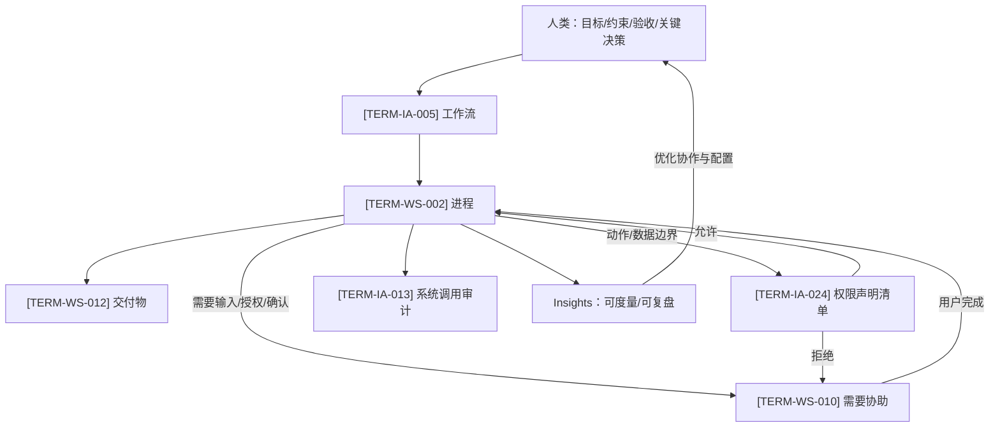
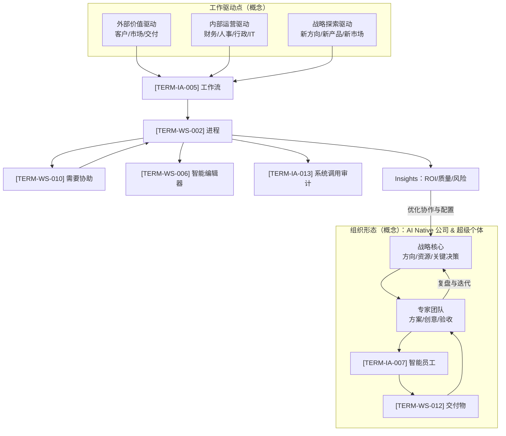
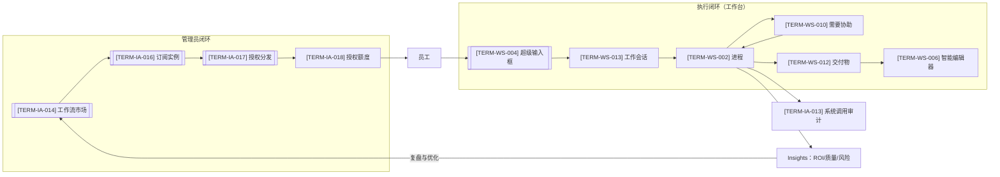
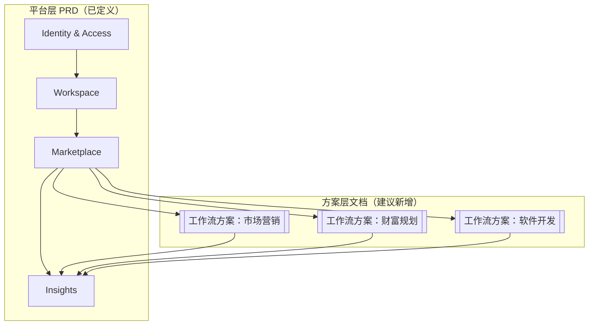

# Orbitaskflow 产品总览（MVP 宏观描述草案）

## 0 文档元信息
文档版本：v0.3（Draft）  
最后修改日期：2026-01-23  
作者：Billow
适用范围：`docs/features/` 下的 L1 产品总览（跨模块入口）  
相关文档：
- `docs/docs-map.md`
- `docs/standards/doc-guidelines.md`
- `docs/standards/ssot-glossary.md`
文档目的：提供“第一次读 PRD 的人”所需的宏观地图（定位/边界/核心对象/端到端闭环/读 PRD 顺序），作为各模块 PRD 的导航页。
---

## 1 一句话摘要
Orbitaskflow 是一个以 **[TERM-IA-005] 工作流** 重新定义“人做什么、**[TERM-IA-007] 智能员工**做什么”的新型智能工作空间（**[TERM-WS-001] 工作台即操作系统**），并支持通过 **[TERM-IA-014] 工作流市场** 订阅/购买与组织化分发能力，目标是赋能企业成为 AI Native 公司与个人成为超级个体：在 **[TERM-IA-015] 工作流方案** 中以可插拔、可定制的方式组合智能员工，并将可定制的 **[TERM-WS-018] 信息需求** 与 **[TERM-IA-024] 权限声明清单** 显式化，让执行过程可运行、可控、可追溯；同时把关键过程沉淀为组织可治理的 **[TERM-IA-009] 对话资产**，并通过审计与 Insights 形成面向管理员的治理与复盘体验、面向一线用户的发起与交付体验，从设计中心上区别于以“单体对话智能体/聊天”为核心的通用大模型平台。

---

### 1.1 时代背景与核心主张：从“AI 工具”到“数字劳动力”
- 判断：AI（尤其是 Agent）正在成为新的生产力，但如果仍以“工具”方式使用，往往只能获得局部提效，难以形成规模化的组织级产能。
- 关键变化（治理与可追溯）：要释放 Agent 的能力，需要让 Agent 从“被动工具”升级为可被组织管理、可被授权分发的执行单元。
- 关键变化（协作关系重定义）：需要重定义协作关系：把人的职责上移到目标/约束/验收与关键决策，把智能员工的职责下沉到可授权范围内的执行，并通过“需要协助/结果验证/审计”形成可控的协作闭环。
- 产品落点：Orbitaskflow 以 **[TERM-WS-001] 工作台即操作系统** 承载执行闭环，把工作按 **[TERM-IA-005] 工作流** 与 **[TERM-WS-002] 进程** 组织；通过 **[TERM-IA-014] 工作流市场** 引入能力并分发授权，让 **[TERM-IA-007] 智能员工** 协作产出 **[TERM-WS-012] 交付物**，并由 Insights 将过程与结果沉淀为可度量、可复盘的价值信号。

---

### 1.2 愿景：让 AI Native 公司与超级个体成为可能
AI 原生并非一次技术升级，而是一场可与工业革命、云转型相媲美的范式变革：当“智能”逐步变成可按需调用的生产要素，价值创造将从“人力规模驱动”转向“人类目标与决策 + 数字劳动力执行”的新模式。
Orbitaskflow 正是为这场变革而生的新型人机协作操作系统，赋能客户成为 **AI Native 公司**，并让**超级个体**以极高人效、极低边际成本和极快速度响应市场，持续创造并交付价值。

### 图示：人—智能员工协作操作模型（顶层）

矢量版： [SVG](sandbox:/mnt/data/orbitaskflow_diagram_1_collaboration.svg)

### 图示：AI Native 公司与超级个体的组织 operating model（概念）

矢量版： [SVG](sandbox:/mnt/data/orbitaskflow_diagram_2_operating_model.svg)

---

## 2 产品定位与边界

### 2.1 我们是什么
- 以 **[TERM-IA-005] 工作流** 为协作蓝图的新型智能工作空间（**[TERM-WS-001] 工作台即操作系统**），把分工、信息需求与权限边界前置为可配置、可校验的运行时约束，并以对话资产、审计与度量构成治理闭环。
- 服务于两类核心角色（同一套闭环）：
  - Admin（管理员）：负责能力引入、分发、治理与优化。
  - Employee（一线用户）：负责任务发起、协同执行与交付沉淀。

### 2.2 我们不是什么（MVP 约束口径）
- 不是“通用应用商店”：以 **工作流/工作流方案** 为可订阅与可分发单位。
- 不是“全自治 Agent”：高风险动作必须可控、可追溯，且按职级/策略约束。
- 不是“在线 BI 平台”：MVP 以看板 + 明细导出满足审计与盘点，避免复杂在线筛选。

### 2.3 目标用户与早期价值验证（MVP 聚焦）
#### 2.3.1 目标用户画像（ICP）
**基础画像**：中小企业 + 盈利能力 + 知识型服务为主 + 无独立开发能力 + 有成熟流程对标
**种子客户**（在基础画像上叠加）：
- 中国境内或服务中国企业出海
- 一线/准一线城市
- 企业主拥抱智能化 + 有预算
**可商业化客户**（在种子客户上叠加）：
- 愿意付费使用已标品化的定制能力
- 以 **[TERM-IA-015] 工作流方案** / **[TERM-WS-020] 智能体定制包** 为采购与交付单位
#### 2.3.2 早期价值初验方向（3 条旗舰场景）
- 市场营销：创意策划、危机公关、内容生产等高频知识工作，强调速度、质量与一致性
- 财富规划：面向企业经营与个人家庭的整体规划与组合建议等高信任任务，强调合规、可追溯与风险控制
- 软件开发：需求梳理、架构设计、代码生成等工程链路，强调可运行交付与效率提升
#### 2.3.3 ToB/ToC 统一落点与阶段策略
- **ToB**：企业 **[TERM-IA-005] 工作流** 与授权分发。
- **ToC**：个人复用同一套协作模型（身份上等价于“仅主账号、无子账号”）。
- **阶段策略**：先企业后个人；购买与分发由管理员完成。个人形态在身份模型上等价于“仅主账号、无子账号”，但闭环口径保持一致。

---

## 3 核心理念与关键差异点
### 3.1 数字化雇佣：为能力与产出付费
- 以 **[TERM-MP-004] 数字化雇佣** 为顶层商业范式。
- 支持 **[TERM-MP-006] 按岗雇佣**、**[TERM-MP-005] 按结果付费**、以及混合模式。

### 3.2 工作台即操作系统：把“聊天”升级为“可执行、可追溯的工作流运行时”
- 核心交互链路：**[TERM-WS-013] 工作会话 → [TERM-WS-002] 进程 → [TERM-WS-012] 交付物**。
- 关键 UI 机制：
  - **[TERM-WS-004] 超级输入框**（任务发起的统一入口）。
  - **[TERM-WS-005] 服务端驱动界面**（确认/补信息/审批等结构化交互）。
  - **[TERM-WS-010] 需要协助**（进程 Suspended 等待用户输入/授权/确认）。
  - **[TERM-WS-006] 智能编辑器**（交付物精修与导出）。

### 3.3 企业级治理：隔离、可见性、继承、审计
- 多租户/组织隔离与资产归属：以 **[TERM-IA-001]/[TERM-IA-002]/[TERM-IA-003]** 的三层账号模型为基础。
- 对话资产的默认私有与团队沉淀：**[TERM-IA-010] 私有 → [TERM-IA-011] 团队公开**（用户显式选择）；离职/解绑触发 **[TERM-IA-012] 解绑归档**。
- 高风险动作留痕：**[TERM-IA-013] 系统调用审计**。

---

## 4 核心对象地图（只引用，不重定义）
说明：完整定义见 `ssot_glossary.md`，此处列出关键对象以便理解端到端闭环。

**组织与身份（Identity & Access）**  
[TERM-IA-001] 主账号、[TERM-IA-002] 子账号、[TERM-IA-003] 员工账号、[TERM-IA-004] 主账号授权额度池、[TERM-IA-006] 授权开关、[TERM-IA-007] 智能员工、[TERM-IA-008] 智能员工职级、[TERM-IA-009] 对话资产（[TERM-IA-010] 私有 / [TERM-IA-011] 团队公开 / [TERM-IA-012] 解绑归档）

**市场与订阅（Marketplace）**  
[TERM-IA-014] 工作流市场、[TERM-IA-015] 工作流方案、[TERM-IA-016] 订阅实例、[TERM-IA-017] 授权分发、
[TERM-IA-018] 授权额度、[TERM-IA-019] 可用额度、[TERM-IA-020] 已分配额度、[TERM-IA-021] 回收、[TERM-IA-022] 自动回收、[TERM-IA-023] 试用额度、
[TERM-IA-024] 权限声明清单、[TERM-MP-001] 标准连接端点、[TERM-MP-002] 结果验证器、[TERM-MP-003] 外部智能体桥接

**执行与交付（Workspace）**  
[TERM-WS-001] 工作台即操作系统、[TERM-WS-013] 工作会话、[TERM-WS-002] 进程、[TERM-WS-012] 交付物、[TERM-WS-004] 超级输入框、[TERM-WS-005] 服务端驱动界面、[TERM-WS-006] 智能编辑器、[TERM-WS-010] 需要协助、[TERM-WS-017] 企业知识源、[TERM-WS-018] 信息需求、[TERM-WS-019] 检索配置档案、[TERM-WS-020] 智能体定制包

---

## 5 端到端闭环（产品主链路）

### 5.1 管理员闭环：引入能力 → 分发 → 治理 → 复盘
1) 在 **[TERM-IA-014] 工作流市场** 浏览与筛选工作流/方案（含成本与关键决策要素）。
2) 订阅/购买生成 **[TERM-IA-016] 订阅实例**（版本锁定）。
3) 按企业组织结构执行 **[TERM-IA-017] 授权分发**（将 **[TERM-IA-018] 授权额度** 分配到子账号/员工）。
4) 通过 **[TERM-IA-024] 权限声明清单** 明确边界；运行期越权默认拦截。
5) 在 **Insights** 查看 ROI/质量/风险信号，并据此调整：
   - 工作流方案的智能员工组合、授权范围、定制包与知识配置。
   - 回收/续费/增购等订阅管理动作。

### 5.2 员工闭环：发起任务 → 协同执行 → 交付与沉淀
1) 在工作台通过 **[TERM-WS-004] 超级输入框** 发起任务（指令 + 文件/素材 + 选择 **[TERM-IA-005] 工作流**）。
2) 系统创建/进入 **[TERM-WS-013] 工作会话**，启动一个或多个 **[TERM-WS-002] 进程**。
3) 执行中以 **[TERM-WS-005] 服务端驱动界面** 提供结构化交互；需要用户输入/授权/确认时进入 **[TERM-WS-010] 需要协助**。
4) 产出 **[TERM-WS-012] 交付物** 并进入 **[TERM-WS-006] 智能编辑器** 精修/导出；版本与差异可回看。
5) 对话资产默认 **[TERM-IA-010] 私有**，可显式切换为 **[TERM-IA-011] 团队公开** 以沉淀复用。

### 图示：端到端闭环（能力引入 → 执行交付 → 治理审计 → 度量复盘）

矢量版： [SVG](sandbox:/mnt/data/orbitaskflow_diagram_3_end_to_end.svg)

---

## 6 跨模块系统不变量（宏观层面的“必须成立”）
说明：这些不变量是跨 PRD 的一致性检查点。

- 企业隔离与资产归属：对话资产必须随子账号归属，并受可见性规则约束。
- 能力引入必须“可控”：订阅前看清将访问的数据与可执行操作；运行期越权默认拦截。
- 高风险动作必须“可追溯”：能回答“谁在何时做了什么、对什么对象做、结果如何、为何允许/拒绝”。
- 执行必须“可恢复”：中断、失败、断网等必须有可行动的恢复路径。
- 价值必须“可度量”：至少能把任务量/成功率/接管率/自治等级与节省工时等信号汇总给管理员。

---

## 7 模块边界与依赖关系（读 PRD 的顺序建议）
1) **Identity & Access**：先确立组织边界、对话资产归属与治理底座。
2) **Marketplace**：再定义能力引入（订阅/授权/回收/计费）与权限声明。
3) **Workspace**：最后落到执行闭环（会话/进程/交付物/UI 协议/协同）。
4) **Insights**：基于前 3 者产生的执行与审计数据，提供 ROI/质量/风险的可视化与导出。

---

## 8 文档导航（本总览与各 PRD 的关系）
- 组织与身份：`docs/features/prd-identity-access.md`
- 执行与交付：`docs/features/prd-workspace.md`
- 能力引入与商业闭环：`docs/features/prd-marketplace.md`
- 价值度量与复盘：`docs/features/prd-insights.md`

---

## 9 开放问题（用于后续迭代，不阻塞 MVP）
- 结果验证器（[TERM-MP-002]）的验证覆盖与可解释性边界如何分层（自动/半自动/人工）？
- “节省工时”估算模型的参数口径是否需要行业化模板？
- 跨子账号协作/跨组织协作是否会成为 vNext 的必选项（当前术语边界明确不含跨组织协作）？

---

## 10 从“操作系统 PRD”到“解决方案 PRD”：补齐早期价值初验的产品表达
现状：当前四份 PRD（Identity & Access / Workspace / Marketplace / Insights）主要定义的是 Orbitaskflow 作为“工作台即操作系统”的通用能力。
补充：为了让早期价值初验更可落地、可复制，需要在不改变底层术语与对象的前提下，新增一层“解决方案表达”，把不同行业/职能的 **[TERM-IA-005] 工作流** 如何组合 **[TERM-IA-007] 智能员工**、如何声明 **[TERM-WS-018] 信息需求**、如何绑定 **[TERM-WS-017] 企业知识源** 与 **[TERM-WS-019] 检索配置档案**、以及如何通过 **[TERM-IA-024] 权限声明清单** 与 **[TERM-IA-013] 系统调用审计** 实现治理，写成可复用的“工作流方案级文档”。

### 10.1 文档分层（建议）
- **模块 PRD（平台层）**：定义“能力底座”和系统不变量（已存在：IA/WS/MP/Insights）。
- **解决方案文档（方案层）**：以 **[TERM-IA-015] 工作流方案** 为交付单元，描述“某类工作如何在 Orbitaskflow 上跑起来”，用于：
  - 早期价值验证（能否提效/降本/控风险）
  - 规模化复制（可移植到更多客户/团队）
  - 商品化上架（进入 [TERM-IA-014] 工作流市场，形成订阅与 [TERM-IA-017] 授权分发）

### 10.2 单个“工作流方案级文档”的最小骨架（不引入新术语）
- 一句话摘要：这套 **[TERM-IA-015] 工作流方案** 解决什么问题、交付什么 **[TERM-WS-012] 交付物**。
- 目标用户与适用边界：适用团队/岗位、输入前提、不可用场景。
- 智能员工组合：包含哪些 **[TERM-IA-007] 智能员工**（可插拔）、每个智能员工在流程中承担的职责。
- 信息需求清单：每个关键步骤的 **[TERM-WS-018] 信息需求**（必填/选填/默认值/校验）。
- 知识与定制：绑定的 **[TERM-WS-017] 企业知识源**、**[TERM-WS-019] 检索配置档案**、可选的 **[TERM-WS-020] 智能体定制包**（口径/风格/规则）。
- 权限与风险控制：对应的 **[TERM-IA-024] 权限声明清单**、默认拦截/需要协助策略（对齐 [TERM-WS-010] 需要协助）。
- 结果验证：对齐 **[TERM-MP-002] 结果验证器** 的最小验证口径（Pass/Fail/需要人工）。
- 运营与复盘：对应 Insights 看板/明细导出的关键指标口径（ROI/质量/风险）。

### 10.3 与当前“早期价值初验方向”的对齐方式
- 市场营销：以“创意策划 / 内容生产 / 危机公关”等工作流方案为上架单位，强调结果可验证与品牌/合规护栏。
- 财富规划：以“整体方案 / 资产配置建议 / 风险披露”类交付物为上架单位，强调审计、可追溯与高风险动作拦截。
- 软件开发：以“需求澄清 / 架构设计 / 代码生成 / 评审修订”类工作流方案为上架单位，强调可运行交付与版本差异沉淀。

