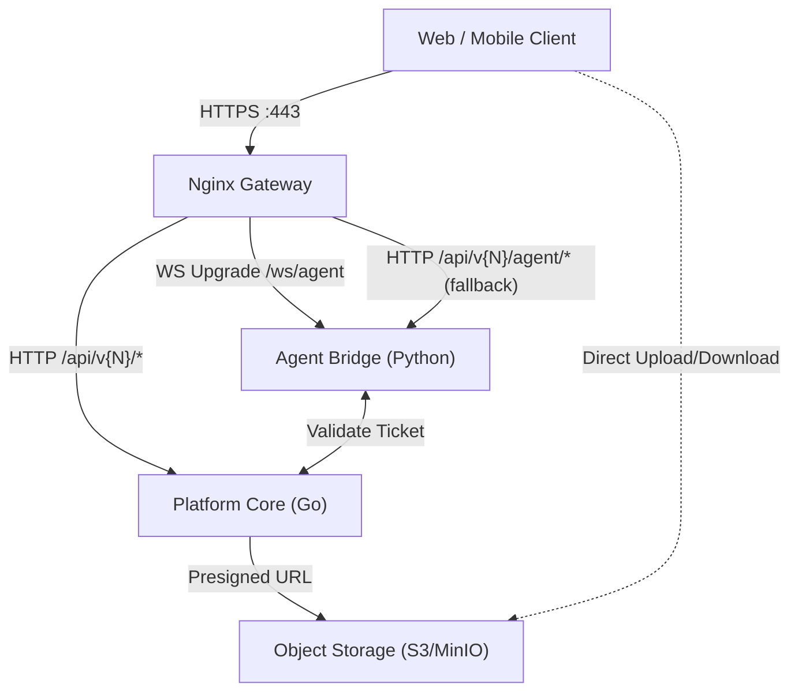

# API 治理宪法 (API Governance Constitution)

文档版本：v2.1（Draft）  
最后修改日期：2026-01-26 
作者：Billow
适用范围：`docs/standards/` 下的 API 治理规范（跨服务一致规则，L1 SSOT）  
相关文档：
- `docs/docs-map.md`
- `docs/standards/doc-guidelines.md`
- `docs/standards/ssot-glossary.md`
- `docs/features/platform-overview.md`
- `docs/features/prd-identity-access.md`
- `docs/features/prd-workspace.md`
- `docs/features/prd-marketplace.md`
- `docs/features/prd-insights.md`
- `docs/technical/architecture/fullstack-architecture.md`
- `docs/technical/protocols/interaction-protocol.md`
- `docs/technical/data/database-design.md`
- `docs/technical/api/core-service.md`
- `docs/technical/api/agent-bridge.md`
- `docs/technical/ops/nginx_gateway_architecture.md`

docs/technical/ops/observability-logging.md
文档目的：定义 Orbitaskflow 的 API 治理 SSOT：路由拓扑、对外协议边界、错误/trace/版本/幂等/限流/上传等跨服务一致规则；为各服务的 L2 API 契约提供统一约束，避免接口蔓延与协议不一致。
---
## 0. 需求对齐原则（最小）
本文不复述各模块 PRD 的业务流程，但以下“治理类需求”必须在 API 风格中体现为一致的契约行为（例如：鉴权失败语义、越权拦截/拒绝原因码、审计/计量/回执字段、导出/异步任务接口形态等）。上游需求来源：
- `docs/features/prd-identity-access.md`
- `docs/features/prd-workspace.md`
- `docs/features/prd-marketplace.md`
- `docs/features/prd-insights.md`

## 1. 总览 (Overview)

### 1.1 定位与范围 (Positioning & Scope)

#### 1.1.1 In Scope
- **边缘入口与路由拓扑**：网关职责、HTTP/WS 的入口路径与上游服务边界。
- **API 治理宪法（跨服务 SSOT）**：
  - 成功响应的通用约束（字段命名、时间格式、分页、版本）。
  - **错误语义**：统一采用 **Problem Details (RFC 7807)** + 可机读 `reason_code`。
  - **Trace 传播**：W3C Trace Context。
  - 幂等、并发控制（ETag）、限流头。
  - 文件上传的 Presigned URL 规范。

#### 1.1.2 Out of Scope
- 具体服务的端点清单与字段级 schema（落在 `docs/technical/api/<service>.md`）。
- WebSocket 事件类型与事件字段注册表（落在 `docs/technical/protocols/interaction-protocol.md`）。
- Nginx 配置细节、超时/缓冲/跨域/健康检查等运维 Runbook（落在 `docs/technical/ops/*`）。

#### 1.1.3 依赖与单向引用 (Dependencies)
- 交互协议：`docs/technical/protocols/interaction-protocol.md`（事件语义与重连/ACK/分片）。
- 系统架构与 Ticket-only 原则：`docs/technical/architecture/fullstack-architecture.md`。
- 数据与隔离：`docs/technical/data/database-design.md`。

#### 1.1.4 变更触发器 (Change Triggers)
- 新增/修改错误结构、`reason_code`、trace 字段、幂等/版本/限流/上传策略。
- 新增/修改对外入口路径（HTTP/WS）或路由拓扑（服务增减/拆分）。

### 1.2 通信形态总览

Orbitaskflow 的对外通信采用 **WebSocket First + HTTP REST (Management) + Async Jobs** 的组合：
- **WebSocket（Primary）**：用于工作区核心交互（聊天、打断、Generative UI 推送、编辑器协同）。
- **HTTP REST（Management）**：用于资源管理与后台类操作（主账号/子账号/员工账号、工作流与资产管理等）。
- **HTTP（Fallback/Compatibility）**：可提供与 WS 事件语义一致的 SSE/HTTP Streaming 兼容入口，但其事件语义由 `docs/technical/protocols/interaction-protocol.md` 统一定义。

本规范在“跨服务一致性”层面强制：
- **统一错误语义**：RFC 7807 + `reason_code`
- **统一可观测**：W3C Trace Context
- **统一治理约束**：幂等、并发控制、限流、上传策略

# **2\. 背景 (Background)**

本系统采用“控制面 / 执行面”分离的混合架构：控制面 Platform Core（Go）承载身份与资源管理等治理能力，执行面 Agent Bridge/Worker（Python）承载交互与任务执行；前端工作区由 Workspace Web（Next.js）提供。
约束：MVP 不引入独立的 BFF 服务边界；如 Workspace Web 存在服务端能力（SSR/Server Actions），其仍属于 Workspace Web 形态，不作为单独的 BFF 微服务对外声明。


* **协议一致性**：统一不同语言服务间的错误码格式、分页标准及命名风格（CamelCase vs SnakeCase）。  
* **全链路可观测性**：确立跨服务的分布式追踪标准 (Trace ID)，消除监控盲区。  
* **通信可靠性**：定义统一的重试策略、幂等性机制及限流标准，保障系统稳定性。

# **3\. 架构视图 (Architecture View)**

## **3.1 路由拓扑 (Routing Topology)**

系统采用 Nginx 作为唯一的流量入口，负责 SSL 卸载和路由分发。



### 3.2 路由规则表 (Routing Rules)

| 入口路径 | 上游服务 | 协议 | 说明 |
|---|---|---|---|
| `/api/v{N}/*` | Platform Core (Go) | HTTP | 资源管理/鉴权/CRUD 等管理类 API（具体端点在各服务契约中定义）。 |
| `/ws/agent` | Agent Bridge (Python) | WebSocket | 工作区核心交互入口（事件语义见 `docs/technical/protocols/interaction-protocol.md`）。 |
| `/api/v{N}/agent/*` | Agent Bridge (Python) | HTTP | 兼容/辅助入口（如 SSE fallback、异步任务创建/状态查询等；字段与鉴权在服务契约中定义）。 该入口同样必须遵循 Ticket-only（仅传输层不同）。|
| *(文件直传)* | Object Storage | HTTPS | 客户端使用 CoreSvc 签发的 Presigned URL 直传；禁止网关透传二进制流。 |

NOTE：具体端点、请求/响应字段与鉴权前置条件，必须落在 L2 的 `docs/technical/api/<service>.md`，本文件只定义跨服务一致规则与入口边界。

# **4\. API 规范 (API Standards)**

## 4.1 通信协议

### Agent 交互：WebSocket + SSE 风格事件语义

由于 LLM 生成具有明显的流式特性，Agent 交互接口采用 **WebSocket 长连接承载 SSE 风格事件流** 的方式：

* **Workspace Web / 第一方客户端**：
  * 通过 WebSocket 连接网关公开的 `/ws/agent`（由 Nginx 转发至 Agent Bridge）；
  * **事件语义与事件格式**：以 `docs/technical/protocols/interaction-protocol.md` 为唯一 SSOT（包含事件类型注册表、data schema、ACK/重连/分片等规则）。

* **兼容 / 外部集成客户端（可选）**：
  * 可提供 HTTP SSE 形式的兼容接口；
  * 其事件语义必须与 WebSocket 通道一致，具体以 `docs/technical/protocols/interaction-protocol.md` 为准。

NOTE：对内协议统一以“事件语义（SSE 风格）”为主，
具体传输层可为 WebSocket 或 HTTP SSE。
Workspace Web 优先使用 WebSocket，HTTP SSE 主要用于脚本、CI 或第三方集成场景。

### 常规业务：RESTful over JSON

对于 CRUD 操作，遵循标准 REST 语义（200/201/202 等）。

错误语义与错误结构（含可机读 reason_code）不在本节枚举，统一见 “错误语义章节（RFC 7807 + reason_code）”。

## **4.2 数据契约 (Data Contract)**

所有 JSON API（非 SSE）必须遵循以下规范，并在服务内完成 **snake_case (DB) -> camelCase (API)** 的转换。

### **数据类型规范**

* **Date/Time**: 必须使用 **ISO 8601 UTC** 字符串格式 (e.g., "2026-01-17T12:00:00Z")。

### **响应信封结构**

* **成功响应（非错误）**：不再强制要求所有服务统一使用 `ApiResponse<T>` envelope。成功响应是否使用 `data/meta` 由对应 L2 服务契约固定，但必须满足：
  * 分页资源需要返回清晰的分页信息（见 4.5）。
  * 可观测追踪信息必须可获取：优先通过 W3C Trace Context（`traceparent`），如需要在 body 内返回 `traceId`，其语义需与 traceparent 对齐。

* **错误响应（强制统一）**：所有 HTTP 错误响应 **必须** 采用 **Problem Details (RFC 7807)** 结构，并附带可机读 `reason_code`。

```json
{
  "type": "https://docs.orbitaskflow/errors/validation_failed",
  "title": "Validation failed",
  "status": 400,
  "detail": "One or more fields are invalid.",
  "instance": "/api/v{N}/workflows",
  "traceparent": "00-<trace-id>-<span-id>-01",
  "traceId": "<trace-id>",
  "reason_code": "VALIDATION_FAILED",
  "errors": [
    {"field": "name", "issue": "REQUIRED"}
  ]
}
```
### **标准错误码 (Standard Error Codes) [NEW]**

为保证前端错误处理的一致性，系统保留以下跨服务 reason_code（服务可扩展，但不得与本表冲突）：
约束：客户端不得仅依据 HTTP status 分支处理；必须依据 `reason_code` 决定用户引导与重试策略。

| reason_code | 说明 | 对应 HTTP |
| :--- | :--- | :--- |
| `VALIDATION_FAILED` | 参数校验失败（可带errors[]） | 400 |
| `UNAUTHORIZED` | 未登录或凭证无效 | 401 |
| `PERMISSION_DENIED` | 无权访问该资源 | 403 |
| `RESOURCE_NOT_FOUND` | 请求的资源不存在 | 404 |
| `CONFLICT` | 资源状态冲突（含乐观锁冲突）| 409 |
| `IDEMPOTENCY_REPLAYED` | 幂等键重放且请求体不一致/被拒绝复用 | 409 |
| `PRECONDITION_FAILED` | 并发前置失败（ETag/If-Match） | 412 |
| `RATE_LIMITED` | 触发瞬时限流（短期可恢复；必须带 Retry-After） | 429 |
| `QUOTA_EXCEEDED` | 配额/额度不足（与订阅/授权额度相关） | 403 |
| `INTERNAL_ERROR` | 服务器内部错误（不泄漏敏感细节） | 500 |

## **4.3 版本控制**

* **URI Versioning**: 所有 HTTP API 入口必须显式版本化为 `/api/v{N}/...`。
* **策略**: 破坏性变更必须升级版本号；非破坏性变更在原版本迭代。
* **WebSocket 版本**：事件语义与版本协商机制以 `docs/technical/protocols/interaction-protocol.md` 为唯一 SSOT，本节不复述。

## **4.4 文件上传协议 (File Upload Protocol)**

为了减轻 API 网关的流量压力，文件上传**禁止**通过 API 透传二进制流 (Multipart)，必须采用 **预签名 URL (Presigned URL)** 模式。

1. **Request Upload**: 客户端 `POST /api/v{N}/files/presign`（带文件名、大小、内容类型等）。
2. **Generate URL**: 服务端验证权限与额度，生成 S3/MinIO PUT Presigned URL（TTL 建议 15min）。
3. **Direct Upload**: 客户端直接 PUT 文件到该 URL。
4. **Confirm**: 客户端 `POST /api/v{N}/files/confirm` 通知服务端文件已上传。
   * **后端行为**: 服务端必须通过 HeadObject/等价手段校验文件实际大小和存在性，严禁信任前端传入的元数据。

NOTE: 具体端点字段以 `docs/technical/api/core-service.md`（platform-core 服务契约）为准；本文仅定义“必须直传 + 必须确认校验”的治理规则。

## **4.5 复杂查询标准 (Query Standards)**

对于列表接口，根据业务场景选择分页模式。

### **A. 游标分页 (Cursor-based)**

**适用场景**: 聊天记录 (messages)、活动流 (audit\_logs)、无限滚动列表。

* **Request**:  
  * GET /api/v{N}/messages?limit=20 (获取最新)  
  * GET /api/v{N}/workflows?limit=20\&cursor=eyJ0cyI6... (获取历史，cursor 为 Base64 编码的不透明字符串)  
* **Response**: meta.cursor 返回下一页的锚点。  
* **优势**: 避免数据实时插入导致的分页漂移 (Offset Shift)，支持基于时间戳或联合主键的灵活实现。

### **B. 传统分页 (Offset-based)**

**适用场景**: 管理后台表格 (users, workflows)、需要跳页的场景。

* **Request**: GET /api/v{N}/workflows?page=1&pageSize=20 
* **Response**: meta.total 返回总条数。

### **C. 过滤与排序**

约束：过滤/排序/全文检索参数的**具体语法**属于服务契约（L2）责任域；各服务必须在其 `docs/technical/api/<service>.md` 中固定参数语法与字段集合。
本文（L1）只强制“分页机制的选择原则与一致性约束”，避免跨服务出现语义不一致。

**示例（非规范性，仅用于说明）**：
* **Search**: `q=contract`（全文检索）
* **Filtering**: `filter[status]=active`（示例：LHS Brackets）
* **Sorting**: `sort=-createdAt`

## **4.6 并发控制 (Concurrency Control)**

对于 Workflow 编辑或 User Profile 更新等易冲突操作，采用 **乐观锁 (Optimistic Locking)**。

* **Read**: GET 响应头包含 ETag: "v123"。  
* **Write**: PUT/PATCH 请求头必须包含 If-Match: "v123"。  
* **Conflict**: 若版本不匹配，返回 412 Precondition Failed，前端提示用户刷新。

## **4.7 国际化支持 (i18n)**

### 原则
1) **机读优先**：客户端不得依赖英文文案做逻辑判断；必须以 `reason_code` 作为分流、引导、重试策略的主依据。
2) **可本地化字段**：允许对 RFC 7807 的 `title` / `detail` 做本地化展示；其余字段（如 `type/status/instance/traceId/reason_code`）不参与本地化。
3) **不新增 message 字段（L1 约束）**：为避免错误结构分叉，L1 不引入 `error.message` 之类扩展字段；如确需扩展，必须在 `## 4.2 数据契约` 的错误结构中显式声明并全局一致。

### 推荐客户端策略（非规范性）
- 优先用 `reason_code` 映射到本地化文案表；
- 若缺失映射，则展示服务端返回的 `title/detail`；
- 最终兜底展示 `reason_code` 作为可定位信息。

## **4.8 批量操作标准 (Batch Operations)**

为减少 RTT，针对集合资源支持批量操作。

* **Endpoint**: POST /api/v{N}/{resource}/batch  
* **Action**: 通过 Query 参数指定动作，如 ?action=delete。  
* **Body**: { "ids": \["uuid1", "uuid2"\] }  
* **Response**: 返回 207 Multi-Status 或简化的成功/失败统计。

## **4.9 异步任务 (Async Jobs)**

适用场景：导出、批量处理、长耗时分析、外部集成执行等。
约束：创建任务必须返回可轮询的状态资源，并能被审计/计量/回执关联。

- **Create**：`POST /api/v{N}/jobs`
  - **Response**：`202 Accepted`
  - body（最小）：`{ "jobId": "<id>", "statusUrl": "/api/v{N}/jobs/<id>", "receiptId": "<id>" }`
- **Get Status**：`GET /api/v{N}/jobs/<id>`
  - body（最小）：`{ "jobId": "<id>", "status": "queued|running|succeeded|failed|cancelled", "progress": 0, "resultUrl": "..." }`
- **Cancel（可选）**：`POST /api/v{N}/jobs/<id>:cancel`（或 `DELETE /api/v{N}/jobs/<id>`，由服务契约固定）
NOTE：任务状态枚举、进度语义、result 的下载鉴权等属于 L2 服务契约；本节只统一“接口形态 + 202 + 可关联字段”。

# **5\. 安全机制 (Security Model)**

## **5.1 服务间鉴权 (Service-to-Service Auth)**

* **入口唯一化（Ticket-only）**：执行面（Agent Bridge / Worker）不得接受裸请求；只能处理由控制面签发的 Work Ticket / Job Ticket（详见 `docs/technical/architecture/fullstack-architecture.md`）。
  * WebSocket 建连前必须获取一次性 Work Ticket；
  * 异步任务/后台执行必须绑定 Job Ticket。

* **失败策略 (Fail-closed)**：Ticket 缺失/过期/撤销/上下文不一致必须拒绝，并产生日志化信号用于审计追溯。

NOTE：本文不定义 Ticket 字段细节；Ticket 的结构与生命周期约束属于架构与服务契约范畴（以 `docs/technical/architecture/fullstack-architecture.md` 与各服务契约为准）。

## **5.2 出站与副作用治理 (Egress & Side-effect Governance)**

- 所有对外部系统的读取类访问必须经过 **[TERM-G-009] 出站网关（Egress Gateway）**，以便统一做授权裁决、审计/计量、限流/配额与数据防泄漏。
- 所有会改变外部状态的动作必须经过 **[TERM-G-010] 副作用网关（Side-effect Gateway）**，默认 fail-closed；必要时可触发二次确认/条件允许（obligations）。
- 所有出站/副作用请求必须全链路传播 **[TERM-G-012] 追踪上下文（Trace Context）**（W3C Trace Context：traceparent/tracestate）。
- 副作用网关的允许/拒绝都必须生成 **[TERM-G-011] 回执（Receipt）**；拒绝与失败必须返回可机读 **[TERM-G-013] 拒绝原因码（reason_code）**，用于统计、告警与复盘。
- 对于所有经过 **[TERM-G-010] 副作用网关（Side-effect Gateway）** 的写操作：服务端必须在响应中提供 `receiptId`（camelCase）用于关联审计与计量。
  - 推荐放置于响应 body 的 `meta.receiptId`；若该端点不使用响应信封结构，则必须以响应头 `X-Orbit-Receipt-Id` 返回。
- 对于被拒绝的副作用请求：错误响应必须携带 `reason_code`；若系统已生成回执，也必须同时提供 `receiptId`（同上规则）。

## **5.3 幂等性控制 (Idempotency)**

对于涉及 **[TERM-G-010] 副作用网关（Side-effect Gateway）** 的写操作 (POST/PATCH)，客户端 **必须** 提供 `Idempotency-Key` Header。

- **副作用的范围（示例）**：
  - 触发外部系统调用（邮件/短信/IM/第三方 API）；
  - 触发“执行/发布/回滚”等不可逆或代价较高的动作；
  - 引起订阅/授权额度等“治理状态”变更（如配额扣减、授权分发/回收）。

- **服务端行为**：需在 TTL 窗口内缓存执行结果以防止重复执行。
- **冲突**：同一 Key 对应不同请求体必须拒绝（建议 `409 CONFLICT` + `reason_code=IDEMPOTENCY_REPLAYED`）。

NOTE：若未来引入第三方支付通道，支付类写操作同样纳入本节幂等策略。

## **5.4 Webhook 接收安全**

对于外部系统回调（如：支付通道、消息平台、第三方自动化系统等），必须验证签名并防重放。

- **Verification**:
  - 统一支持 `X-Orbit-Signature` (HMAC-SHA256)；
  - 若特定第三方回调自带签名头（例如支付通道的 `Stripe-Signature` 等），在对应适配器/接入文档（L2/L3）中声明并实现校验。

- **Anti-Replay**: 必须校验 Timestamp 窗口（建议 < 5min）。

# **6. 部署 / 运维注意事项 (Ops Notes)**

NOTE：运维级细节（动态配置、可观测性、限流、健康检查、CORS、长连接超时等）属于 ops 文档责任域，不在本 L1 文档复述。
统一引用：
- `docs/technical/ops/nginx_gateway_architecture.md`
- `docs/technical/ops/observability-logging.md`

# **7\. 附录 (Appendix)**

## **7.1 版本历史**

| 版本 | 日期 | 修改人 | 变更内容 |
| :---- | :---- | :---- | :---- |
| **v2.1** | 2026-01-25 | Billow | 对齐 docs-map 最新路径与 L2 API 契约；清理 blockquote；补齐适用范围；关键治理术语改为 SSOT 标注；背景段移除独立 BFF 歧义。 |
| **v2.0** | 2026-01-17 | Billow | 协议总览对齐 WebSocket First；错误语义统一为 RFC7807 + reason_code；安全入口对齐 Ticket-only；清理运维细节并归位到 ops 文档。 |
| **v1.8** | 2025-11-28 | Billow | 修正游标分页参数为通用 cursor；增强上传确认安全校验；规范 i18n 权重解析。 |
| **v1.7** | 2025-11-28 | Billow | 新增游标分页标准 (Cursor-based) 及 SSE 长连接超时运维配置。 |
| **v1.6** | 2025-11-28 | Billow | 新增 ISO8601 日期强制、结构化验证错误、Search 参数及 CORS 策略。 |
| **v1.5** | 2025-11-28 | Billow | 补齐并发控制 (ETag)、国际化 (i18n) 及批量操作规范；新增未来扩展章节。 |
| **v1.4** | 2025-11-28 | Billow | 新增文件上传协议 (Presigned URL)、复杂查询语法及 Webhook 签名标准。 |
| **v1.3** | 2025-11-28 | Billow | 依照文档规范重构章节结构；合并部分技术细节。 |
| **v1.2** | 2025-11-28 | Billow | 新增 W3C 追踪、幂等性键、IETF 限流头及健康检查标准。 |
| **v1.1** | 2025-11-28 | Billow | 定义动态端口配置机制。 |
| **v1.0** | 2025-11-28 | Billow | 初始草稿。 |

