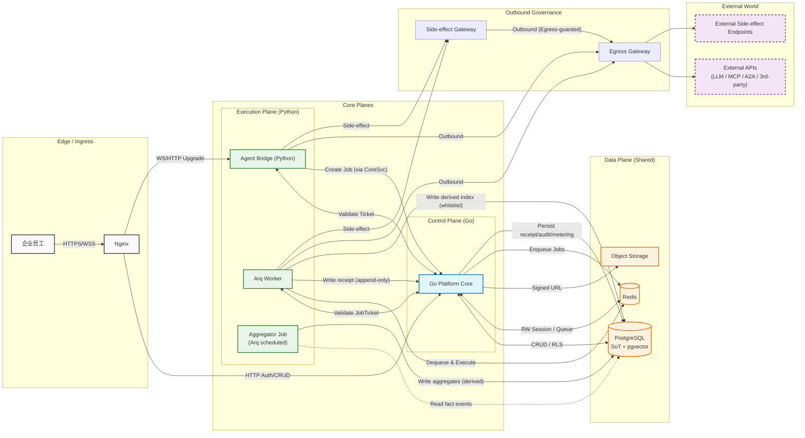

# Fullstack Architecture（系统级全栈架构）
文档版本：v0.4（Draft）  
最后修改日期：2026-02-01
作者：Billow  
适用范围：`docs/technical/architecture/` 下的系统级全栈架构（Control Plane / Execution Plane / Edge / Data Plane）  
相关文档：
- `docs/docs-map.md`
- `docs/standards/doc-guidelines.md`
- `docs/standards/tech-design-template.md`
- `docs/standards/ssot-glossary.md`
- `docs/standards/api-style-guide.md`
- `docs/features/platform-overview.md`
- `docs/features/prd-identity-access.md`
- `docs/features/prd-workspace.md`
- `docs/features/prd-marketplace.md`
- `docs/features/prd-insights.md`
- `docs/technical/protocols/interaction-protocol.md`
- `docs/technical/protocols/agent-interface-spec.md`
- `docs/technical/data/database-design.md`
- `docs/technical/api/core-service.md`
- `docs/technical/api/agent-bridge.md`
文档目的：说明 Orbitaskflow 的系统级拓扑、模块边界、关键数据流与关键不变量（多主账号隔离、策略平面、出站/副作用治理、可观测与运行）。本文为 L2 Technical SSOT（Doc-ID：TECH-ARCH-FULLSTACK-001）。
---

# **1\. 概述（Overview）**

本架构文档描述 Orbitaskflow 平台的整体技术结构，包括：

* WebSocket 优先的通信模型  
* 控制面（Go）与执行面（Python）的职责边界  
* **异步任务引擎 (Async Task Engine)** 的引入与设计  
* 前端、服务端、基础设施的整体拓扑  
* 系统的核心理念与设计原则

系统目标：构建一个面向 B2B 企业的 **AI Native 协同操作系统**。

为了实现这一目标，系统采用以下关键设计：

* 引入 **Generative UI（生成式 UI）**，前端通过服务端意图动态生成界面  
* 强化 **多主账号隔离（Master Account Isolation）**，确保企业级用户与数据隔离  
* 采用 **自建 WebSocket 网关策略**，实现高实时性与私有化部署  
* 采用控制面/执行面的职责分离：Platform Core (Go) 负责 CRUD，Agent Bridge (Python) 负责推理  
* 架构采用分层服务边界：Workspace Web（Next.js）+ 控制面（Go Platform Core）+ 执行面（Python Agent Bridge/Worker），由 Nginx 统一入口路由；**不引入独立的 BFF 服务边界**（避免“幽灵组件”导致实现对齐歧义）。

**Architecture Vision (架构愿景)**: 综上，本系统通过微服务、WebSocket First、Generative UI 的组合，构建具备企业级协同能力的智能工作平台。

## **1.1 市场战略与阶段 (Market Strategy)**

为了适应不同区域市场的合规要求、生态集成及基础设施差异，架构演进分为两个明确的阶段：

* **Phase 1: 中国市场优先 (China First)**  
  * **目标**: 快速落地中国 B2B 场景，满足数据本地化与合规要求。  
  * **基础设施**: 优先适配阿里云/火山云 (Aliyun/Volcengine)。  
  * **模型接入 (For Custom Agents)**: 对接 **DeepSeek**, **Aliyun Bailian (Qwen)**, **Volcengine Ark (Doubao)** 以支持自研智能体开发。  
  * **生态接入 (For External Agents)**: 集成 **Coze CN** (API), **Dify**, 及未来第三方开发者 Agent 的标准 API 接入。  
  * **商业化底座（MVP）**：只提供“可商业化闭环”——[TERM-IA-016]订阅实例 / [TERM-IA-017]授权分发 / [TERM-IA-018]授权额度 + 计量事件（metering）+ 审计事件（audit）+ receipt（回执） 证据链，并可在 Insights 复盘；**不集成具体支付通道**。  
  * **合规**: 严格遵循 ICP 备案与数据驻留 (Data Residency) 规定，确保数据不出境。  

* **Phase 2: 全球化扩展 (Global Expansion)**  
  * **目标**: 拓展国际市场，集成全球主流 SaaS 生态。  
  * **基础设施**: 适配 AWS/GCP。  
  * **模型接入**: 扩展支持 OpenAI, Google Gemini, Claude。  
  * **生态接入**: 集成 Coze Global, GPTs。  
  * **商业化底座（延续）**：保持 [TERM-IA-016]订阅实例 / [TERM-IA-017]授权分发 / [TERM-IA-018]授权额度 + 计量事件 + 审计事件 + receipt（回执） 的事实链路不变；支付通道作为 vNext 插拔，仅在商业化 ADR 选型中明确；一旦接入，必须纳入 receipt（回执）/计量事件/审计事件 证据链与对账口径。
## 1.2 PRD → Architecture Coverage Matrix（Architecture-only）

说明：本表是 **L1(PRD 规则) → L2(架构落点/契约锚点)** 的索引。
- **最小内容表示**：不复述 PRD 细则；不写字段/API/算法细节。
- **锚点限制**：L2 Anchor 只允许引用 `docs-map.md` 已注册的 L2 技术 SSOT 文件名（如需补齐章节，用 `§TBD` 标注）。

| PRD Rule | Owner（组件/域） | L2 Anchor（文件名/章节） | Architecture Invariants（≤3条） |
|---|---|---|---|
| IA.R20 | Policy Plane（PDP）+ 各 PEP + Agent Runtime | `fullstack-architecture.md` §2.2/§4.x/§5 + `core-service.md` §(Policy Admin/Check TBD) + `agent-bridge.md` §(PEP enforcement TBD) | 1) 执行前必须 policy_check（fail-closed） 2) capability 可撤销 3) 副作用必须走网关并写 receipt |
| IA.R(订阅/配额类) | Platform Core（Billing/Quota）+ Policy Plane | `core-service.md` §(Billing/Quota TBD) + `database-design.md` §(subscription/quota/metering TBD) | 1) 配额检查属于 policy_check 的一部分 2) 拒绝必须可审计（receipt/audit） |
| WS.R1 | Workspace Web + Platform Core + Agent Bridge/Worker | `interaction-protocol.md` §(Reconnect + cursor TBD) + `database-design.md` §(process/task state fields TBD) | 1) 进程/任务权威状态在 DB 2) 重连必须按 cursor 补拉 3) 关键状态点必须写 receipt（append-only） |
| WS.R(VFS/交付物类) | Platform Core（VFS/Assets）+ Workspace Web | `database-design.md` §(VFS/Deliverables/Assets TBD) + `core-service.md` §(Export/Assets API TBD) | 1) 资产写入必须带主账号/子账号上下文（`master_account_id`/`sub_account_id`），并在 PEP/DB RLS 处强制校验（fail-closed） 2) 导出属于受控 egress（可审计） |
| IN.R2 | Aggregator Job + Platform Core | `fullstack-architecture.md` §3(Principle#20 Facts-first) + `database-design.md` §(facts/aggregates TBD) + `core-service.md` §(Insights API TBD) | 1) Facts 为唯一来源 2) 聚合可重跑 3) watermark 驱动增量 |
| MP.R2 | Marketplace Domain + Workspace Web | `core-service.md` §(Marketplace browse/catalog TBD) + `database-design.md` §(marketplace catalog TBD) | 1) 市场入口仅管理员可见（fail-closed） 2) 成本标签口径必须与计费一致 |
| MP.R3 | Marketplace Domain + Platform Core + Policy Plane | `core-service.md` §(entitlement distribution TBD) + `database-design.md` §(entitlement events/state TBD) | 1) 分发/回收必须幂等 2) 分发结果必须可追溯（facts/audit/receipt） 3) 分发必须受配额与授权开关约束 |
| MP.R4 | Marketplace Domain + Platform Core | `core-service.md` §(subscription/order query TBD) + `database-design.md` §(orders/subscriptions ledger TBD) | 1) 订阅/订单可查询可对账 2) 状态变更产生事实事件（append-only） |
| MP.R5 | Marketplace Domain + Platform Core | `database-design.md` §(subscription instance snapshot TBD) + `core-service.md` §(upgrade/rollback TBD) | 1) 订阅实例绑定版本快照 2) 不允许自动升级覆盖 3) 升级必须可审计（最小=保留旧快照） |
| MP.R6 | Platform Core（Entitlement）+ Worker（Auto-reclaim） | `database-design.md` §(reclaim lifecycle TBD) + `core-service.md` §(reclaim APIs TBD) | 1) 撤权对后续请求在 PEP 处立即生效（允许有界滞后） 2) 额度回流一致性 3) 自动回收可审计、可重放 |
| MP.R7 | Policy Plane（PDP）+ 各 PEP + Marketplace | `agent-interface-spec.md` §(Permission Manifest schema TBD) + `core-service.md` §(Consent record/query TBD) + `agent-bridge.md` §(Runtime enforcement TBD) | 1) 订阅前确认需记录 2) 运行期越权默认拦截（fail-closed） 3) 拦截写事实/审计 |
| MP.R10 | Marketplace Domain + Platform Core | `core-service.md` §(runnability check TBD) + `agent-interface-spec.md` §(dependency declaration TBD) | 1) 校验必须在下单/分发前强制执行 2) 不可运行返回 machine-readable reason_code 3) reason_code 可审计 |
| MP.R12 | Connector Domain + Platform Core | `agent-interface-spec.md` §(standard connection endpoint / MCP TBD) + `fullstack-architecture.md` §(Egress/Side-effect gateway) | 1) 连接走标准协议（如 MCP） 2) 禁止为单一 SaaS 硬编码私有协议 3) 握手/能力发现可审计 |
| MP.R13 | Billing/Quota + Marketplace Domain | `database-design.md` §(metering events as facts TBD) + `core-service.md` §(pricing/billing/validation TBD) | 1) 计费模式严格区分 2) 按结果扣费以前置验证为准 3) 计费事件进入 Facts 供 Insights 复盘 |
| MP.R14 | External Agent Adapter + Policy Plane + Audit | `agent-interface-spec.md` §(external agent schema TBD) + `agent-bridge.md` §(runtime adapter TBD) + `fullstack-architecture.md` §(audit/egress governance) | 1) 外部 Agent 不直接接触用户凭证（代理身份） 2) 输出适配工作台交互协议 3) 行为审计受本系统托管 |

# **2\. 背景（Background）**

随着工作区、Agent、多模态协同等能力的持续发展，系统需要满足：

* 更强的实时交互体验  
* 更强的主账号隔离能力（Master Account First，见 [TERM-IA-001] 主账号） 
* **长时任务与批量处理能力** (RAG Indexing, Batch Inference)  
* 前后端通过 Intent/Generative UI 实现统一的数据结构  
* 提供私有化部署能力与可控的运行成本
### 2.1 Multi-Master Account & Sub-Account Isolation Invariants（隔离不变量）
#### 2.1.1 统一隔离域（Scope）
- **[TERM-IA-001] 主账号**：企业级隔离边界（企业/付费主体/管理员）。
- **[TERM-IA-002] 子账号**：主账号内的组织与权限边界载体，承载对象的默认归属与可见性边界（例如：[TERM-IA-009] 对话资产、[TERM-WS-012] 交付物、[TERM-WS-003] 虚拟文件系统路径）。主账号级共享对象使用 `ROOT_SUB_ACCOUNT_ID`（或 `NULL + scope=master`）表示。
#### 2.1.2 数据层隔离策略（Default）
采用 **DB-enforced isolation（Postgres RLS）** 作为 [TERM-IA-001] 主账号隔离的默认强制机制。
- 所有业务表必须包含 `master_account_id`。
- 所有可持久化对象表必须包含 `master_account_id`，并携带 `scope`（master/sub_account）与 `sub_account_id`（当 scope=sub_account 时必填；scope=master 时使用 `ROOT_SUB_ACCOUNT_ID` 或 `NULL`）。
- 对“核心对象表”（[TERM-IA-009] 对话资产、[TERM-WS-012] 交付物、工作流实例、订阅实例、授权分发、审计/计量事件）启用 RLS，确保任何跨主账号访问在数据层被硬阻断。
- 任何服务（Go Core / Agent Bridge / Worker）对上述对象的读写不得绕过数据层隔离与审计链路。
Escape Hatch：当某个 [TERM-IA-001] 主账号提出更高隔离/合规/性能要求时，可将其升级为“独立 schema / 独立 database”模式；该升级不改变产品域术语，仅改变存储部署与运维边界。
#### 2.1.3 Redis / Queue 隔离
- Redis Key 统一前缀：`master:{master_account_id}:sub:{sub_account_id}:`
- Job Queue / Ticket / Session / RateLimit / Cache 都必须带 **master/sub** 前缀（禁止无前缀 key）。
#### 2.1.4 VectorDB / PgVector 隔离
- 向量记录必须包含 `master_account_id` 与（可选）`sub_account_id` 元数据。
- 召回必须 **hard filter**：`master_account_id = ? AND (sub_account_id IN ?)`，禁止仅依赖 prompt/rerank 软隔离。
- MVP 默认实现：Postgres 启用 pgvector 扩展（不引入独立向量库作为必选依赖）；独立 VectorStore 仅作为 Adapter 演进选项。
#### 2.1.5 VFS Sandbox 挂载策略（从“目录规范”升级为“隔离边界”）
- Sandbox Mount：`/mnt/workspace/{master_account_id}/{sub_account_id}/{workspace_id}`
- 默认只读挂载；仅对“工作区写目录”开放写权限（AllowList）。
- 容器运行用户 non-root + 目录 ACL，避免越权写入。
#### 2.1.6 可验收不变量
- 任意一条 DB/Redis/Vector/VFS 读写都能从数据/路径/Key 上反推出 master/sub。
- 任意跨主账号/跨子账号访问在 **数据层（RLS/filter）** 或 **挂载层（path/acl）** 被阻断，而不是仅依赖应用层“写了过滤”。
### 2.2 Zero-Trust Policy Plane（策略平面：PDP/PEP + Capability）
OS 化系统的关键在于：**所有“能动系统资源的动作”必须是显式授权（capability），而不是环境默认权限（ambient authority）**。
#### 2.2.1 逻辑组件
- **PDP（Policy Decision Point）**：策略决策点（Policy Engine + Policy Admin）。
- **PEP（Policy Enforcement Point）**：策略执行点。
#### 2.2.2 强制点（PEP must-cover）
- **HTTP API 层（Go Gateway/Core）**：订阅/分发/回收/导出/高风险管理操作。
- **Agent Bridge（Python）**：每次 tool_call、外部连接、文件读写、导出、索引写入前。
- **Worker（异步执行）**：离线任务同样必须 policy_check，不允许绕过。
#### 2.2.3 Capability 令牌（OS syscalls 的唯一入口）
- 将高风险动作（vfs.write / net.connect / deliverable.export / tool.invoke / connector.call）抽象为“系统调用”。
- 所有系统调用在执行前必须持有 **短期 capability token**（不可伪造、可降权、可撤销），并与 `master_account_id/sub_account_id/subscription_instance_id/principal_id/trace_id` 绑定。
- PEP 在执行点强制校验 capability；PDP 负责签发与策略决策（Zero Trust：PDP/PEP 分离）。
- Anti-replay（最小不变量）：capability 必须包含 `jti/nonce` 与短 TTL，并与 `aud`（目标网关/动作域）绑定；网关侧需记录已使用 `jti`（TTL 窗口内）并拒绝重放，拒绝原因以可机读 `reason_code` 返回并写入审计。
### 2.2.4 PDP/PEP 最小契约（MVP）
#### 定义
- **PDP（Policy Decision Point）**：策略决策点，负责进行 **Policy Check（允许运行/拒绝）** 的权威决策。
- **PEP（Policy Enforcement Point）**：策略强制点，负责在动作发生前 **拦截/放行/记录证据**。
- **Capability Token**：一次会话/一次动作的最小授权载体（短期、可撤销、可审计）。
#### 架构不变量（必须成立）
1) **默认拒绝（Fail-closed）**：任何无法完成 policy_check 的路径必须默认拒绝（不允许 fail-open）。
2) **单一决策权威（Single Decision Authority）**：PDP 的权威决策入口归属 **Platform Core（CoreSvc）**；其他组件不得“自创授权”。
3) **撤销可生效（Revocation-Effective）**：撤销必须在后续请求/动作上可生效（不要求强一致实时广播，但必须在下一次强制点检查时生效）。
4) **撤销（Revocation）生效语义（架构不变量）**：当授权/能力在 CoreSvc 中被撤销后，任意后续请求或动作必须在任一 PEP（Agent Bridge / Worker / Egress）处被拒绝并形成可审计证据（fail-closed）。系统允许存在“有界滞后（bounded staleness）”，但 PEP 侧授权缓存不得无限期有效；当缓存过期或无法确认撤销状态时，必须触发再校验，校验失败则拒绝。
5) **副作用强制出站（Side-effect Gated）**：所有对外副作用（外部 I/O、write-back、connector 调用）必须经过 Side-effect/Egress 强制链路并产生可审计证据。
#### PDP 放置（MVP）
- **PDP = CoreSvc 内的 Policy Engine（逻辑模块，MVP 不新增独立服务）**。
- CoreSvc 提供两类能力：
  - **Policy Admin**：策略/订阅/授权/Manifest 的管理与读取
  - **Policy Check**：运行期决策
#### PEP 强制点（MVP）
1) **客户端（Workspace Web）**
- 客户端不可信，不作为最终 PEP。
- 客户端仅携带会话 token / capability token（由服务端签发/绑定），不做最终授权判断。
2) **实时交互层（Agent Bridge）**
- **PEP-Interactive**：对所有运行期动作（工具调用/动作执行/异步任务触发）执行强制校验。
- 优先验证 capability（本地验签/缓存）；必要时向 PDP 发起 policy_check（关键/高风险动作）。
- 拒绝时必须阻断并返回 machine-readable `reason_code`。
3) **异步执行层（Worker）**
- **PEP-Async**：每个 job 在执行前必须完成一次 policy_check（或 capability 验证 + 撤销校验）。
- 强制点位于 job dequeue / before-execute。
- 拒绝时必须标记 denied，并产生可审计证据。
4) **出站治理（Side-effect / Egress）**
- **PEP-Egress**：所有对外访问（HTTP/外部 API/connector call/write-back）必须经过该强制点校验（capability + policy）。
- 该强制点承载“副作用唯一出口”的系统不变量。
注：MVP 不要求引入新的独立网关服务。
实现形态可以是 Core 模块 / 边缘网关扩展 / 独立服务，但架构层必须冻结：**所有副作用必须经过该强制点**。
# **3\. 架构总体原则（Architecture Principles）**
1. **SSOT（单一事实来源）**：同一事实只在一个地方定义，其他文档只引用；冲突裁决与分层职责以 `docs/docs-map.md` 为准：
   - 业务目标 / 用户体验 / 验收口径：以 L1/L3 为准
   - 技术契约（API/协议/数据模型）：以 L2 为准（L1 只能引用，不可重定义）
   - 实现细节（代码结构/部署脚本）：以 L4 为准（但不得违反 L2/L3 契约与验收）
   本文档属于 L2（Technical SSOT），其相关技术契约的文档落点以 `docs-map.md` 注册的 `docs/technical/{architecture,data,protocols,api}/` 为准；术语命名以 `docs/standards/ssot-glossary.md` 为准，禁止发明新词。
2. **Backend Dictates Frontend（后端主导）**：UI 组件生命周期由后端意图 (Intent) 通过 WebSocket 驱动，实现 Generative UI。
3. **WebSocket First**：核心交互 (Chat, Collaboration) 优先使用 WebSocket，HTTP 仅作为降级或辅助。
4. **Master Account First（主账号优先）**：所有数据模型与 API 调用必须携带 `master_account_id` 上下文；隔离校验必须在各边界统一执行并可审计。
5. **Dual-Mode Deployment（双模部署）**：系统必须同时支持容器化 (Docker/K8s) 与裸机 (Systemd/VM) 两种部署形态。
6. **Async by Default（异步优先）**：耗时 > 5 秒的操作必须异步化（默认通过任务队列/作业系统承载），严禁阻塞 HTTP/WS 线程。
7. **Unified Agent Abstraction（统一智能体抽象）**：无论自研运行时还是外部接入（MCP/A2A/API Connector），对上层统一抽象，统一计量、审计与可观测口径。
8. **Resource Governance（资源治理）**：所有高成本动作必须可限流/配额/熔断，且计量事件可按主账号归因与对账。
9. **Context Contract SSOT（主账号隔离上下文契约）**：HTTP / WebSocket（建连与事件）/ Async Job / DB Session / Redis / VFS / 对外 MCP/A2A/API 调用必须遵循同一份“主账号隔离上下文契约（Context Contract）”，缺失或不一致在关键路径必须 fail-closed，并产生日志化信号。
10. **Capability 最小集合（仅高风险动作）**：普通 CRUD 不强制 capability；仅对“系统调用级”的高风险/高成本/跨边界动作启用 capability，以确保可撤销、可审计、可紧急切断。
11. **Execution Plane Non-Persistence（执行面无业务持久化）**：执行面默认不得直接写入核心业务表/关键对象；执行面产生的结果与状态变更必须回写控制面，由控制面统一落地隔离校验、额度闭环、版本语义与审计/计量事件。
12. **DB 最小权限边界（强制不变量）**：
  * 执行面（Agent Bridge / Worker）的数据库访问角色默认禁止写入任何核心对象表与业务事实表；
  * 如执行面需要维护派生数据（例如 pgvector 派生索引/embedding/derived index tables），仅允许对**白名单派生表**进行写入（append/update），且不得反向写入业务事实；
  * 核心对象表与业务事实表的写入必须经由 Control Plane 的 API/事件入口完成，以便统一执行**主账号隔离**校验、额度闭环、版本语义与审计/计量口径。
13. **Ticket-only Entry（执行面入口唯一化）**：执行面只能执行控制面签发的 Work Ticket（在线/流式）或 Job Ticket（离线/异步）；不得接受裸请求/裸脚本直接执行。
14. **At-least-once + Idempotency（默认语义）**：异步任务与事件处理按 at-least-once 设计；所有可重试动作必须幂等，涉及外部副作用必须具备去重/幂等保护。
15. **Unified Egress & Side-effect Gateways（统一出站与副作用闸门）**：执行面对外出站必须经统一 [TERM-G-009]出站网关（deny+allowlist + 目标校验 + 配额/限流 + 事件化）；外部副作用调用必须经 [TERM-G-010]副作用网关（[TERM-IA-030]能力令牌 + `idempotency_key` + trace）。
16. **Defense in Depth（防御纵深：Dev-time + Run-time）**：隔离与授权必须同时通过开发期门禁（CI/自动化检查）与运行期兜底（DB 强制隔离/统一 PEP/Capability/网关）实现；任何单点缺陷不得导致跨主账号访问或越权。
17. **Trace Context Everywhere（全链路可观测性传播）**：统一采用 W3C Trace Context（traceparent/tracestate；见 [TERM-G-012]追踪上下文）；必须在 HTTP/WS（连接与每条事件）/Async Job/[TERM-G-011]回执/对外调用 注入与传播，关键日志、审计/计量事件必须可关联到同一 trace。
18. **Gateway Cross-cutting (Rate Limit / Circuit / Observability)**：网关层横切能力作为系统不变量：
   * **入口限流**：按 `[TERM-IA-001]主账号/[TERM-IA-002]子账号/[TERM-IA-003]员工账号（含 [TERM-IA-007]智能员工）/route/外部 Provider（模型/工具）` 维度实施；拒绝必须返回可机读 [TERM-G-013]`reason_code`，并至少写入 审计事件/计量事件 之一以便复盘；
   * **出站韧性**：对外 Provider（模型/工具）调用必须具备 `timeout/retry/circuit` 语义，并与幂等/receipt 状态机对齐；关键下游允许降级；
   * **端到端可观测**：`trace_id` 贯穿 WS/Job/[TERM-G-011]回执（receipt）/审计事件/计量事件；统一结构化日志字段与最小指标集（QPS/错误率/P95/队列积压/出站成功率）；
   * **不取代策略平面**：网关治理不取代 `policy_check`/权限继承；所有拒绝必须可归因（policy/approval/rate_limit/circuit/timeout/upstream）。
19. **Workflow Runtime Adapter (Engine-agnostic)**：冻结“Workflow Runtime Adapter”为系统不变量：对外固定 [TERM-IA-005]工作流 定义/版本、run 状态机、step 事件口径与 timeout/retry 语义，使运行时实现引擎无关；MVP 使用轻量状态机；vNext 如引入 Temporal/Camunda 等，仅替换 Adapter 内部实现，不改变外部 API/事件口径与审计/洞察链路；动作执行仍必须遵循 `action_intent → PEP/Egress → receipt`。
20. **Insights Pipeline ([TERM-G-014]Facts → Aggregates → Presentation)**：洞察采用三层：[TERM-G-014]事实事件（`审计事件/计量事件/[TERM-G-011]回执（receipt）(+workflow events)`）为唯一来源（append-only，可回放）；聚合层默认落在 Postgres（增量聚合表/物化视图），每个指标必须冻结口径（source_events/filters/time_window/dedupe_key）；聚合由可重跑的 aggregator job 推进（watermark 驱动）；vNext 可引入 OLAP 作为派生存储加速，但不改变事实事件与口径定义。
21. **Logic Binding via object_view.derived_attributes**：在 `object_view` 中引入可版本化的 `derived_attributes`（派生属性）承载 AI 输出，并作为后续动作/洞察的可复用对象态；派生属性必须携带最小 provenance（source_refs/run_id/trace_id/inputs_hash/provider_id/generated_at/refresh_policy），MVP 支持 stale 标记 + on_demand 刷新，vNext 扩展 on_change/ttl 与场景推演（兼容 branch_from/dry_run）。
22. **[TERM-G-015]Provenance / Lineage（证据链）+ Rebuildability**：冻结 provenance/lineage 的最小口径：任何派生数据与洞察聚合都必须记录 `{trace_id, source_refs, query_plan_summary, acting_subject, policy_decision, [TERM-G-011]receipt[]}` 并可回溯到 [TERM-G-014]事实事件；派生数据（索引/snapshot/derived_attributes/聚合）必须可重建（append-only 事实层 + 可重跑派生/聚合任务），对象派生与洞察聚合必须通过 trace/run/process 形成同一证据链；动作链必须落 [TERM-G-011]回执（receipt）并联动 审计事件/计量事件/approval。
23. **Graph as Derived, Not SoT**：对象关系图（Links/Traversal）可作为查询与推理加速，但必须作为“派生层”存在：可重建、可回放、可版本化；不得成为权限/事实的唯一来源。权限裁决仍以 SoT + RLS/PEP 为准；所有写入与副作用仍落 receipt（回执）并联动审计事件/计量事件。
24. **OAG Grounding via [TERM-G-017]Object View / [TERM-G-018]Link View**：LLM 的 grounding 默认基于 [TERM-G-017]对象视图 + [TERM-G-018]关系视图（而非仅文档向量检索）。对外部事实引用仍需要可追溯证据（source_refs），并能回溯到对象态/[TERM-G-014]事实事件/[TERM-G-011]回执 证据链。
# **4\. 系统组件（System Components）**

## **4.1 前端（Workspace Web – Next.js 14）**

Workspace Web (前端):

* 基于 Next.js 14。  
* 负责 UI 渲染、Zustand 状态管理。  
* 实现 Event Stream Parser 解析 WebSocket 消息。

## **4.2 入口网关（Nginx）**

Gateway (Nginx):

* 作为流量入口。  
* 负责 SSL 卸载、静态缓存。  
* **关键:** 必须正确配置 Upgrade 头以支持 WebSocket。  
* 负责空闲连接的超时清理。

## **4.3 控制面 Service（Go – Platform Core）**

Platform Core Service (Go):

* **职责:**
  * **身份与安全**: 登录、Session 管理、JWT 签发、WS Ticket。  
  * **业务中台**: 主账号管理、计费订阅、应用市场。  
  * **数据中心**: 负责 [TERM-IA-009] 对话资产的历史读取与管理（具体存储表与字段见 data SSOT）。 
* **定位**: 系统的“大脑皮层”，处理高并发 I/O 和业务逻辑。

### 4.3.1 [TERM-G-016]语义映射层（Semantic Mapping Layer）— [TERM-G-017]对象视图 / [TERM-G-018]关系视图（对标 Palantir Semantic Layer）

**定位**：位于 SoT（Postgres）之上、工作台/智能员工（Agent Bridge/Worker）之下的“业务对象视图层”。它把底层表/日志/外部连接数据组织为可读的对象视图与关系视图，为 OAG 的 `plan→query→propose_action→execute_action` 提供确定性 grounding。

**最小落点（MVP）**：
- **[TERM-G-017]对象视图（Object View）**：以 `object_view`（typed view, JSON + schema_version）承载“对象类型/属性”的统一视图；AI 产生的结果通过 `object_view.derived_attributes` 进行 Logic Binding（可版本化 + provenance；见 [TERM-G-015]证据链）。
- **[TERM-G-018]关系视图（Link View）**：以关系表/视图表达对象之间的 Links（例如 `object_link(src_object_id, link_type, dst_object_id, attrs...)`），允许基于关系做查询/遍历（Graph Traversal 的最小等价实现）。
- **动作目录（Action/Function Registry）**：声明式 Actions/Functions 绑定到对象类型（相当于 Palantir 的 Kinetic Layer 最小切片），但执行必须走 `action_intent → [TERM-IA-032]策略执行点（PEP）/出站治理（[TERM-G-009]/[TERM-G-010]）→ [TERM-G-011]回执`。

**演进路径（vNext）**：
- Graph 并非 SoT：图结构作为“派生索引/派生存储”插拔（可重建、可回放）；当关系规模与遍历复杂度超过 Postgres 可接受范围时，再引入专用图存储/引擎作为加速层，但 SoT 与证据链口径不变。

#### 4.3.1.1 语义对象注册表（[TERM-G-019]SOR，最小不变量）

**定位**：将“对象类型/关系类型/动作类型”的 key、版本与可用状态，从分散代码与临时约定，提升为可版本化、可发布、可回滚的**控制面 SSOT**，为 OAG grounding、权限裁决、契约生成与可观测口径提供统一来源。

**MVP 最小能力**（与 `platform_core_impl.md` 的 SOR 口径一致）：
- **类型注册（Schema-of-Types，而非实例数据）**：
  - **[TERM-G-020]Object Type**：`type_key + version + status + stability + json_schema + required_fields + default_data_classification + etag`。
  - **[TERM-G-022]Link Type**：`link_key + version + status + stability + src_type_key + dst_type_key + edge_schema + etag`。
  - **[TERM-G-021]Action Type**：`action_key + version + status + stability + input_schema + output_schema + side_effect_profile_key + etag`。
  - **[TERM-G-025]SideEffectProfile**：`profile_key + risk_level + requires_human_review + requires_idempotency_key + obligations`。
- **状态与兼容（最小集合）**：
  - `status`（生命周期）：`active | deprecated | disabled`
  - `stability`（稳定性等级）：`experimental | beta | ga`
  - 兼容策略（最小集合）：`backward_compatible` 标记 + `breaking_change_reason`（若不兼容必须显式说明）
  - 弃用要求（最小集合）：`deprecated_at/sunset_at/replaced_by/migration_notes`
- **可追溯性**：每次变更必须记录 `publisher_principal_id/trace_id/inputs_hash/changed_fields_summary`，并写入审计事件（Audit）；并可触发 `ontology.sor.updated`（协议事件名见 `interaction-protocol.md`）。

**强制约束（不可绕过）**：
- Agent Bridge/Worker 产生的 **[TERM-G-017]Object View** / **[TERM-G-018]Link View** / `action_intent`：
  - 必须引用 `object_type_key`，并携带 `schema_version`；
  - 其中 `schema_version` **必须等价于** SOR 中对应 Object Type 的 `version`（即：`object_type_key@version` 的版本口径），不得出现“脱离 SOR 的自定义 schema_version”；
  - 缺失、或引用到 `status!=active` 的条目必须 **fail-closed**，并生成可机读 `reason_code`（例如 `semantic.schema_unpublished` / `semantic.schema_missing`）。
- 所有跨组件引用对象/动作实例时，必须使用：
  - **[TERM-G-023]ObjectRef**（仅引用，不在事件里塞全量对象 JSON）
  - **[TERM-G-024]ActionRef**（仅引用，不在事件里塞全量动作 payload）

#### 4.3.1.2 契约生成（Contract Generation：面向 OSDK 的最小等价）

**目标**：用 [TERM-G-019]SOR 生成对外/对内的**稳定契约**，降低“对象视图/动作契约”在多语言（Go/Python/TS）之间漂移的风险。

**MVP 输出物**（生成物可以存放在仓库 `docs/technical/contracts/`，按版本归档）：
- `object_view` 的 JSON Schema（按 `object_type_key + schema_version` 切分；其中 `schema_version` 必须对应 SOR 的 `version`）。
- `action_spec` 的 JSON Schema（按 `action_key + version` 切分，包含输入/输出、必需 capability、幂等与补偿语义、`side_effect_profile_key` 引用）。
- （可选）为前端 SDUI 生成“对象卡片/字段渲染 hint”的最小配置（不改变前端组件体系，仅提供字段元数据）。

**vNext（可插拔）**：
- 面向 TS/Python 的轻量 SDK 生成（仅生成类型与调用壳；运行时仍遵循 Ticket/Policy/Receipt 口径）。

#### 4.3.1.3 动作目录（Action/Function Registry，Kinetic Layer 最小切片）

**补齐字段（最小集合）**：每个 Action/Function 必须在注册表中声明：
- `action_key` / `version`（对齐 [TERM-G-021]Action Type 的 SOR 口径）；如需引用某次动作实例，使用单独的 `action_instance_id`（用于与 receipt/audit/task 关联）
- `bound_object_type`（绑定的对象类型）
- `input_schema` / `output_schema`
- `required_capabilities`（capability scopes）
- `idempotency_policy`（是否必须提供 `idempotency_key`，去重窗口建议）
- `compensation_policy`（COMPENSABLE / PARTIALLY_COMPENSABLE / NOT_COMPENSABLE）
- `side_effect_level`（low/medium/high，用于默认审计等级与二次确认策略）
- `rate_limit_class`（用于网关治理归类）

**执行不变量（与现有闭环对齐）**：
- 所有动作执行仍必须遵循：`action_intent → PEP/Egress → receipt`。
- 任何 `NOT_COMPENSABLE` 动作必须升级 capability + 二次确认，并提高审计等级；拒绝原因必须写入 receipt + 审计事件。

**职责边界（强制不变量）**：
- **Registry 是声明的 SSOT**：动作的 capability/幂等/补偿/风险等级等语义以 Registry 为权威来源，并参与契约生成与审计口径；
- **PEP/Gateway 是强制执行点**：所有执行必须走 `action_intent → PEP/Egress → receipt`；涉及外部副作用必须经 Side-effect Gateway 执行幂等去重、二次确认升级与补偿状态机。

## **4.4 执行面 Service（Python – Agent Bridge）**

Agent Bridge Service (Python FastAPI):

* **职责**:
  * **在线交互编排**：承载 WebSocket 会话交互、工具调用编排、生成流式输出与中断。
  * **任务投递**：将长时任务请求规范化后交由 Control Plane 创建任务并入队（Agent Bridge 不作为任务创建的权威入口）。
  * **状态推送**：将进程/任务状态与生成增量以事件形式推送给 Client（并支持断线重连后的补拉）。
  * **receipt 回写**：将执行结果以 receipt（append-only）形式回写 Control Plane，由 Control Plane 负责落库、审计与计量。

## **4.5 异步任务引擎 (Async Task Engine)**

Task Runner (Arq \+ Redis):

* **技术选型**: **Arq** (Python) \+ **Redis Streams（MVP 默认；如未来需要替换为其他队列，仅在 ADR/实现文档中说明，不在架构文档并列多种形态）**。  
* **理由**: 轻量、原生异步 (Async Native)、与 FastAPI 完美契合。  
* **职责**:  
  * **RAG Ingestion**: 文档解析、切片、向量化。  
  * **Batch Inference**: 批量处理 CSV/Excel 输入。  
  * **Background Jobs**: 定时摘要、长时记忆压缩。
  * **Workflow Step Execution**: 工作流 step/activity 的异步执行（由 Control Plane 的 workflow_run 状态机驱动；执行仍遵循 `action_intent → PEP/Egress → receipt`）。
  * **Insights Aggregation (Aggregator Job)**: 基于事实事件（`审计事件/计量事件/receipt(+workflow events)`）推进增量聚合表/物化视图；支持可重跑与 watermark 驱动。
  * **Derived Attributes Refresh**: 对 `object_view.derived_attributes` 的按需刷新（MVP：stale 标记 + on_demand 刷新；vNext：on_change/ttl）。

## **4.6 技术栈总览 (Tech Stack)**

| 类别 | 技术选型 (Phase 1: CN First) | 关键职责 |
| :---- | :---- | :---- |
| **应用层** | **Next.js 14+ (App Router), TypeScript** | 渲染容器，动态组件加载，状态流管理，支持 Server Actions |
| **UI 体系** | **React 18, Tailwind CSS, Shadcn/UI** | 组件原子化，支持 Server-Driven 渲染 (参考 Vercel AI SDK 理念) |
| **API 网关** | **Nginx** (Deploy on Aliyun SLB / Volcengine CLB) | 入口网关（Gateway）：SSL 卸载与连接升级（HTTP/WS Upgrade），入口治理（按 [TERM-IA-001]主账号/[TERM-IA-002]子账号/[TERM-IA-003]员工账号（含 [TERM-IA-007]智能员工） + route + 外部 Provider(模型/工具) 维度的限流/熔断/超时），统一拒绝归因（reason_code），端到端可观测（trace_id 贯通并透传最小 metrics/logs），域名与 ICP 备案绑定|
| **控制面** | **Go：1.22+（以仓库 toolchain/CI 为准)** (Chi \+ Goroutines) | 业务对象单一事实来源（SoT），身份与策略平面（WS Ticket 签发 / 策略裁决（PDP）/ Postgres RLS 强隔离），运行态对象与状态机（workflow_run / [TERM-WS-002]进程），商业化底座（[TERM-IA-016]订阅实例 / [TERM-IA-017]授权分发 / [TERM-IA-018]授权额度 + 计量事件 / 审计事件 / [TERM-G-011]回执（receipt）事实链路）|
| **执行面** | **Python：3.11+（以执行面 runtime 镜像为准）+** (FastAPI / ADK / LangGraph) | **双轨运行时**：MVP 以自研运行时（ADK + LangGraph）为主；**[vNext]** 预留外部运行时适配能力（如 Coze/Dify 等），作为 Adapter 演进项，不作为 MVP 必选依赖。|
| **数据库** | **PostgreSQL 16+** (PgVector) | 核心业务数据，JSONB，RLS，向量检索 (兼容 RDS/PolarDB) |
| **缓存/队列** | **Redis 7+** | Session Store，WS Ticket，分布式锁，Arq Job Queue (兼容 Tair/Redis) |
| **基础设施** | **Aliyun OSS / Volcengine TOS** | 对象存储 (数据驻留中国)，CDN 分发 |
| **部署** | **Docker / K8s** (ACK/VKE) 或 **Systemd** | 根据客户基础设施灵活选择 (Public Cloud / Private Cloud) |

## **4.7 基础设施**

Infrastructure:

* **Redis:** 用于存储 Ticket、会话状态、编辑器分布式锁、**任务队列**。  
* **PostgreSQL:** 存储核心业务数据（JSONB），支持 pgvector (可选) 存储向量。  
* **Object Storage (S3/MinIO):** 存储用户上传的文件和生成的制品。

## **4.8 统一出站出口（[TERM-G-009]出站网关 / Egress Gateway）**

* **定位**：平台对外访问（LLM Provider、Remote Agent、MCP 工具、第三方 API 等）的统一出口与治理点（见 [TERM-G-009]）。
* **强制约束（不可绕过）**：执行面（Agent Bridge/Worker/Connector）不得直连公网；所有对外请求必须经 [TERM-G-009]。
* **默认策略**：deny-by-default + 显式 allowlist（可按主账号/能力/[TERM-IA-030]能力令牌/连接器维度生效）。
* **目标校验与 SSRF 防线（硬禁止）**：
  * 硬禁止 localhost / link-local / 私网网段 / 云元数据服务等高风险目标。
  * 域名解析、重定向与最终目标必须在网关侧校验。
* **资源治理**：按主账号进行限流/配额；出站请求产生计量事件（可对账）。
* **审计与可观测**：allow/deny、命中策略、阻断原因、目的域名/IP、上游 Ticket/[TERM-G-012]追踪上下文 必须事件化并可追溯。

## **4.9 外部副作用唯一出口（[TERM-G-010]副作用网关 / Side-effect Gateway）**

* **对齐语义来源**：[TERM-G-010] 的执行规则（[TERM-IA-030]能力令牌/幂等/补偿/二次确认）必须以 4.3.1.3 的 Action Registry 声明为输入；网关负责强制执行与事件化对账，不在网关内引入与 Registry 冲突的“隐式规则”。
* **副作用定义**：任何会在平台外产生不可逆或难补偿影响的调用（写第三方系统、创建/删除外部资源、扣费/支付、触发 RPA、发通知等）均视为外部副作用。
* **唯一出口（不可绕过）**：所有外部副作用必须经 [TERM-G-010]；Connector/Adapter/Tool 不得直连副作用端点。
* **强制三件套**：每次副作用调用必须携带并校验：
  * `capability`：允许的动作与范围（最小权限；可撤销；见 [TERM-IA-030]）。
  * `idempotency_key`：按主账号域去重/幂等；key 的生成口径需可重复（同一业务动作得到同一 key），去重窗口与副作用类型绑定（Redis 仅作为短期去重窗口），最终事实与对账以 `[TERM-G-011]回执（receipt）/audit` 为准。
  * `trace_context`：可追溯到 Ticket/主体/全链路（见 [TERM-G-012]）。
* **补偿语义（必须声明）**：每个 action 必须声明 `compensation_policy`：
  * `COMPENSABLE`：必须提供补偿动作（同走网关、可幂等、可重试）。
  * `PARTIALLY_COMPENSABLE`：必须明确补偿边界，并提高审计等级。
  * `NOT_COMPENSABLE`：必须升级为更强 [TERM-IA-030]能力令牌 + 二次确认，并提高审计等级。
* **可紧急切断**：[TERM-IA-030]能力令牌 撤销/风控阻断必须运行期立即生效；网关 fail-closed，并回写拒绝原因（[TERM-G-011]回执/事件）。
* **事件化对账**：请求/响应、去重命中、拒绝、失败重试、补偿动作必须事件化，并与主账号/主体/Ticket/[TERM-G-012]追踪上下文 关联。

**与 [TERM-G-009]出站网关（Egress Gateway）的关系（口径收口）**：[TERM-G-010] 属于“需要更强治理约束的出站子集”。任何副作用出站调用必须满足**两类约束集合**：  
1) **Egress 约束**（统一出站：目标域名/网络出口/allowlist 等出站治理）；  
2) **Side-effect 约束**（更强治理：policy_check、审计证据/[TERM-G-011]回执、计量/配额等）。  
实现形态可以是 **Side-effect 内置 Egress 校验** 或 **Side-effect → Egress 串联**，但架构不变量冻结为：**副作用不得绕过上述两类约束集合中的任意一类**。
**实现建议（Non-normative）：Outbox → Side-effect Gateway → Receipt**

- Control Plane 在同一数据库事务内：写入业务事实（facts/audit）并写入一条 `outbox` 记录（包含 `action_ref`、`idempotency_key`、目标连接/能力令牌引用、以及最小执行参数摘要）。
- 后台发布器（publisher）异步读取 `outbox`，调用 Side-effect Gateway 执行外部副作用；Side-effect Gateway 落库/回写 `receipt`（或触发 `receipt.created`）。
- 该模式确保“写事实/审计”和“触发外部副作用”之间具备可恢复的一致性锚点，避免断电/重试导致的双写或漏写。

# **5\. 架构拓扑（System Topology）**
采用 **WebSocket First（WS 优先）** + **Async Task Queue** 的混合架构，系统核心为 **Control Plane（Go）** 与 **Execution Plane（Python）** 两个 Plane 并行协作。

图例（最小阅读指南）：
- Control Plane / Execution Plane：前者负责权威决策与状态（Policy/CRUD/队列入队/审计落库），后者负责运行期执行（交互/异步/聚合/索引构建）。
- Outbound vs Side-effect：Outbound 为普通出站访问；Side-effect 为产生外部副作用的出站，必须经过 Side-effect Gateway，并且满足 Egress 的出站约束集合。
- External APIs：LLM / MCP / A2A / 第三方 API 等“非副作用型”出站目的地集合；External Side-effect Endpoints：副作用型出站目的地集合。
- 虚线/实线：虚线表示“逻辑访问/受控依赖”（不展开字段/API）；实线表示主数据流/关键调用路径。
- 对象存储：Client 通过 Signed URL 直连（数据流不经 CoreSvc）。

# **6\. 通信与数据流 (Communication & Data Flow)**

### **6.1 协议：WebSocket 优先 (Primary)**

* **用途**: 所有核心工作区交互 (聊天、打断、Generative UI 推送、编辑器协同)。  
* **机制**: 全双工持久连接，Client 通过网关（Nginx）Upgrade 转发至 Agent Bridge（Python）。 
* **标准**: 定义于 docs/technical/protocols/interaction-protocol.md (V2)。  
* **关键特性**:  
  * **Ticket 鉴权**: 连接前必须通过 Go 服务获取一次性 Ticket，Python 服务验证 Ticket 有效性及主账号归属。  
  * **智能休眠 (Smart Hibernation)**：传输层空闲连接回收策略，**阈值可配置**（例如 10–15 分钟，按部署配置）。断开后前端按协议重连并补拉事件恢复状态。
  * 说明：Smart Hibernation 属于“传输层资源优化/连接回收”，不等同于 7.1 的鉴权 idle timeout（安全门禁）。

### **6.2 协议：HTTP REST (Management)**

* **用途**: 资源管理（[TERM-IA-003] 员工账号、[TERM-IA-001] 主账号、[TERM-IA-002] 子账号、[TERM-IA-009] 对话资产列表/元数据）。  
* **流向**: User \<-\> Nginx \<-\> Platform Core (Go).
* **错误语义（对齐 ADR-086）**：HTTP 错误响应统一采用 Problem Details（RFC 7807）结构 + 可机读 `reason_code`；用于前端可解释提示与一致降级。具体字段以 API 治理与服务契约为准。

### **6.3 协议：Async Job Queue (Background)**

* **用途**: 耗时 \> 5s 的任务 (Ingestion, Batch)。  
* **机制**:
 1. Client 发起“创建异步任务”请求的**权威入口在 Control Plane（CoreSvc）**（见 `core-service.md` 的 Job API 落点 §TBD）；在 WebSocket 会话内，Agent Bridge 仅作为代发方转交请求（见 `docs/technical/api/agent-bridge.md`），但不作为任务创建的权威入口；
   - Agent Bridge 负责校验连接态/会话态与基础参数，并将“创建任务”请求转交给 Control Plane（CoreSvc）的 Job API（携带 capability / quota / idempotency_key）。
   - Control Plane 作为权威入口负责：校验权限与额度（必要时预留/扣减）、在 DB 写入任务记录（Status=pending，包含 trace_id / idempotency_key / requester）、并将任务投递到 Redis Streams。
   - Control Plane 返回 task/job 标识；Agent Bridge 将该标识返回给 Client。
  2. Client 通过（a）HTTP 查询端点（见契约）或（b）WebSocket 事件流（见 interaction-protocol）获取任务状态更新。
  3. Worker 消费队列执行任务，并将状态/结果通过 receipt / 回调接口回写控制面；由控制面进行隔离校验、审计/计量与持久化落库（见 data SSOT 与服务契约）。
### **6.4 协议：Notification Delivery (Hybrid Push-Pull)**

* **机制**: 采用 **"推拉结合" (Push-Pull Hybrid)** 模式，确保实时性与可靠性并存。
    1.  **在线推送 (Online Push)**: 
        * 当用户 WebSocket 在线时，后端通过 `notification.event` 事件实时推送轻量级载荷 (Notification ID + Summary)。
        * 前端收到推送后，显示 Toast/Snackbar 提示，并更新未读计数。
    2.  **离线存储 (Offline Storage)**:
        * 所有通知必须持久化至 PostgreSQL（表结构与索引见 data SSOT）。
        * **兜底拉取**：用户建立 WebSocket 连接握手成功后，或浏览器 Tab 重新聚焦时，前端调用「Notifications API」（落点：`core-service.md` §(Notifications TBD)）拉取错过的消息。

### **6.5 执行面入口：[TERM-IA-033]工作票据 / [TERM-IA-034]作业票据（Ticket-only）**

* **原则**：执行面不得接受“裸请求/裸脚本”直接执行；只能执行由控制面签发的 Ticket。
* **两类 Ticket**：
  * **[TERM-IA-033]工作票据（Work Ticket）**：面向在线/流式交互（WebSocket 场景）。
  * **[TERM-IA-034]作业票据（Job Ticket）**：面向离线/异步任务（Queue/Worker 场景）。
* **Ticket 必含绑定信息（最小集合，概念级）**：
  * 主账号隔离上下文引用（`master_account_id` + 可选 `sub_account_id` + 主体）。
  * [TERM-G-012]追踪上下文（`traceparent` 等）。
  * `idempotency_key` / `dedupe_key`（按主账号域生效）。
  * 如涉及消耗：`reservation_token`（额度预留）。
  * capability set（允许调用的连接器/外部工具/外部 Agent 与动作范围；见 [TERM-IA-030]能力令牌）。
* **fail-closed**：Ticket 缺失/过期/撤销/上下文不一致/能力不匹配必须拒绝执行，并产生日志化事件用于追溯。

### **6.6 [TERM-G-011]回执（Receipt）回写（开始/完成/失败/取消）**

* **原则**：执行面在关键状态点必须回写 [TERM-G-011]回执 到控制面，用于推进状态机、落审计/计量、对账 `reservation_token` 的 Commit/Release。
* **最小回写点**：`started` / `succeeded` / `failed` / `canceled`。
* **回执最小载荷（概念级）**：`ticket_id`、`master_account_id`、`trace_context`（见 [TERM-G-012]）、`status`、`reason_code`（见 [TERM-G-013]；失败/拒绝原因）、`result_summary`（结果摘要或引用）、`metering_hint`（本次消耗摘要）。

### **6.7 Ticket 生命周期（TTL / Revoke / Lease-Heartbeat / Cooperative Cancel）**

* **TTL + Max-uses**：Ticket 默认 one-shot，必须包含过期时间；多次使用必须显式声明并受控。
* **撤销（Revoke）**：控制面可随时撤销 Ticket/能力；执行面在关键节点必须校验撤销状态，撤销后必须尽快停止并回写 receipt。
* **长任务续租（Lease/Heartbeat）**：对长任务必须采用 `lease_expires_at` + heartbeat 续租；控制面可拒绝续租（撤销/超限/风控），执行面收到拒绝必须终止并回写 receipt。
* **协作式取消（Cooperative Cancel）**：
  * Worker 的长步骤必须周期性检查取消/续租结果；
  * 外部调用必须可超时/可中断/可降级；
  * 终止必须清理或标记不可用的中间产物，并释放预留额度。
* **Anti-replay（最小不变量）**：Ticket 必须包含 `jti/nonce`，默认 one-shot；执行面使用前需校验“未被消费/未被撤销/未过期”，并在消费时写入去重记录（Redis 窗口 + receipt 证据），重放必须 fail-closed 并回写 `reason_code`。
### 6.8 策略检查流（Policy Check Flow）
本节仅冻结“强制检查点（PEP）在关键路径上必须发生”的最小流程，不展开字段/API 细节。
#### 6.8.1 交互动作（WebSocket / Realtime Action）
1) Client 发起动作请求（携带 capability token）。
2) Agent Bridge 作为 PEP-Interactive：优先本地验证 capability；关键/高风险动作触发对 PDP 的 policy_check。
3) 若拒绝：直接阻断并返回 machine-readable reason_code；同时产生可审计证据（receipt/audit）。
4) 若允许：继续执行动作；若触发对外访问，按 6.8.3 的出站链路强制执行。
#### 6.8.2 异步任务（Async Job）
1) 任务创建的权威入口在 Control Plane：Agent Bridge 仅发起请求，由 CoreSvc 进行校验并入队（写入队列/事实事件/必要的审计记录）。
2) Worker dequeue 时作为 PEP-Async：在执行前再次验证 capability 与撤销状态（允许有界滞后；无法确认则默认拒绝）。
3) 若拒绝：任务标记 denied，并产生可审计证据（receipt/audit）；不执行后续步骤。
4) 若允许：执行任务；若产生派生写入，仅允许写入派生白名单（derived/whitelist）。
#### 6.8.3 出站与副作用（Outbound / Side-effect）
1) 任意组件发起外部访问必须经 Egress 约束集合；产生外部副作用的访问必须走 Side-effect Gateway（并满足 Egress 约束集合）。
2) 出站强制点（PEP-Egress）在调用前校验 capability/policy；无法完成校验时默认拒绝（fail-closed）。
3) 允许后执行外部调用，并产生可审计证据（receipt/audit，必要时包含计量/配额相关记录）。

## **7\. 核心业务模块 (Core Modules)**

### **7.1: 身份与多主账号 (Identity & Multi-Master Account)**

* **鉴权链路**：Client → **Go Platform Core（Auth 模块：Login/Session/JWT）** → JWT → **Go Platform Core（WS Ticket Issue）** → Client → **Agent Bridge（WS Handshake）** → Agent Bridge 向 Platform Core 校验 Ticket（归属/撤销/TTL/anti-replay）。
* **隔离策略**:  
  * **HTTP/WS**: 主账号/子账号上下文注入执行上下文（具体字段与恢复方式以 API 治理与服务契约为准）。
  * **Async Jobs**: 主账号/子账号上下文必须随任务载荷持久化并在 Worker 执行时恢复，禁止缺失隔离上下文的任务执行。
* **WS Session 续期与 idle timeout（最小不变量）**：
  * WS 建连必须使用一次性/短 TTL 的 WS Ticket；连接存续需定期续租（re-auth）刷新 Ticket。
  * 必须存在可配置 idle timeout（例如 30~60 分钟）；超时后必须 re-auth 或断开连接，并返回可机读 `reason_code`（如 `auth.reauth_required`）。
  * 风险事件触发 re-auth：密码变更/权限提升/异常登录/风控命中等；命中时拒绝续期并主动断开，形成高风险审计。
  * 并发登录策略可配置；命中回收旧连接需返回可机读 `reason_code`（如 `concurrent_session_evicted`）。
* **本地密码策略（若启用）**：
  * 硬门槛保持：长度 ≥ 8（对齐 MVP PRD）。
  * 同时冻结安全基线：允许长度至少 64；鼓励 passphrase（建议默认 ≥ 15，单因子）；支持空格与 Unicode。
  * 必须拒绝已泄漏/常见弱密码（breach/weak password check）；不强制复杂度组合规则（避免可用性与安全性适得其反）。

### **7.2: Generative UI 交互 (Generative UI Protocol)**

**ADR-003: Intent-Driven Rendering**
* **核心理念**: 采用 **Server-Driven UI (SDUI)** 模式，参考 **Vercel AI SDK** 的流式组件设计理念，但使用 **语言无关的 JSON Schema** 实现跨语言 (Python \-\> React) 的意图传输。  
* **机制**: Python 后端不返回单纯的 HTML/JSX，而是通过 `docs/technical/protocols/interaction-protocol.md` 中定义的 **UI Intent 类 canonical 事件** 下发结构化 **JSON Schema (UI Intent)**（事件名与 envelope 以协议 SSOT 为准，本文不在架构层冻结具体 type 字符串）。  
* **流程**: LLM 决策 -> 生成 UI Intent Payload -> 通过协议事件下发 -> 前端解析器动态映射为 Shadcn 组件。

### **7.3 异步任务管理 (Job Management)**

**ADR-007: Arq for Async Tasks & Persistence**
* **选型**: 使用 **Arq** (Python) + **Redis Streams**。
* **状态持久化 (State Persistence) [NEW]**:
    * **Redis**: 仅作为瞬时队列 (Ephemeral Queue) 和短期状态缓存 (TTL 24h)。
    * **PostgreSQL**: 引入 **`async_tasks`** 表作为长时任务的 **审计日志 (Audit Log)**。
    * **流程**:
        1.  Task Enqueue -> 控制面写入 DB (Status=pending) -> 写入 Redis。
        2.  Worker Dequeue -> 执行前必须校验 Job Ticket（TTL/撤销/anti-replay/上下文一致性）并执行 policy_check/capability；失败必须 fail-closed，并回写拒绝/失败 receipt（reason_code）。
        3.  Worker Start -> 回写控制面 receipt(started) -> 控制面更新 DB (Status=processing)。
        4.  Worker Finish/Fail -> 回写控制面 receipt(succeeded/failed) -> 控制面更新 DB (Status=completed/failed, Result/Error)。
    * **价值**: 允许管理员在 Admin Panel 查询历史任务（如 RAG 索引）的失败原因，满足 B2B 可追溯性要求。

### **7.4: 智能编辑器协同 (Smart Editor & Collaboration)**

**ADR-005: Hybrid Protocol & Concurrency（乐观并发为主，分布式锁仅优化）**

* **场景**：用户与 Agent 在 [TERM-WS-006] 智能编辑器中共同编辑同一 [TERM-WS-012] 交付物。
* **正确性基线**：资源更新必须携带 `object_version`（或 ETag / If-Match 等价机制），服务端做乐观并发校验；冲突返回可机读 `reason_code`（如 `conflict.version_mismatch`），并提供最新版本引用用于前端合并/回滚。
* **分布式锁（写租约，优化项）**：可选使用 Redis 锁作为短 TTL 的 write-lease，以减少冲突与 UI 抖动；锁失效/被回收/续租失败时，生成侧必须停止继续写入并返回可机读 `reason_code`（如 `collab.lock_lost`）。
* **同步**：编辑/生成增量通过 WebSocket 推送（见 `docs/technical/protocols/interaction-protocol.md` 的 canonical 事件注册表）；断线重连按游标补拉恢复一致状态。

### **7.5: 异步 ROI 分析 (Async ROI Analytics)**

**ADR-006: Write-Optimized Event Sourcing**

* **机制**：采用事件溯源 (Event Sourcing) 思想。执行面仅产出“分析事件/结果摘要”，不直接写入业务统计事实表。
* **实现**：
  * Agent Bridge/Worker 将分析事件投递到队列；
  * 由控制面（或控制面托管的后台作业）消费事件并写入统计表（如 daily_stats），确保：主账号隔离校验、幂等、审计/计量口径统一。

**派生流水线注册（Derived Pipeline Registry，最小等价）**：
- 将“聚合/派生/索引构建”抽象为可版本化的 pipeline：
  - `pipeline_id` / `pipeline_version` / `kind`（insights_aggregate / derived_attributes_refresh / graph_index_build / vector_index_build）
  - `inputs`（source_events / object_types / time_window / filters）
  - `outputs`（aggregate_tables / object_view fields / derived indexes）
  - `dedupe_key` / `watermark_policy` / `rebuildability`（可重跑/可重建声明）
  - `code_ref`（实现引用：repo path + commit sha 或镜像 digest）
- 每次 pipeline 运行必须产出 `{trace_id, run_id, source_refs, query_plan_summary}` 并写入事实事件链路，以支撑回放与复盘。

**说明**：ROI 只是洞察指标域的一个实例。本节的事件溯源与异步聚合机制作为通用框架，适用于任意分析/洞察/派生索引构建。

### **7.6: 智能体框架策略 (Agent Framework Strategy)**

采取“双轨并行”的策略，满足短期可交付与长期可演进：

* **Track 1（接入外部 Agent 生态）**：优先兼容成熟生态与协议，降低早期交付风险。
  * **对接方式**：MCP / A2A / 标准 HTTP API。
  * **治理要求**：所有外部工具调用必须通过 `action_intent → PEP/Egress → receipt`；外部副作用统一走 Side-effect Gateway，严格 capability 校验与审计计量。
  * **适用场景**：快速集成搜索、知识库、第三方 SaaS、企业内部系统等。

* **Track 2（自研智能体框架）**：在关键路径上逐步自研框架与能力，以获得更强可控性与差异化。
  * **关键能力**：Planner/Executor 分离、工具契约强类型化、可回放可观测（trace/receipt/audit/metering）、策略与权限统一下沉。
  * **适用场景**：对时延/可靠性/合规有强要求的核心工作流与交付链路。

### **7.7: 语义对象注册表与动作目录（[TERM-G-019]SOR & Action Registry）**

**定位**：控制面提供 **[TERM-G-019]SOR（对象类型/关系类型/动作类型/副作用档案）** + 动作目录（Action Registry）的管理与发布能力，为 OAG grounding、权限裁决、契约生成与可观测提供统一 SSOT。

**MVP 管理面能力（Admin only）**：
- **SOR 管理**：
  - 创建/更新 **[TERM-G-020]Object Type / [TERM-G-022]Link Type / [TERM-G-021]Action Type / [TERM-G-025]SideEffectProfile**；
  - 校验 Schema（json_schema/input_schema/output_schema/edge_schema），维护 `status/stability/version/etag`；
  - 发布/弃用/紧急下线（`deprecated/disabled` 必须可审计，并可触发 `ontology.sor.updated`）。
- **Action Registry 管理**：
  - 以 **[TERM-G-021]Action Type** 为权威来源（SoT），维护动作与对象类型绑定、capability、幂等/补偿语义、以及 `side_effect_profile_key` 引用；
  - 发布审计：所有发布/弃用/下线动作必须写入审计事件（Audit），并可在 Insights 复盘。

**运行时约束（不可绕过）**：
- 运行时 grounding 仅允许引用 SOR 中 `status=active` 的条目；否则 fail-closed，并事件化（receipt/audit）。
- 涉及外部副作用的动作执行必须遵循既有闭环：`action_intent → PEP/Egress → receipt`；并满足 `idempotency_key` 与能力令牌校验要求（Side-effect Gateway 强制执行）。

# **8\. 数据层（Data Layer）**

**Soft-Protobuf 策略**:

* **Schema**: 所有 WS 消息和 Job Payload 必须由 **Pydantic** (Python) 和 **Struct** (Go) 严格定义。  
* **Runtime Validation**: 前端必须对接收到的非结构化 JSON 进行 **运行时 Schema 校验 (e.g., Zod)**，防止脏数据导致 UI 崩溃 (Fail-Fast)。  
* **State Persistence**:
  * **Hot Data (运行时/可回收)**: Redis（Session、Ticket、Queue、分布式锁、短期运行态）。
  * **Cold Data (业务事实/权威)**: PostgreSQL（主账号/子账号/员工账号、核心对象元数据与版本语义、工作流实例、订阅/额度/授权分发、审计/计量事件、导出元数据等）。
  * **Execution Plane 输出落地**：执行面产出的结果/状态变更必须通过控制面 API/事件入口回写并由控制面落库；执行面自身仅允许白名单式的短期中间产物与运行时缓存，不得成为业务事实来源。
## **8.1 Data Classification（最小三档）**

* **分级**：PUBLIC / INTERNAL / SENSITIVE（MVP 最小集合）。
* **默认策略挂钩（四个硬控制点）**：
  * **Logging**：SENSITIVE 禁止明文入日志；INTERNAL 默认不记录 payload 明文。
  * **Egress**：SENSITIVE 默认不出站；INTERNAL 出站需显式 allow；PUBLIC 按 allowlist。
  * **Persistence**：SENSITIVE 默认不落盘或仅以受控形态（引用/摘要/指纹）；INTERNAL 落盘需明确用途与保留策略。
  * **Export**：SENSITIVE 导出必须升级授权/二次确认并提高审计等级。
* **标注机制**：对象级默认分级（必须）+ 字段级覆盖（扩展位）；未标注默认最严。
* **SSOT + 版本化**：分级定义、默认策略、脱敏/裁剪/导出字段集必须以可机读配置纳入仓库与版本控制；变更必须事件化审计。

## **8.2 Sensitive Data in LLM Context（SENSITIVE 默认不入上下文）**

* **默认禁止**：SENSITIVE 数据不得直接进入 system/user prompt、RAG chunk、memory 或任何工具输出拼接入 prompt。
* **例外三件套（必须同时满足）**：显式 capability（最小范围/最短 TTL/可撤销）+ 脱敏/裁剪（最小必要集）+ 事件化审计/计量（记录命中规则与出站目标）。
* **默认不入长期记忆**：SENSITIVE 不进入长期 memory；需要时必须显式授权并有保留策略。

## **8.3 Data Retention & Cleanup（retention_policy + legal hold 扩展位）**

* **统一目标**：把“保留/清理”从实现细节提升为可配置的系统不变量，并与审计/计量/导出/合规策略一致。
* **口径关系**：删除/硬删窗口与 SLA 以 ADR-037 为准；对象存储 lifecycle 与其一致并以 ADR-038 为准；本节对应 ADR-093，仅定义全域框架（对象清单 / `retention_policy` 表达 / 审计 / 索引跟随）。
* **对象清单（必须覆盖）**：
  * 控制面事实：对话资产、工作流实例、订阅实例、授权分发/额度、receipt、audit、metering。
  * 执行面派生：进程事件/回放片段、工具调用引用（snapshot_ref）、向量索引/embedding。
  * 文件类：导出文件、附件/大对象（若启用对象存储）。
  * 观测类：日志、指标与 trace（不含敏感明文）。
* **表达方式（Policy-as-config）**：每类对象必须有 `retention_policy`（保留期/是否可检索/是否可导出/是否可共享/清理方式），支持环境/主账号/子账号（可选）作用域覆盖。
* **legal hold 扩展位（最小不变量）**：对象允许被标记 `legal_hold=true`（或等价语义）；命中时到期清理与硬删任务必须 fail-closed，并形成高风险审计。
* **索引跟随**：向量索引生命周期必须与源对象一致（删除/到期清理必须触发索引清理）。
* **清理审计**：到期自动清理与管理员主动清理均为高风险操作，必须写入审计事件（范围/对象数/结果/trace_context），并提供可机读 `reason_code`（如 `data.retention_expired`）。

# **9\. 部署与运维（Deployment & Ops）**

### **9.1 部署模式**

* **Mode A (Container)**:  
  * 适用于 K8s/Cloud Run 环境。  
  * 架构：Nginx (Ingress/Sidecar) \-\> Pods (Go/Python/Worker)。  
  * 优势：弹性伸缩，CI/CD 友好。  
* **Mode B (Bare Metal)**:  
  * 适用于私有化/单机部署。  
  * 架构：Systemd 管理 Python/Go/Worker 进程，本地 Nginx 反代。  
  * 优势：运维简单，无 K8s 开销。
### **9.2 可观测性**
* **[TERM-G-012]追踪上下文（Trace Context）**: 入站请求与下行事件统一生成/透传 W3C `traceparent`（可选 `tracestate`）；Go/Python/Worker 在日志中记录派生的 `trace_id/span_id`（用于检索与聚合），并将 trace 上下文注入异步任务载荷以实现异步链路追踪。
### **9.2.1 Trace Context Everywhere（HTTP / WS / Async / Outbound）**
* **WS 事件级传播**：除连接级 trace 外，所有 WS 业务事件必须携带可关联的 trace（或从连接上下文派生并在服务端事件化记录）。
* **[TERM-WS-021]异步信封（Async Envelope）**：队列消息/Job payload 必须携带 `traceparent`，Worker 处理时必须继续传播到 [TERM-G-011]回执、日志与审计/计量事件。
* **Outbound 注入**：通过 [TERM-G-009]出站网关 / [TERM-G-010]副作用网关 的对外调用必须注入 [TERM-G-012]追踪上下文，并把网关侧的 allow/deny/去重/阻断原因与 trace 关联。
### **9.2.2 结构化日志分层与采样（最小不变量）**
* **分层**：access log（网关）/ app log（服务）/ job log（worker）/ audit & metering（证据事件）。
* **结构化最小字段**：`trace_context`（见 [TERM-G-012]）、service、env、region、actor_ref（若有）、object_ref（若有）、`reason_code`（见 [TERM-G-013]；失败/阻断时）。
* **`master_account_id` 规则**：对已鉴权且已绑定隔离上下文的请求必填；仅匿名/未鉴权入口可为空。审计/计量事件中 `master_account_id` 必填不例外。
* **采样红线**：成功路径可采样；失败/阻断/高风险事件不得采样（必须全量）。采样策略必须可配置且可审计（对齐配置中心/特性开关口径）。
* **敏感红线**：日志必须 redaction；Secrets/PII/SENSITIVE 不得落日志明文。
### **9.2.3 SLO / Error Budget 闭环（最小不变量）**
* 每条关键链路 SLO 必须映射到可计算的 error budget。
* 必须具备 burn rate（燃烧率）告警与最小分级阈值；灰度/发布门禁必须参考 burn rate / 预算消耗进行收敛（例如自动降速、暂停扩量或触发回滚）。
* 关键事件（熔断/降级/切换/门禁阻断）需形成可审计事件并可关联 trace。
### **9.2.4 备份与恢复（PITR/RPO/RTO 最小不变量）**

* 必须具备 PITR 能力与明确的 RPO/RTO 目标。
* 必须监控 WAL 归档健康（归档延迟/失败率）并告警。
* 必须做备份完整性校验（可自动化作业化）；恢复演练需定期执行并可追溯。

# **10\. 未来扩展 (Future Work)**

* **多 Agent 协同 (Multi-Agent Orchestration)**: 引入 Supervisor Agent 来协调多个子 Agent，处理复杂任务。
* **Graph-based Workflow**: 从目前的线性 Chain 升级为有向无环图 (DAG) 或循环图 (Cyclic Graph)，支持更复杂的逻辑分支。
* **多模态实时协同 (Multimodal Collaboration)**: 支持音频流、视频流的实时传输与处理 (e.g., Omni-channel)。
* **SSO/MFA**: (已规划进 Platform Core) 完整的企业级单点登录与多因素认证支持。
* **Content Safety (内容安全)**: **[Moved Here]** 集成内容安全护栏 (Guardrails)，实现敏感词过滤与输出合规审查。

* **[TERM-G-019]SOR 平台化（Semantic Object Registry）**：将对象类型/关系类型/动作类型/副作用档案纳入可版本化发布体系（`active/deprecated/disabled` + `stability` + `etag`），并与审计事件/洞察复盘打通；禁止再引入与 SOR 并列的“Schema Registry”口径。
* **契约生成与轻量 SDK（Contract/SDK Generation）**：基于 [TERM-G-019]SOR 生成 JSON Schema / OpenAPI / 类型声明（TS/Python），降低多语言契约漂移风险；生成物按 `key@version` 归档并可回滚。
* **治理与调试工具（Action/Receipt Debugger）**：为 `action_intent → PEP/Egress → receipt` 闭环提供可观测调试视图（输入/输出/工具调用/拒绝原因/receipt 状态机级别），不暴露模型私密推理，仅提供治理证据链的可检索与复盘能力。
* **场景推演（Scenario / branch_from / dry_run）**：补齐 branch 的隔离、TTL、只读/禁副作用默认策略，以及与 capability/approval 的联动；支持 what-if 推演与结果对比。
* **多环境交付与 Day-2 运维增强（可选）**：若商业化推进到私有化/隔离网络/边缘环境，需引入更系统的多环境发布与回滚机制（优先用 GitOps/K8s 落地，避免在架构期承诺重型平台）。

