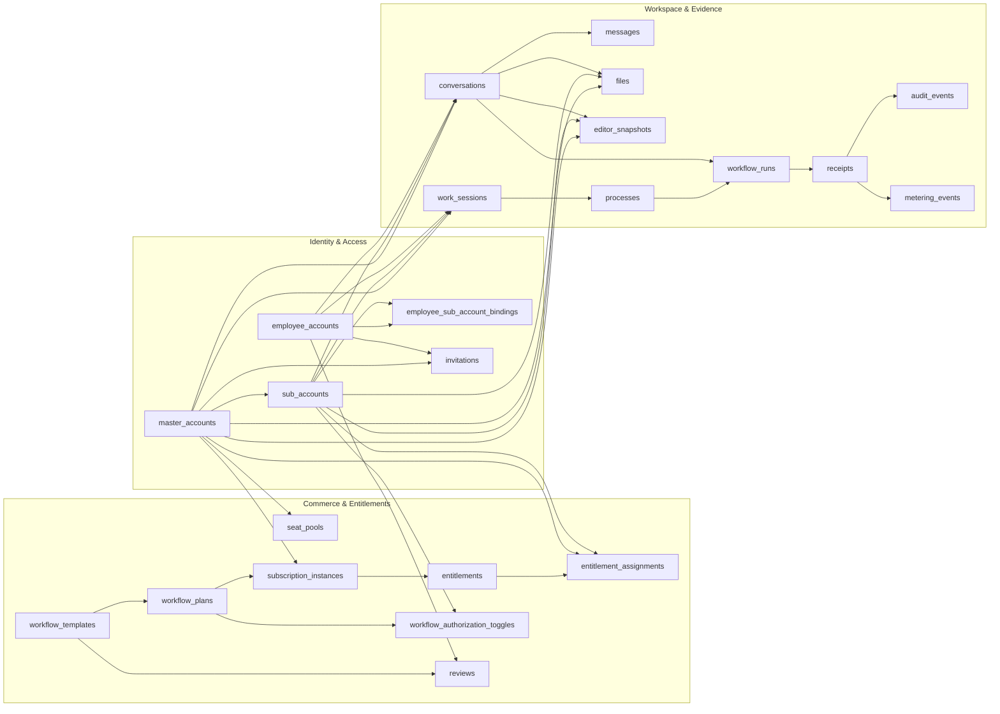
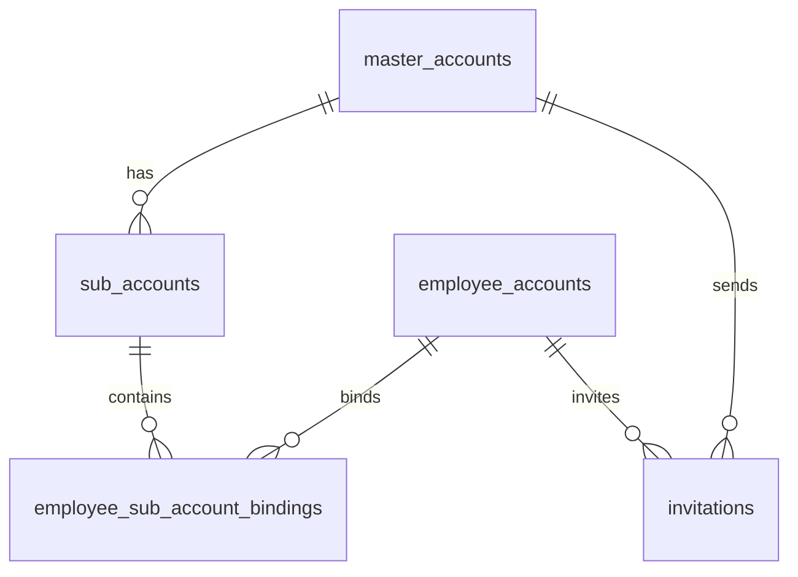
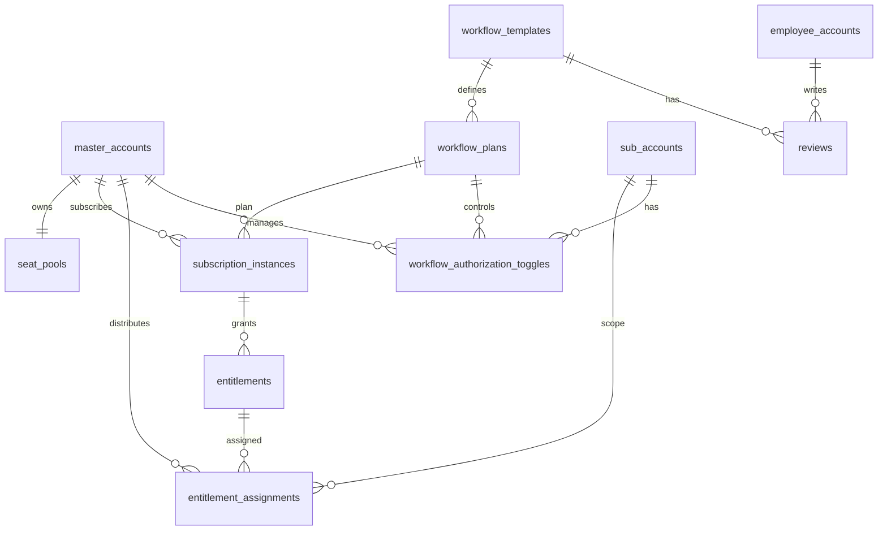
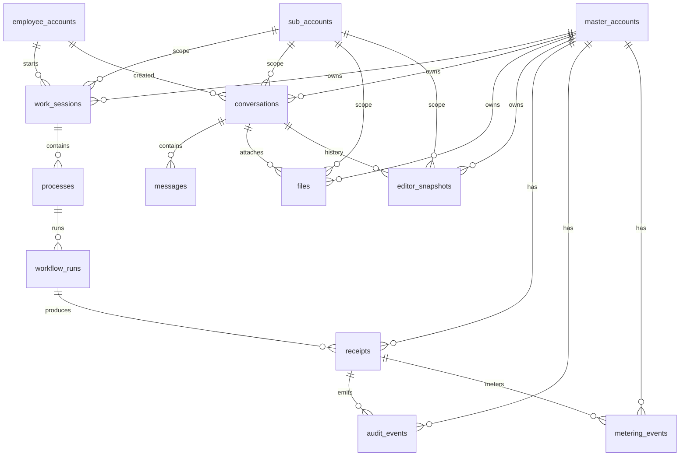

# 数据库设计与数据模型 (Database Design & Data Models)
文档版本：v3.2 (Golden Master - User Experience Optimized)  
最后修改日期：2026-02-01 
作者：Billow  
相关文档：
- `docs/technical/architecture/fullstack-architecture.md` (V2.3)
文档目的：本文档定义 Orbitaskflow 数据持久化层的唯一事实来源（SSOT），覆盖核心实体/表结构、数据隔离策略、索引性能要点与关键 JSON Schema，用于指导实现、联调与审计回溯。
---
## 1. 设计原则 (Design Principles)

1. **Master Account First（主账号优先）**: 几乎所有业务表（**除 employee_accounts 与平台级公共目录表（如 workflow_templates）/系统配置外**）必须包含 master_account_id 字段。这是实现数据隔离（Logical Isolation）和未来行级安全（RLS）的基础。
2. **Identity Separation (身份分离)**: 区分“自然人” (employee_accounts) 和“企业成员” (employee_sub_account_bindings)。一个自然人可以归属于多个主账号。  
3. **Write-Optimized (写优化)**: 对于高频统计数据（如 ROI），避免实时聚合大表，采用预聚合表 (analytics\_daily\_usage)。  
4. **Traceability (可追溯性)**: 核心执行记录必须包含配置快照、输入输出及错误信息，确保审计可复现。
5. **Graph as Derived（Ontology / Knowledge Graph 为派生层）**: 本文件的 ER/表结构定义的是 Postgres 事实层（SSOT）。Ontology/Knowledge Graph 为派生投影（Derived Projection），可重建/可回放/可版本化，且不得作为权限裁决或事实唯一来源；任何写入/副作用必须落 receipts 并联动 audit_events / metering_events。
6. **Schema Hardening (结构固化)**: 对于 JSONB 字段，必须在文档层面定义严格的 Schema，防止结构漂移。  
7. **Audit & Compliance (审计合规)**: 所有敏感的管理操作和资源消耗必须有据可查。
8. **Status over Nullable Time (状态明确性)**: 用明确的 `status` 字段表达生命周期，不依赖多个可空时间字段来“猜状态”（例如：`subscription_instances / workflow_runs / async_tasks / receipts`）。

## 2. 实体关系图 (ER Diagram)
### **全局概览**


#### **identity&Access**


### **Commerce&Entitlements**

### **Workspace & Evidence**

说明：本章 ER 图描述 **事实层（关系模型）** 的实体与约束；Ontology / Knowledge Graph 的 schema 以 **Object View / Link View** 形式从事实层派生（vNext），不改变事实层 SoT。
### 2.1 Ontology（派生层）最小落地形态（vNext）

- **Object View（对象视图）**：统一对象表示（对象态 + derived_attributes），用于 grounding 与语义检索。
  - 最小要求：每个对象视图必须携带 `master_account_id`，并可选携带 `sub_account_id` 以支持范围隔离。

- **Link View（关系视图）**：统一关系表示（最小等价为关系表/视图），用于图遍历与关联检索。
  - 最小等价结构（示意）：
    - `object_link(master_account_id, sub_account_id?, src_object_id, link_type, dst_object_id, attrs_jsonb?, provenance_jsonb?)`
  - provenance（溯源）最小要求（示意）：
    - `trace_id` / `workflow_run_id` / `source_refs`（如表/行/文件/版本号），用于重建、回放与审计对齐。

## 3. 详细表结构设计 (Schema Definitions)

### 3.1 身份与主账号隔离模块 (Identity & Master Account Isolation)

此模块实现了 B2B 组织架构的核心。

* **master_accounts (主账号表)**  
  * **职责**: 代表一家企业或组织实体。  
  * id: UUID (PK)  
  * name: VARCHAR(255)  
  * slug: VARCHAR(50) (Unique, 用于子域名或 URL 标识)  
  * plan\_tier: VARCHAR(20) (Check: 'free', 'pro', 'enterprise'; Default: 'free')  
    * **说明**: 仅控制**平台级基础能力**（如：存储空间、成员上限、SSO支持）。  
    * **注意**: plan_tier 不控制具体工作流/Agent 的使用权限；权限由 seat_pools + subscription_instances + entitlements/entitlement_assignments + workflow_authorization_toggles 共同决定。 
  * created\_at: TIMESTAMPTZ
* **master_account_quotas (主账号配额表) [NEW]**
  * **职责**: 实现 Resource Governance，精确控制主账号的资源使用上限（架构 V3.8 要求）。
  * id: UUID (PK)
  * master_account_id: UUID (FK -> master_accounts.id, Indexed)
  * resource_type: VARCHAR(50) (Check: 'llm_tokens_monthly', 'storage_gb', 'seat_count')
  * limit_value: BIGINT (Default: -1)
    * **语义规范 [CRITICAL]**:
      * `-1`: **Unlimited (无限制)**。应用层计算百分比时需特殊处理（分母视为无穷大）。
      * `0`: **Blocked (无配额)**。该主账号禁止使用此资源。
      * `> 0`: **Specific Limit (具体额度)**。
  * used_value: BIGINT (Default: 0, 持久化快照，实时值可能在 Redis)
  * reset_period: VARCHAR(20) (Check: 'monthly', 'never', 'daily')
  * last_reset_at: TIMESTAMPTZ
  * updated_at: TIMESTAMPTZ
  * **Constraint**: Unique(master_account_id, resource_type) 
* **employee_accounts (自然人表)**  
  * **职责**: 存储全局唯一的登录凭证。不包含任何主账号特定的业务数据。  
  * id: UUID (PK)  
  * email: CITEXT (Unique)  
  * password\_hash: VARCHAR(255) (Bcrypt)  
  * full\_name: VARCHAR(255) (支持长国际化姓名)  
  * avatar\_url: TEXT  
  * **settings: JSONB (Default: {}) \[NEW\]**  
    * **说明**: 存储用户个性化偏好（如主题、语言、通知开关）。详细定义见第 7 节。  
  * **is\_password\_reset\_required: BOOLEAN (Default: false)**  
    * **说明**: 安全策略字段。如果为 true，用户登录后必须立即重置密码。用于“批量导入”或“管理员重置密码”场景。  
  * **last\_active\_master\_account\_id: UUID (FK \-\> master_accounts.id, Nullable)**  
    * **说明**: 记录用户上次活跃的主账号，用于登录后自动跳转。若为空，前端应展示“选择主账号”页面。  
  * **created\_at: TIMESTAMPTZ \[NEW\]**  
* **sub_accounts (部门表 / 子账号)**  
  * **职责**: 主账号内的**扁平化**业务单元（对应 PRD 中的“子账号”），作为\*\*“数字工位”\*\*承载资源分配和资产归属。AI Native 企业通常采用扁平协作，不强调复杂的树状科层制。  
  * id: UUID (PK)  
  * master\_account\_id: UUID (FK \-\> master_accounts.id, Indexed) **\[Isolation Root\]**  
  * name: VARCHAR(100)  
  * **created\_at: TIMESTAMPTZ \[NEW\]**  
* **employee_sub_account_bindings (成员关系表)**  
  * **职责**: 连接“自然人（employee_accounts）”与“主账号/子账号（master_accounts/sub_accounts）”，承载成员角色与状态，用于 B2B 权限与组织范围治理。
  * id: UUID (PK)  
  * master\_account\_id: UUID (FK \-\> master_accounts.id)  
  * employee\_account\_id: UUID (FK \-\> employee_accounts.id)  
  * sub_account\_id: UUID (FK \-\> sub_accounts.id, Nullable)  
  * role: VARCHAR(20) (Check: 'owner', 'admin', 'member')  
  * **status: VARCHAR(20) (Check: 'active', 'disabled'; Default: 'active')**  
    * **说明**: 支持“离职/禁用”场景。禁用后，用户即使密码正确也无法进入该主账号，但历史数据（如分配记录）依然保留。  
  * **Constraint**: Unique(master_account_id, employee_account_id, sub_account_id)  
  * **created\_at: TIMESTAMPTZ \[NEW\]** (即入职时间)  
* **invitations (邀请表) \[NEW\]**  
  * **职责**: 管理 B2B 成员邀请流程，支持“未注册先邀请”。  
  * token: VARCHAR(64) (PK, Secure Random)  
  * master\_account\_id: UUID (FK \-\> master_accounts.id, Indexed)  
  * email: CITEXT (Indexed)  
  * role: VARCHAR(20) ('admin', 'member')  
  * inviter\_employee\_account\_id: UUID (FK \-\> employee_accounts.id)  
  * status: VARCHAR(20) (Check: 'pending', 'accepted', 'expired')  
  * expires\_at: TIMESTAMPTZ  
  * created\_at: TIMESTAMPTZ  
* **system\_audit\_logs (系统审计日志表) \[NEW\]**  
  * **职责**: 记录主账号内的关键管理操作，满足企业合规需求。  
  * id: UUID (PK)  
  * master\_account\_id: UUID (FK \-\> master_accounts.id, Indexed)  
  * actor\_employee\_account\_id: UUID (FK \-\> employee_accounts.id)  
  * action: VARCHAR(50) (e.g., 'member.update\_role', 'billing.update')  
  * target\_resource: VARCHAR(100) (e.g., 'membership:uuid')  
  * changes: JSONB (记录变更前后的 Diff)  
  * ip\_address: INET  
  * created\_at: TIMESTAMPTZ

### 3.2 资产与许可模块 (Assets & Licensing)

此模块支持“企业买单，按需分配”的 B2B 商业模式。**这是权限控制的核心。**

* **workflow\_templates (工作流/商品表)**  
  * **职责**: 定义市场中的 Agent 商品信息，以及 ROI 计算基准。  
  * id: UUID (PK)  
  * slug: VARCHAR(50) (Unique, e.g., 'contract-review-v1')  
  * name: VARCHAR(255)  
  * description: TEXT  
  * avatar\_url: TEXT (Icon)  
  * provider: VARCHAR(50) (e.g., 'system', 'coze')  
  * is\_public: BOOLEAN (Default: true)  
  * price\_per\_seat: DECIMAL(10, 2\) (Display only)  
  * **category: VARCHAR(50) (Indexed) \[NEW\]**  
    * **说明**: 市场分类，如 'legal', 'marketing', 'coding'。  
  * **tags: TEXT\[\] (GIN Indexed) \[NEW\]**  
    * **说明**: 搜索关键词标签，如 \['contract', 'review', 'pdf'\]。  
  * **rating\_avg: DECIMAL(3, 2\) (Default: 0.00) \[NEW\]**  
    * **说明**: 评分均值冗余字段，用于排序。  
  * **rating\_count: INT (Default: 0\) \[NEW\]**  
    * **说明**: 评价数量冗余字段。  
  * **meta: JSONB** (详细定义见第 7 节)
   * io_schema: JSONB
    * **说明**: 描述该 workflow 的输入/输出结构（JSON Schema），用于前端表单生成、参数校验与工具调用约束。
    * **示例**:
      ```json
      {
        "input": {
          "type": "object",
          "properties": {
            "pdf_url": { "type": "string" }
          }
        },
        "output": {
          "type": "object",
          "properties": {
            "summary": { "type": "string" }
          }
        }
      }
      ```  
  * created\_at: TIMESTAMPTZ  
* **reviews (市场评价表) [NEW]**
  * **职责**: 记录用户对 Agent 的评价，构建信任体系。
  * id: UUID (PK)
  * workflow_template_id: UUID (FK -> workflow_templates.id, Indexed)
  * employee_account_id: UUID (FK -> employee_accounts.id, Indexed)
  * rating: INT (Check: 1-5)
  * comment: TEXT (Nullable)
  * created_at: TIMESTAMPTZ
  * **Constraint**: Unique(workflow_template_id, employee_account_id)  (每个用户对每个 Agent 只能评一次) 
* **subscriptions (订阅订单表)**
  * **职责**: 记录主账号与支付平台“订阅对象”的映射与关键状态（如 Stripe Subscription），用于 Webhook 回调关联、对账与权限判定。
  * id: UUID (PK)
  * master_account_id: UUID (FK -> master_accounts.id, Indexed) **[Mandatory]**

  * **provider: VARCHAR(20) (Check: 'stripe'; Default: 'stripe') [NEW]**
    * **说明**: 支付平台标识；为后续多支付渠道预留（即使当前只接 Stripe）。

  * **external_id: VARCHAR(100) (Indexed, Nullable)**
    * **说明**: 支付平台的 Subscription ID（如 `sub_...`），Webhook 回调的主关联键。
  * **Constraint: Unique(provider, external_id)**
    * **说明**: `external_id` 可在“本地先建单/尚未创建平台订阅”阶段为 NULL；PostgreSQL 的 UNIQUE 对 NULL 的行为需注意（可多条 NULL）。

  * **external_customer_id: VARCHAR(100) (Indexed, Nullable) [NEW]**
    * **说明**: 支付平台 Customer ID（如 `cus_...`），便于按 customer 回溯/对账。
  * **status: VARCHAR(20) (Check: 'incomplete','incomplete_expired','trialing','active','past_due','canceled','unpaid','paused')**
    * **说明**: 对齐 Stripe 订阅状态，用于“是否应提供服务”的核心判定（尤其 `past_due/unpaid/paused` 等）。

  * **collection_method: VARCHAR(20) (Check: 'charge_automatically','send_invoice'; Nullable) [NEW]**
    * **说明**: Stripe 订阅收款方式（自动扣款/发票）。

  * current_period_start: TIMESTAMPTZ (Nullable) **[NEW]**
  * current_period_end: TIMESTAMPTZ (Nullable)
    * **说明**: 计费周期边界（Webhook 同步的关键字段）。
  * cancel_at_period_end: BOOLEAN (Default: false) **[NEW]**
  * cancel_at: TIMESTAMPTZ (Nullable) **[NEW]**
  * canceled_at: TIMESTAMPTZ (Nullable) **[NEW]**
    * **说明**: 取消策略/取消时间点，避免“已设定期末取消”与“已取消”语义混淆。
  * raw_payload: JSONB (Nullable) **[NEW]**
    * **说明**: 可选保存最近一次同步的订阅对象（用于排障与审计回放；不作为事实来源）。
  * created_at: TIMESTAMPTZ **[NEW]**
  * updated_at: TIMESTAMPTZ **[NEW]**
* **seat_pools (席位名额池表)**
  * **职责**: 以“主账号/主账号”为维度维护席位总量（不对子账号切分数量）。
  * id: UUID (PK)
  * master_account_id: UUID (FK -> master_accounts.id, Indexed)
  * total_seats: INT
  * updated_at: TIMESTAMPTZ
  * **Constraint**: Unique(master_account_id)

* **workflow_plans (工作流方案表)**
  * **职责**: 定义可订阅的方案（对齐 [TERM-IA-015] 工作流方案）。
  * id: UUID (PK)
  * workflow_template_id: UUID (FK -> workflow_templates.id, Indexed)
  * plan_code: VARCHAR(50) (Unique)
  * pricing_meta: JSONB
  * created_at: TIMESTAMPTZ

* **subscription_instances (订阅实例表)**
  * **职责**: 记录主账号对某工作流方案的“生效订阅实例”（对齐 [TERM-IA-016] 订阅实例）；用于权限判定与计费态追溯。
  * id: UUID (PK)
  * master_account_id: UUID (FK -> master_accounts.id, Indexed) **[Mandatory]**
  * workflow_plan_id: UUID (FK -> workflow_plans.id, Indexed) **[Mandatory]**
  * subscription_id: UUID (FK -> subscriptions.id, Nullable, Indexed) **[NEW]**
    * **说明**: 关联支付平台订阅对象（如 Stripe Subscription）的本地记录；允许在“未完成对接/异步补齐”阶段为 NULL。

  * status: VARCHAR(20) (Check: 'active', 'paused', 'canceled', 'expired')
  * started_at: TIMESTAMPTZ
  * ended_at: TIMESTAMPTZ (Nullable)
  * created_at: TIMESTAMPTZ

  * **Constraint**: Unique(master_account_id, workflow_plan_id) WHERE status = 'active'
    * **说明**: 用 **Partial Unique Index** 实现“同一主账号 + 同一 plan 同时最多 1 条 active”，但允许保留多条历史 `canceled/expired` 记录。

* **entitlements (授权额度表)**
  * **职责**: 订阅带来的“可用额度/能力包”（对齐 [TERM-IA-018] 授权额度）。
  * id: UUID (PK)
  * master_account_id: UUID (FK -> master_accounts.id, Indexed)
  * subscription_instance_id: UUID (FK -> subscription_instances.id, Indexed)
  * resource_type: VARCHAR(50)  -- 例如: seat, llm_tokens, runs, storage
  * limit_value: BIGINT
  * period: VARCHAR(20) ('monthly','never','daily')
  * status: VARCHAR(20) ('active','expired','revoked')
  * created_at: TIMESTAMPTZ

* **entitlement_assignments (授权分发表)**
  * **职责**: 将授权额度分发到“主账号范围”或“子账号范围”（对齐 [TERM-IA-017] 授权分发）。
  * id: UUID (PK)
  * master_account_id: UUID (FK -> master_accounts.id, Indexed)
  * entitlement_id: UUID (FK -> entitlements.id, Indexed)
  * scope: VARCHAR(20) (Check: 'master','sub_account')  -- 或 master/sub_account
  * sub_account_id: UUID (FK -> sub_accounts.id, Nullable)
  * assigned_value: BIGINT (Nullable)            -- 若你们坚持“只开关不切分”，则该字段可为空或固定为 -1
  * status: VARCHAR(20) ('active','revoked','expired')
  * created_at: TIMESTAMPTZ
  * **Constraint**: Unique(entitlement_id, scope, sub_account_id)

* **workflow_authorization_toggles (工作流授权开关表)**
  * **职责**: 对子账号启用/禁用某工作流方案（不切分席位数量）。
  * id: UUID (PK)
  * master_account_id: UUID (FK -> master_accounts.id, Indexed)
  * sub_account_id: UUID (FK -> sub_accounts.id, Indexed)
  * workflow_plan_id: UUID (FK -> workflow_plans.id, Indexed)
  * is_enabled: BOOLEAN (Default: true)
  * updated_at: TIMESTAMPTZ
  * **Constraint**: Unique(master_account_id, sub_account_id, workflow_plan_id)


### 3.3 核心交互模块 (Core Interaction)

支持 Generative UI 和编辑器协同的核心业务数据。
* **conversations (会话表)**
  * **职责**: 存储对话元数据。
  * id: UUID (PK)
  * master_account_id: UUID (FK -> master_accounts.id, Indexed) **[Mandatory]**
  * sub_account_id: UUID (FK -> sub_accounts.id, Indexed) **[Mandatory]**
  * employee_account_id: UUID (FK -> employee_accounts.id, Indexed)
  * workflow_template_id: UUID (FK -> workflow_templates.id, Indexed)
  * title: VARCHAR(255)
  * mode: VARCHAR(20) (Check: 'standard', 'temporary'; Default: 'standard')
    * **说明**: 区分普通对话与“临时/无痕模式”对话 (PRD-02)。
  * visibility: VARCHAR(20) (Check: 'private','team'; Default: 'private')
  * last_message_at: TIMESTAMPTZ (Sort Key)
  * archived_at: TIMESTAMPTZ (Soft Delete)
  * created_at: TIMESTAMPTZ
* **messages (消息表)**
  * **职责**: 存储聊天记录，支持 Generative UI 的意图存储。
  * id: UUID (PK)
  * master_account_id: UUID (FK -> master_accounts.id, Indexed) **[Data Isolation]**
  * sub_account_id: UUID (FK -> sub_accounts.id, Indexed) **[Data Isolation]** **[NEW]**
    * **说明**: 写入时从 `conversations.sub_account_id` 复制（denormalize）；用于减少高频查询 join 成本，并降低 Hard Filter 漏用风险。
  * conversation_id: UUID (FK -> conversations.id, Indexed)
  * role: VARCHAR(10) (Check: 'user', 'assistant', 'system')
  * content: TEXT (Markdown)
  * ui_intent: JSONB (存储 Generative UI 的组件指令, 详细定义见第 7 节)
  * metadata: JSONB **[NEW]**
    * **说明**: 存储思维链 (Thoughts)、引用来源 (Citations) 等结构化数据。详细定义见第 7 节。
  * feedback: JSONB (Nullable) **[NEW]**
    * **说明**: 用户对该消息的点赞/点踩及评论，用于 RLHF。
  * safety_status: VARCHAR(20) (Check: 'pass', 'blocked', 'flagged'; Default: 'pass') **[NEW]**
    * **说明**: 内容安全拦截状态 (Arch V3.8 Guardrails)。
  * safety_reasons: TEXT[] (Nullable) **[NEW]**
    * **说明**: 触发的安全策略标签，如 ['political_sensitive']。
  * pinned_at: TIMESTAMPTZ (Nullable) **[NEW]**
    * **说明**: 如果不为空，表示该消息被置顶。用于 PRD-02 “User can pin messages” 功能。
  * created_at: TIMESTAMPTZ
* **files (文件元数据表)**
  * **职责**: 统一管理所有上传文件及生成文件，支撑 PRD 02 的附件栏和 PRD 04 的导出。
  * id: UUID (PK)
  * master_account_id: UUID (FK -> master_accounts.id, Indexed) **[Mandatory]**
  * sub_account_id: UUID (FK -> sub_accounts.id, Indexed) **[Mandatory]**
  * uploader_employee_account_id: UUID (FK -> employee_accounts.id, Indexed)
  * conversation_id: UUID (FK -> conversations.id, Nullable, Indexed)
  * filename: VARCHAR(255)
  * storage_key: TEXT (S3/MinIO Path)
  * mime_type: VARCHAR(100)
  * size_bytes: BIGINT
  * status: VARCHAR(20) (Check: 'uploading', 'ready', 'error')
  * created_at: TIMESTAMPTZ 
* **notifications (异步通知表) \[NEW\]**  
  * **职责**: 存储系统发送给用户的异步通知（如“任务完成”、“收到邀请”），支持离线消息。  
  * id: UUID (PK)  
  * master\_account\_id: UUID (FK \-\> master_accounts.id, Indexed)  
  * employee\_account\_id: UUID (FK \-\> employee_accounts.id, Indexed)  
  * type: VARCHAR(50) (e.g., 'workflow.completed', 'invite.received')  
  * data: JSONB (跳转链接、预览文本等)  
  * is\_read: BOOLEAN (Default: false)  
  * created\_at: TIMESTAMPTZ  
* **editor\_snapshots (智能编辑器快照表)**  
  * **职责**: 支持文档协同的乐观锁和版本回溯。  
  * id: UUID (PK)  
  * master\_account\_id: UUID (FK, Indexed) **\[Data Isolation\]**
  * sub\_account\_id: UUID (FK -> sub\_accounts.id, Indexed)  
  * conversation\_id: UUID (FK)  
  * version: INT (Incrementing)  
  * content: TEXT (Full Snapshot)  
  * patch: JSONB (Optional, delta from prev version)  
  * modified\_by: UUID (User ID or System Agent ID)  
  * created\_at: TIMESTAMPTZ (Version Timestamp)

### 3.3.1 work_sessions（工作会话表）
- **职责**: 对应 SSOT 的“工作会话”，作为对话资产与执行链路的顶层容器。
- id: UUID (PK)
- master_account_id: UUID (FK -> master_accounts.id, Indexed) **[Mandatory]**
- sub_account_id: UUID (FK -> sub_accounts.id, Indexed) **[Mandatory]**
- employee_account_id: UUID (FK -> employee_accounts.id, Indexed)
- status: VARCHAR(20) (Check: 'active','archived'; Default: 'active')
- created_at: TIMESTAMPTZ
- archived_at: TIMESTAMPTZ (Nullable)

### 3.3.2 processes（进程表）
- **职责**: 对应 SSOT 的“进程”，一个工作会话包含 N 个进程（并行/串行步骤）。
- id: UUID (PK)
- master_account_id: UUID (FK -> master_accounts.id, Indexed) **[Mandatory]**
- sub_account_id: UUID (FK -> sub_accounts.id, Indexed) **[Mandatory]**
- work_session_id: UUID (FK -> work_sessions.id, Indexed)
- type: VARCHAR(50) (e.g., 'chat','workflow','toolchain')
- status: VARCHAR(20) (Check: 'created','running','suspended','completed','failed','cancelled')
- created_at: TIMESTAMPTZ
- finished_at: TIMESTAMPTZ (Nullable)

### 3.4 统计与审计模块 (Analytics & Audit)
* **workflow_runs (执行流水表)**
  * **职责**: 记录每一次 Agent 执行的详细状态。
  * id: UUID (PK)
  * master_account_id: UUID (FK -> master_accounts.id, Indexed) **[Mandatory]**
  * sub_account_id: UUID (FK -> sub_accounts.id, Nullable, Indexed)
  * work_session_id: UUID (FK -> work_sessions.id, Indexed)
  * process_id: UUID (FK -> processes.id, Indexed)
  * employee_account_id: UUID (FK -> employee_accounts.id, Indexed)
  * workflow_template_id: UUID (FK -> workflow_templates.id, Indexed)
  * workflow_plan_id: UUID (FK -> workflow_plans.id, Nullable, Indexed)
  * subscription_instance_id: UUID (FK -> subscription_instances.id, Nullable, Indexed)
  * status: VARCHAR(20) (Check: 'created','running','suspended','completed','failed','cancelled')
  * duration_ms: INT
  * time_saved_seconds: DECIMAL(10, 2)
  * cost_usd: DECIMAL(10, 4) **[NEW]**
    * **说明**: 本次执行的估算成本（基于 Token 用量）。
  * usage_metrics: JSONB **[NEW]**
    * **说明**: Token 消耗明细（prompt_tokens, completion_tokens, model_name）。
  * error_message: TEXT (Nullable) **[NEW]**
    * **说明**: 记录执行失败的具体原因（如 \"LLM Timeout\", \"Quota Exceeded\"）。
  * inputs: JSONB (Nullable) **[NEW]**
    * **说明**: 执行时的输入参数快照，用于审计回溯。
  * outputs: JSONB (Nullable) **[NEW]**
    * **说明**: 执行成功后的输出结果快照。
  * workflow_snapshot: JSONB (Nullable)
    * **说明**: 记录任务执行时 Agent 的关键配置（如 Prompt Version、Model Name），用于审计回溯与结果解释。
  * created_at: TIMESTAMPTZ
  * finished_at: TIMESTAMPTZ
* **async_tasks (异步任务审计表)**
    * **职责**: 持久化记录长时任务（耗时 > 5s）的执行状态与结果，弥补 Redis 数据易丢失的问题，提供任务可观测性。
    * id: UUID (PK)
    * **job_id: VARCHAR(64) (Indexed, Unique)**
        * **说明**: 对应 Arq/Redis 中的 Task ID，用于关联查询。
    * master_account_id: UUID (FK -> master_accounts.id, Indexed)
    * created_by: UUID (FK -> employee_accounts.id, Nullable)
        * **说明**: 触发任务的操作员（系统自动任务可为空）。
    * type: VARCHAR(50) (e.g., 'rag.index_document', 'batch.csv_inference')
    * **status: VARCHAR(20) (Check: 'pending', 'processing', 'completed', 'failed', 'cancelled','suspended')**
    * progress: INT (Default: 0, 0-100)
        * **说明**: 用于前端进度条轮询。
    * **payload: JSONB**
        * **说明**: 任务的输入参数快照（如文件路径、配置参数）。
    * **result: JSONB (Nullable)**
        * **说明**: 任务成功后的结构化输出（如生成的 Artifact ID）。
    * error: TEXT (Nullable)
        * **说明**: 堆栈追踪或错误摘要。
    * created_at: TIMESTAMPTZ
    * started_at: TIMESTAMPTZ
    * finished_at: TIMESTAMPTZ
    * **Index**: idx_async_tasks_master_status
      * **Definition**: CREATE INDEX ON async_tasks (master_account_id, status, created_at DESC);
* **analytics_daily_usage (每日用量聚合表)**
  * **职责**: 存储预计算的 ROI 数据，支持快速报表。
  * id: UUID (PK)
  * master_account_id: UUID (FK -> master_accounts.id, Indexed) **[Mandatory]**
  * sub_account_id: UUID (FK -> sub_accounts.id, Nullable, Indexed)
  * workflow_template_id: UUID (FK -> workflow_templates.id, Indexed)
  * date: DATE (e.g., '2024-01-01')
  * total_runs: INT (Counter)
  * total_duration_seconds: BIGINT (Counter)
  * estimated_time_saved: DECIMAL(10, 2) (Counter)
  * total_cost_usd: DECIMAL(10, 4) (Counter) **[NEW]**
  * **Constraint**: Unique(master_account_id, sub_account_id, workflow_template_id, date)  -> 用于 INSERT ON CONFLICT UPDATE。
* **receipts (副作用回执表 / Append-only)**
  * **职责**: 记录每一次对外部世界产生影响（或被拦截）的“回执”，形成可追溯证据链（Egress/Side-effect Gateway 的落库）。
  * id: UUID (PK)
  * master\_account\_id: UUID (FK -> master\_accounts.id, Indexed)
  * sub\_account\_id: UUID (Nullable)                  -- 若当前阶段未落子账号，可先保留 Nullable
  * job\_id: VARCHAR(64) (Nullable, Indexed)            -- 对应 async\_tasks.job\_id / worker job
  * workflow\_run\_id: UUID (Nullable, FK -> workflow\_runs.id, Indexed)
  * trace\_id: VARCHAR(64) (Indexed)                    -- 或 traceparent
  * status: VARCHAR(20) (Check: 'started','succeeded','failed','denied','cancelled')
  * reason\_code: VARCHAR(50) (Nullable)                -- 例如 quota\_exceeded / policy\_denied
  * result\_summary: TEXT (Nullable)
  * metering\_hint: JSONB (Nullable)                    -- 计量提示（如 token 数、模型名）
  * created\_at: TIMESTAMPTZ

* **audit\_events (审计事件表)**
  * **职责**: 记录“谁在什么上下文下，对什么资源做了什么动作，策略如何决策”，用于合规审计与追责。
  * id: UUID (PK)
  * master\_account\_id: UUID (FK -> master\_accounts.id, Indexed)
  * sub\_account\_id: UUID (Nullable)
  * actor\_principal\_id: UUID (Nullable)               -- 员工账号/数字员工/系统主体（建议统一 principal 口径）
  * action: VARCHAR(100)
  * target\_resource: VARCHAR(200)
  * decision: VARCHAR(10) (Check: 'allow','deny')
  * policy\_ref: VARCHAR(200) (Nullable)
  * trace\_id: VARCHAR(64) (Indexed)
  * receipt\_id: UUID (Nullable, FK -> receipts.id, Indexed)
  * created\_at: TIMESTAMPTZ

* **metering\_events (计量事件表)**
  * **职责**: 记录可计费/可扣额度的资源消耗（token、运行次数、存储等），用于计费/额度扣减与对账。
  * id: UUID (PK)
  * master\_account\_id: UUID (FK -> master\_accounts.id, Indexed)
  * sub\_account\_id: UUID (Nullable)
  * subscription\_instance\_id: UUID (Nullable, FK -> subscription\_instances.id)  -- 若你们已落地 subscription\_instances
  * resource\_type: VARCHAR(50)                          -- e.g. llm\_tokens, runs, storage\_bytes
  * quantity: BIGINT
  * trace\_id: VARCHAR(64) (Indexed)
  * receipt\_id: UUID (Nullable, FK -> receipts.id, Indexed)
  * created\_at: TIMESTAMPTZ

### 3.5 Ontology / SOR（最小语义对象模型，MVP）

说明：SOR 是 Control Plane 的“语义类型注册表”，用于统一 Object Type / Action Type / Link Type 的 key、版本与 schema 口径。
要求：append-only 版本化、可审计、可缓存；读写受 policy_check 保护（fail-closed）；变更可触发 outbox/事件（事件口径见 interaction-protocol.md）。

* **sor_object_types（SOR：对象类型 / Append-only）**
  * **职责**：注册并版本化 Object Type（type_key + schema），为 ObjectRef / Object View 提供稳定类型锚点。
  * id: UUID (PK)
  * master_account_id: UUID (FK -> master_accounts.id, Indexed)
  * type_key: VARCHAR(100) (Indexed)                 -- 稳定 key（如 "contract"）
  * version: INT                                     -- 单调递增；append-only
  * status: VARCHAR(20) (Check: 'active','deprecated','disabled')
  * schema: JSONB                                    -- 属性定义、类型、约束（受控 JSON schema 子集）
  * etag: VARCHAR(64)                                -- schema 摘要（如 sha256），用于缓存/条件请求
  * created_by: UUID (Nullable, FK -> employee_accounts.id)
  * created_at: TIMESTAMPTZ
  * **Constraint**: Unique(master_account_id, type_key, version)
  * **Index**: idx_sor_object_types_master_key_status
    * **Definition**: `CREATE INDEX ON sor_object_types (master_account_id, type_key, status, version DESC);`

* **sor_action_types（SOR：动作类型 / Append-only）**
  * **职责**：注册并版本化 Action Type（action_key + 输入输出 schema + 副作用治理引用）。
  * id: UUID (PK)
  * master_account_id: UUID (FK -> master_accounts.id, Indexed)
  * action_key: VARCHAR(100) (Indexed)               -- 稳定 key（如 "send_email"）
  * version: INT
  * status: VARCHAR(20) (Check: 'active','deprecated','disabled')
  * input_schema: JSONB
  * output_schema: JSONB (Nullable)
  * side_effect_profile_key: VARCHAR(100)            -- 引用 sor_side_effect_profiles.profile_key
  * etag: VARCHAR(64)
  * created_by: UUID (Nullable, FK -> employee_accounts.id)
  * created_at: TIMESTAMPTZ
  * **Constraint**: Unique(master_account_id, action_key, version)
  * **Index**: idx_sor_action_types_master_key_status
    * **Definition**: `CREATE INDEX ON sor_action_types (master_account_id, action_key, status, version DESC);`

* **sor_link_types（SOR：关系类型 / Append-only）**
  * **职责**：注册并版本化 Link Type（link_key + src/dst 约束 + 边属性 schema）。
  * id: UUID (PK)
  * master_account_id: UUID (FK -> master_accounts.id, Indexed)
  * link_key: VARCHAR(100) (Indexed)                 -- 稳定 key（如 "customer_contract"）
  * version: INT
  * status: VARCHAR(20) (Check: 'active','deprecated','disabled')
  * src_type_key: VARCHAR(100)
  * dst_type_key: VARCHAR(100)
  * cardinality: VARCHAR(20) (Nullable)              -- 可选：'1:1','1:n','n:n'
  * edge_schema: JSONB (Nullable)
  * etag: VARCHAR(64)
  * created_by: UUID (Nullable, FK -> employee_accounts.id)
  * created_at: TIMESTAMPTZ
  * **Constraint**: Unique(master_account_id, link_key, version)

* **sor_side_effect_profiles（副作用档案 / Controlled）**
  * **职责**：为 Action Type 提供统一副作用治理画像，供 Side-effect Gateway 与 PDP/PEP 做默认裁决与义务（obligations）下发。
  * id: UUID (PK)
  * master_account_id: UUID (FK -> master_accounts.id, Indexed)
  * profile_key: VARCHAR(100) (Indexed)              -- 稳定 key
  * risk_level: VARCHAR(20) (Check: 'low','medium','high','critical')
  * requires_human_review: BOOLEAN (Default false)
  * requires_idempotency_key: BOOLEAN (Default true)
  * obligations: JSONB (Nullable)                    -- 例如二次确认、字段脱敏、限额、审批链路等
  * created_by: UUID (Nullable, FK -> employee_accounts.id)
  * created_at: TIMESTAMPTZ
  * **Constraint**: Unique(master_account_id, profile_key)

### 3.6 基础设施模块 (Infrastructure \- Flexible)

支持“有 Redis”和“无 Redis”两种运行模式的平滑切换。

* **sessions (会话持久化表)**  
  * **职责**:  
    * **Standard Mode**: Redis Session 的持久化备份（Cold Backup），用于 Redis 故障恢复。  
    * **Lite Mode**: 主 Session 存储。  
  * token: VARCHAR(64) (PK)  
  * employee\_account\_id: UUID (FK)  
  * master\_account\_id: UUID (FK)  
  * data: JSONB (存储 UserAgent, IP, LoginTime 等)  
  * expires\_at: TIMESTAMPTZ (Indexed for cleanup)  
  * **created\_at: TIMESTAMPTZ \[NEW\]**  
* **system\_locks (分布式锁表)**  
  * **职责**:  
    * **Standard Mode**: 可选。用于审计长时间持有的锁或作为 Redis 锁的兜底。  
    * **Lite Mode**: 主锁机制（利用行锁实现）。  
  * key: VARCHAR(255) (PK, e.g., "lock:editor:{conv\_id}")  
  * holder\_id: VARCHAR(255) (Request ID / Worker ID / Hostname)  
  * expires\_at: TIMESTAMPTZ  
  * **created\_at: TIMESTAMPTZ \[NEW\]**

## 4. 数据隔离策略 (Isolation Policy)

### 4.1 强制不变量 (Mandatory Invariants)

- **所有业务表必须包含 `master_account_id`**（FK -> `master_accounts.id`），并作为 RLS/Hard Filter 的第一层隔离键。

- **子账号范围（sub-account scope）用 `sub_account_id` 表达即可**（FK -> `sub_accounts.id`）：
  - `sub_account_id IS NULL` 表示 **master scope**（归属主账号，不归属某个子账号）。
  - `sub_account_id IS NOT NULL` 表示 **sub_account scope**（归属某个子账号）。
  - **不强制要求所有表都额外携带 `scope` 字段**；`scope` 在需要表达“同一表同时承载两种范围且业务逻辑强依赖显式枚举”时才引入。

- **如果某张表确实需要显式 `scope` 字段**（例如出于业务语义/审计展示/兼容历史）：
  - 必须加一致性约束（示意）：
    - `CHECK ((scope='master' AND sub_account_id IS NULL) OR (scope='sub_account' AND sub_account_id IS NOT NULL))`

- **禁止使用 `ROOT_SUB_ACCOUNT_ID` 作为“主账号范围”的占位**：
  - 统一使用 `sub_account_id = NULL` 表示 master scope，避免引入伪实体与外键/唯一约束复杂度。

- **平台级公共目录表可例外**：
  - 如 `workflow_templates` 等“全局目录/产品目录”可不包含 `master_account_id`（它们不承载主账号业务数据，仅做全局唯一与可检索）。


### 4.2 Postgres RLS 默认开启 (DB-enforced Isolation)

- 对核心对象表默认开启 RLS（至少包含：对话资产、交付物、工作流实例、订阅实例、授权分发/额度、审计/计量事件）。
- 服务端**必须**在每次事务内 `SET LOCAL` 主账号边界键上下文（避免连接池污染），并作为 RLS 策略的唯一取值来源：
  - `SET LOCAL app.master_account_id = '<uuid>';`
  - `SET LOCAL app.sub_account_id = '<uuid_or_empty>';`（无子账号上下文时用空串 `''`，而不是 NULL）
- RLS policy（示意）必须引用 `current_setting()`：
  - `master_account_id = current_setting('app.master_account_id')::uuid`
  - 子账号过滤按业务选择：
    - 仅 sub scope：`sub_account_id = NULLIF(current_setting('app.sub_account_id', true), '')::uuid`
    - master+sub 兼容：按表的 scope 规则组合（见 4.1 不变量）
- 违反上述约束（未 SET LOCAL / 直接拼接 where 条件）视为 P0 缺陷：会导致跨请求串号与审计证据链不可信。

### 4.3 检索与向量召回硬过滤 (Hard Filter)

- 向量记录必须包含 `master_account_id` 与可选 `sub_account_id` 元数据。
- 召回必须 hard filter：`master_account_id = ? AND (sub_account_id IN ?)`。

## 5. 迁移指南 (Migration Guide)

1. **DDL**: 创建所有新表。  
2. **Backfill**: 为现有数据填充 master\_account\_id。  
3. **Constraints**: 启用 NOT NULL 约束。

## 6. 关键索引与性能优化 (Indexing & Performance)

为了保证 SaaS 平台在百万级数据量下的响应速度，必须强制实施以下复合索引策略。

### 6.1 会话列表 (Conversation List)

* **场景**: 用户进入工作区，加载左侧会话历史，按时间倒序。  
* **Index**: idx\_conversations\_master_account\_last\_msg  
* **Definition**: CREATE INDEX ON conversations (master\_account\_id, last\_message\_at DESC);  
* **说明**: 覆盖了最核心的高频读路径，避免全表扫描。

### 6.2 消息流 (Message Stream)

* **场景**: 点击某个会话，加载历史消息。  
* **Index**: idx\_messages\_conversation\_created  
* **Definition**: CREATE INDEX ON messages (conversation\_id, created\_at ASC);  
* **说明**: 确保消息按时间顺序快速提取。

### 6.3 报表统计 (Analytics)

* **场景**: "Insights" 面板查询过去 30 天的 ROI。  
* **Index**: idx\_analytics\_master_account\_date  
* **Definition**: CREATE INDEX ON analytics\_daily\_usage (master\_account\_id, date);  
* **说明**: 支持范围查询 WHERE master\_account\_id \= ? AND date BETWEEN ? AND ?。

### 6.4 市场搜索 (Marketplace Search)

* **场景**: 用户搜索 Agent，如 "contract review"。  
* **Index**: idx\_workflow\_templates\_tags  
* **Definition**: CREATE INDEX ON workflow\_templates USING GIN (tags);  
* **说明**: 利用 GIN 索引加速数组包含查询 (@\>)。
### 6.5 资源配额检查 (Quota Check)

* **场景**: API 网关鉴权时检查主账号是否超额。
* **Index**: idx_master_account_quotas_lookup
* **Definition**: CREATE INDEX ON master_account_quotas (master_account_id, resource_type);

### 6.6 授权开关与额度分发的鉴权与审计 (Authorization Toggle & Entitlement Audit)

* **场景**:
    1. 高频：判断某 sub_account 是否启用了某 workflow_plan（is_enabled=true）。
    2. 中频：查询某主账号的订阅实例是否 active。
    3. 低频：审计 entitlement_assignments 的历史变更。

* **Index A (Toggle Check)**: `idx_workflow_toggles_lookup`
    * **Definition**: `CREATE INDEX ON workflow_authorization_toggles (master_account_id, sub_account_id, workflow_plan_id) WHERE is_enabled = true;`

* **Index B (Active Subscriptions)**: idx_subscription_instances_active
    * **Definition**: CREATE UNIQUE INDEX ON subscription_instances (master_account_id, workflow_plan_id) WHERE status = 'active';

* **Index C (Entitlement Audit)**: `idx_entitlement_assignments_audit`
    * **Definition**: `CREATE INDEX ON entitlement_assignments (entitlement_id, created_at DESC);`

### 6.7 证据链查询 (Receipt/Audit/Metering)

目标：支持两类高频检索  
1) **精确回溯**：按 `trace_id`/`workflow_run_id` 把一次执行的证据链串起来；  
2) **列表与分页**：按 `master_account_id`（可选 `sub_account_id`）按时间倒序浏览最近记录。  
说明：不同查询模式通常需要不同索引；多列索引的有效性依赖“前导列匹配”等规则。

* **Index A (Trace 追踪)**: idx_receipts_master_account_trace
  * **Definition**: `CREATE INDEX ON receipts (master_account_id, trace_id);`
  * **典型查询**:
    * `WHERE master_account_id = ? AND trace_id = ?`

* **Index B (按执行追溯)**: idx_receipts_run
  * **Definition**: `CREATE INDEX ON receipts (workflow_run_id, created_at DESC);`
  * **典型查询**:
    * `WHERE workflow_run_id = ? ORDER BY created_at DESC`

* **Index C (审计检索)**: idx_audit_events_master_account_time
  * **Definition**: `CREATE INDEX ON audit_events (master_account_id, created_at DESC);`
  * **典型查询**:
    * `WHERE master_account_id = ? ORDER BY created_at DESC LIMIT ?`

* **Index D (计量对账)**: idx_metering_events_master_account_time
  * **Definition**: `CREATE INDEX ON metering_events (master_account_id, created_at DESC);`
  * **典型查询**:
    * `WHERE master_account_id = ? AND created_at >= ? AND created_at < ? ORDER BY created_at DESC`

---

#### 可选增强（按 sub_account 范围分页 / 最近 N 条）
当你们在 UI/运营侧经常需要“**某个 sub_account 内的最近 receipts / audit / metering**”时，建议**新增**以下索引（不替换 A-D）：

* **Index E (Receipt 子账号时间线)**: idx_receipts_master_sub_time
  * **Definition**: `CREATE INDEX ON receipts (master_account_id, sub_account_id, created_at DESC);`
  * **典型查询**:
    * `WHERE master_account_id = ? AND sub_account_id = ? ORDER BY created_at DESC LIMIT ?`

* **Index F (Audit 子账号时间线)**: idx_audit_events_master_sub_time
  * **Definition**: `CREATE INDEX ON audit_events (master_account_id, sub_account_id, created_at DESC);`

* **Index G (Metering 子账号时间线)**: idx_metering_events_master_sub_time
  * **Definition**: `CREATE INDEX ON metering_events (master_account_id, sub_account_id, created_at DESC);`

备注：PostgreSQL 的 B-tree 索引可以反向扫描来满足 `ORDER BY ... DESC`，很多情况下不必为了 DESC 单独建“单列倒序索引”。这里在复合索引里写 `created_at DESC` 的主要价值是**表达意图**（倒序分页），是否必须可由实现/压测决定。

---

#### 可选增强（只索引“常查子集”的 Partial Index）
如果审计/计量存在明显的“高频子集”（例如只看 `status='denied'` 或只看某类 `event_type`），可用 **Partial Index** 减小索引体积与写入成本:

- 示例（仅示意，按你们字段为准）：
  - `CREATE INDEX ON audit_events (master_account_id, created_at DESC) WHERE action = 'deny';`


## 7. 核心 JSON Schema 定义 (Core JSON Schemas)

为了防止前后端对 JSONB 字段的理解偏差，在此固化核心 Schema。

### 7.1 UI Intent (Generative UI)

* **Field**: messages.ui\_intent  
* **Type**: Object | null  
* **Description**: 驱动前端动态渲染交互组件的指令集。

interface UIIntent {  
  // 组件类型，映射到前端组件库 (e.g., 'BarChart', 'ApprovalCard')  
  component: string;  
    
  // 组件所需的 Props 数据  
  props: Record\<string, any\>;  
    
  // 当客户端不支持该组件时的降级文本展示  
  fallback\_text: string;  
    
  // 交互 ID，用于追踪组件内的用户操作（如点击“批准”按钮）  
  interaction\_id?: string;  
}

### 7.2 Workflow Meta (商品配置)

* **Field**: workflow\_templates.meta  
* **Type**: Object  
* **Description**: 定义 Agent 的业务属性和 UI 表现。

interface WorkflowMeta {  
  // 核心 ROI 指标：每次执行平均节省工时（小时）  
  standard\_time\_saved: number;  
    
  // 市场卡片 UI 配置  
  ui\_config: {  
    color: string;      // 主题色 Hex  
    icon\_style?: string; // 图标风格  
    tags?: string\[\];    // 前端展示标签（不同于数据库搜索标签）  
  };  
    
  // 执行配置（透传给 Agent Bridge）  
  execution\_config?: {  
    model\_preference?: string; // e.g., "gpt-4"  
    timeout\_seconds?: number;  
    max\_retries?: number;  
  };  
}

### 7.3 Message Metadata (思维链与引用)

* **Field**: messages.metadata  
* **Type**: Object  
* **Description**: 存储 Agent 内部思维过程和外部来源引用，用于前端可折叠展示。

interface MessageMetadata {  
  // 思维链 (CoT) 过程  
  thoughts?: {  
    tool\_name?: string;     // e.g., "web\_search"  
    thought\_text: string;   // "正在分析合同条款..."  
    input?: string;         // 工具调用参数快照  
    output?: string;        // 工具返回结果摘要  
    duration\_ms?: number;  
  }\[\];

  // 引用来源  
  citations?: {  
    title: string;  
    url?: string;  
    snippet?: string;       // 引用片段  
    source\_index: number;   // 对应 Markdown 中的 \[1\]  
  }\[\];  
}

### 7.4 User Settings (用户偏好设置)

* **Field**: employee_accounts.settings  
* **Type**: Object  
* **Description**: 存储用户的 UI 偏好和通知配置。

interface EmployeeAccountSettings {  
  theme: 'light' | 'dark' | 'system';  
  locale: string; // e.g., 'zh-CN'  
  notifications: {  
    email\_digest: boolean;  
    browser\_push: boolean;  
  };  
  // 前端交互偏好  
  preferences?: {  
    composer\_mode?: 'compact' | 'expanded';  
    show\_cot?: boolean; // 是否默认展开思维链  
  };  
}  
