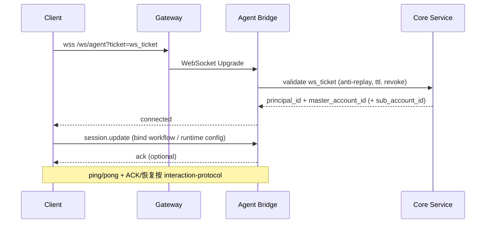
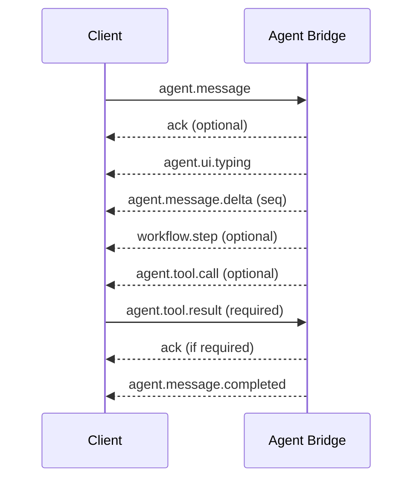
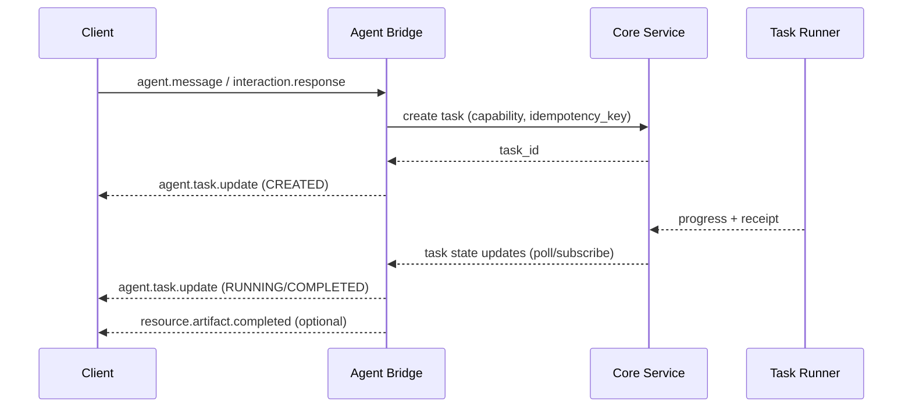

# Agent Bridge 服务实现说明（agent-bridge-impl.md）

文档版本：v0.1（Draft）  
最后修改日期：2026-02-01  
文档所有者：TBD  
建议存放路径：`docs/technical/services/agent-bridge-impl.md`

相关文档（按 docs-map 注册表路径）：
- `docs/docs-map.md`
- `docs/standards/doc-guidelines.md`
- `docs/standards/ssot-glossary.md`
- `docs/standards/api-style-guide.md`
- `docs/standards/tech-design-template.md`

关联 PRD（L1）：
- `docs/features/prd-workspace.md`
- `docs/features/prd-marketplace.md`
- `docs/features/prd-identity-access.md`
- `docs/features/prd-insights.md`

关联 L2 契约 / 协议 SSOT：
- `docs/technical/protocols/agent-interface-spec.md`
- `docs/technical/protocols/interaction-protocol.md`

关联架构/设计文档：
- `docs/technical/architecture/fullstack-architecture.md`
- `docs/technical/ops/nginx-gateway-arch.md`
- `docs/technical/services/core-service.md`
- `docs/technical/services/agent-bridge.md`（如存在：规格/设计文档）

文档层级：L4（实现层）——不得重新定义产品语言；必须遵循 SSOT 术语与 L1/L2 契约。

---

## 1. 背景与范围（Context & Scope）
### 1.1 背景
Agent Bridge 是执行面（Python）在“实时交互通道”上的承载服务：它以 `interaction-protocol.md` 的 WebSocket 信封与可靠性约束为唯一语义来源，面向工作台（Frontend）提供稳定的双向事件流，并把上游交互请求桥接到执行面 runtime/worker。

在产品交互上，用户通过 [TERM-WS-004]超级输入框 在某个 [TERM-WS-013]工作会话 中发起任务；系统可在同一 [TERM-WS-013]工作会话 内启动/管理 0..N 个 [TERM-WS-002]进程，并在 [TERM-WS-003]虚拟文件系统 中读写制品与中间资产。Agent Bridge 的职责是把这些“交互与执行”拆分为：
- **在线交互**：承载 WebSocket 会话、事件编解码、断线恢复、ACK/去重、流式增量。
- **异步投递**：对长时任务只做规范化与转交；任务创建与入队的权威入口在控制面（Go Core Service），Agent Bridge 不作为任务创建的权威入口。

在身份与治理上，Agent Bridge 作为交互入口侧的 [TERM-IA-032]策略执行点（PEP-Interactive），必须在握手阶段从一次性 `ticket` 中恢复并绑定 [TERM-IA-035]主账号边界键（`master_account_id` + 可选 `sub_account_id`）与主体信息（`principal_id`），并在关键入口按需触发控制面 [TERM-IA-031]策略决策点（PDP）裁决。客户端不得伪造或覆盖上述字段；如需出现在事件信封中，仅允许由服务端回填到 `control`。

在可追溯性上，所有拒绝/失败必须携带 [TERM-G-013]拒绝原因码（`reason_code`），并进入审计与 [TERM-G-011]回执链路；链路标识必须携带并传播 [TERM-G-012]追踪上下文（W3C Trace Context）。

在可靠性上，Agent Bridge 必须支持：断线重连、按游标补拉、关键事件 ACK、去重重放与背压控制；所有细节以 `interaction-protocol.md` 第 2/4/5 章为准，本文仅描述实现层如何落地这些约束。

### 1.2 设计范围（In Scope）
- Agent Bridge 的职责边界与与 Gateway/Core Service/执行面的分工
- 会话与流式通道管理（连接、断线重连、ACK、背压），以 `interaction-protocol.md` 为准
- 北向请求与 run/task 的映射与编排（不改变业务事实来源）
- 与 Core Service、存储、可观测系统的集成点（metrics/logs/traces/audit hook）
- 必要的安全控制与 fail-closed 行为（不绕过策略）

### 1.3 非目标（Out of Scope）
- 重新定义任何 SSOT 术语（必须引用 `ssot-glossary.md`）
- 新增/更改 canonical 事件名或 schema（必须遵循 `interaction-protocol.md`）
- 定义产品 UX 或验收标准（属于 L1 PRD）
- 替代 Core Service 成为业务对象的权威持久化来源

### 1.4 依赖（Dependencies）
- 上游依赖：Gateway、Core Service、Identity & Access、Marketplace（按 PRD/L2 口径）
- 下游依赖：Execution Plane（Agent runtime/worker/queue）、artifact store、cache、observability

---

## 2. 目标与验收（Goals & Acceptance）
### 2.1 目标
- G1：在既定协议下稳定承载 run 的流式交互（连接/重连/ACK/背压），对上游提供一致行为
- G2：在不越权的前提下完成北向请求到执行面动作的映射，并可观测、可审计

### 2.2 非功能目标（NFR）
- 性能：P95 延迟、并发连接数、事件吞吐（TBD）
- 可靠性：断线重连与幂等、可恢复性（TBD）
- 安全与合规：隔离上下文必带、策略 fail-closed、审计挂钩（TBD）

### 2.3 验收口径（可测试）
- AC1：按 `interaction-protocol.md` 的重连/ACK 规则，在断线场景下无越权与无语义漂移
- AC2：错误对外呈现符合 `api-style-guide.md`（REST：RFC 7807 + `reason_code`；流式：canonical error events）

---

## 3. 总体设计（High-level Design）
### 3.1 架构位置与边界
- 所属层级：位于 Edge（Gateway）与 Execution Plane 之间的服务层桥接组件
- 边界：
  - 负责：连接与会话管理、协议编解码、事件转发、执行面调度适配
  - 不负责：业务事实写入与权威持久化（归 Core Service）、计费逻辑（归 Marketplace/Policy）

### 3.2 关键不变量（Invariants）
- 隔离上下文：请求必须携带并校验[TERM-IA-001]主账号/[TERM-IA-002]子账号等隔离上下文；缺失或不一致必须 fail-closed
- 策略执行：策略最终裁决归 Core Service/Policy；Agent Bridge 仅作为 PEP 挂钩点（不绕过）
- 副作用与回执：如产生外部副作用/制品写入，必须可追溯并具备幂等与回执语义（按 L2 定义）

### 3.3 拓扑与数据流（概览）

#### 3.3.1 拓扑
- Client（Workspace Web）通过 Gateway（Nginx）建立 WebSocket，升级并转发到 Agent Bridge。
- Agent Bridge 与控制面（Go Core Service）进行：票据校验、策略裁决、任务创建/查询、[TERM-G-011]回执回写等交互。
- 执行面异步任务由 Task Runner（Arq + Redis Streams）承载；Agent Bridge 仅负责转交与订阅状态变化，并以事件推送给 Client。

#### 3.3.2 WebSocket 握手与上下文绑定
实现必须遵循 `interaction-protocol.md` §2（Transport Entry Points & Handshake）。Agent Bridge 在握手阶段的最小实现要求：

1) **票据校验**：对 `ticket` 做一次性校验（anti-replay + TTL），并向控制面请求验证其归属、撤销状态与最小权限范围。
2) **上下文恢复并绑定**：从票据恢复并绑定 [TERM-IA-035]主账号边界键（`master_account_id` + 可选 `sub_account_id`）与主体标识（`principal_id`）。
3) **回填控制字段**：如需在事件信封 `control` 中出现上述字段，只允许由服务端回填；客户端不得伪造或覆盖。
4) **会话业务绑定延后**：禁止在握手 URL 上混入 `agent_id` / `target_agent_id` 等业务选择参数；业务绑定、工作流选择与运行配置通过连接建立后的 `session.update` 完成（见 `interaction-protocol.md` §3.2.2：`session.update`）。
5) **心跳与空闲**：按 `interaction-protocol.md` 的应用层心跳约定实现：`ping`（见 `interaction-protocol.md` §3.2.2：`ping`）与 `pong`（见 `interaction-protocol.md` §3.2.1：`pong`）；空闲关闭必须给出可归因的关闭原因，便于客户端按指数退避重连。
6) **断线恢复入口**：重连后，服务端必须按 `interaction-protocol.md` §4～§5 提供 ACK/去重/补拉语义（`ack` 事件见 `interaction-protocol.md` §3.2.1/§3.2.2：`ack`）；Agent Bridge 至少需要向客户端暴露“可恢复”的最小状态（例如服务端已确认的最后提交点/水位），并在需要时引导客户端走 HTTP 兜底补齐历史。

#### 3.3.3 在线交互循环
在线交互必须严格复用 `interaction-protocol.md` §3.2 的 canonical 事件类型，不得自造新事件名。Agent Bridge 的最小闭环如下：
- **用户输入**：Client 发送 `agent.message`（见 `interaction-protocol.md` §3.2.2：`agent.message`；`agent-interface-spec.md` §2.1），可带 `file_id`/`artifact_id` 引用；服务端将其绑定到当前 `control.session_id`（可选 `control.task_id`；Envelope 见 `interaction-protocol.md` §3.1）。
- **流式输出**：服务端可下发 `agent.ui.typing`（见 `interaction-protocol.md` §3.2.1：`agent.ui.typing`），并以 `agent.message.delta`（见 `interaction-protocol.md` §3.2.1：`agent.message.delta`）逐段推送；达到提交点时下发 `agent.message.completed`（见 `interaction-protocol.md` §3.2.1：`agent.message.completed`）。
- **工具调用**：服务端下发 `agent.tool.call`（见 `interaction-protocol.md` §3.2.1：`agent.tool.call`；对应 `tool_call` 语义 Part 见 `agent-interface-spec.md` §2.2.5；是否需要 ACK 以 L2 Registry 的 ACK 列为准），客户端回传 `agent.tool.result`（见 `interaction-protocol.md` §3.2.2：`agent.tool.result`；对应 `tool_result` 语义 Part 见 `agent-interface-spec.md` §2.2.6）；必要时双方在关键提交点使用 `ack`（见 `interaction-protocol.md` §3.2.1/§3.2.2：`ack`）进行确认与去重。
- **打断/取消**：客户端使用 `agent.interrupt`（见 `interaction-protocol.md` §3.2.2：`agent.interrupt`）请求打断生成或取消 Task；Agent Bridge 必须将其映射为执行面取消信号，并保证幂等（重复取消不应导致状态漂移）。

#### 3.3.4 异步任务投递与状态推送
对于耗时操作（例如 RAG ingestion、批量文档分析、批量导出等），Agent Bridge 必须遵循“异步提交 + 状态查询/推送”的默认口径（事件：`agent.task.update`，见 `interaction-protocol.md` §3.2.1：`agent.task.update`；Task 语义见 `agent-interface-spec.md` §2.3.1）。
- **权威入口**：任务创建与入队由控制面负责；Agent Bridge 仅负责参数规范化与转交，并携带 [TERM-IA-030]能力令牌、`idempotency_key`（若语义契约要求）、[TERM-G-012]追踪上下文。
- **对外状态机**：对外只使用 `agent.task.update`（见 `interaction-protocol.md` §3.2.1：`agent.task.update`） 统一 Task 状态机；不得把内部 job 状态直接暴露为协议语义。
- **恢复与对账**：重连后，客户端可通过 HTTP 兜底补齐历史，并使用 `notification.event`（见 `interaction-protocol.md` §3.2.1）做轻量通知；Agent Bridge 侧不得以“仅凭本地内存状态”给出完成结论。

#### 3.3.5 [TERM-G-011]回执 与审计链路
- **回写路径**：Agent Bridge 只负责生成/收集执行结果，并通过控制面回写 [TERM-G-011]回执（append-only）；不得绕过控制面直接写入业务事实表。
- **一致性提交点**：对外以 `agent.message.completed`（见 `interaction-protocol.md` §3.2.1）、`resource.artifact.completed`（见 `interaction-protocol.md` §3.2.1）等协议提交点作为 UI 更新的依据；当回执回写失败或不确定时，必须通过 `error`（见 `interaction-protocol.md` §3.2.1）或任务状态体现“未达成提交点”，禁止在未持久化前向客户端宣称成功。
- **可追溯与归因**：每条事件必须携带并透传 [TERM-G-012]追踪上下文（W3C Trace Context）。所有拒绝/失败必须给出 [TERM-G-013]拒绝原因码（`reason_code`）并进入审计链路。回执必须能关联到 [TERM-WS-013]工作会话、`session_id`、`task_id`（如存在）、以及 [TERM-IA-035]主账号边界键；并记录关键外部依赖调用结果（例如控制面裁决、执行面完成信号）。

## 4. 接口与协议（APIs & Protocols）
### 4.1 对外入口与路由
- 北向入口（Client/Gateway-facing）：
  - WebSocket：`/ws/agent`（见 `api-style-guide.md` 路由拓扑）；事件信封、事件类型与可靠性语义必须遵循 `interaction-protocol.md`。
  - HTTP（兼容/辅助）：`/api/v{N}/agent/*`（见 `api-style-guide.md` 路由拓扑），用于 SSE fallback、只读补拉、长时任务管理等；字段命名与错误结构必须遵循 `api-style-guide.md`。

### 4.2 请求/响应与错误语义
- REST：统一使用 RFC 7807 Problem Details，并在扩展字段中携带 [TERM-G-013]拒绝原因码（`reason_code`）。
- 流式：统一使用 `interaction-protocol.md` 约定的事件信封与 `error`（见 `interaction-protocol.md` §3.2.1：`error`） 事件；不得以 HTTP 状态码替代流式错误语义。
- 幂等：当交互语义落到 L2 预留的 `action.submit.requested`（见 `interaction-protocol.md` §3.2.2（Reserved）：`action.submit.requested`）等“带副作用的动作提交”链路时，必须携带并校验 `idempotency_key`（以 `interaction-protocol.md` / `agent-interface-spec.md` 的定义为准）。对其他非副作用请求，`idempotency_key` 属于实现层**建议**能力，用于提高重试安全性；不得在未被 L2 契约要求的场景强行把它作为客户端必填。对重连与重发必须通过 ACK/去重策略避免重复执行。

### 4.3 事件（流式）落地约束
- 事件类型：仅允许使用 `interaction-protocol.md` §3.2（Event Type Registry）中的 canonical event types（例如：
  - `agent.message.delta`（见 `interaction-protocol.md` §3.2.1：`agent.message.delta`）/`agent.message.completed`（见 `interaction-protocol.md` §3.2.1：`agent.message.completed`）
  - `agent.tool.call`（见 `interaction-protocol.md` §3.2.1：`agent.tool.call`）/ `agent.tool.result`（见 `interaction-protocol.md` §3.2.2：`agent.tool.result`）
  - `agent.task.update`（见 `interaction-protocol.md` §3.2.1：`agent.task.update`）
  - `resource.artifact.completed`（见 `interaction-protocol.md` §3.2.1：`resource.artifact.completed`）
  - `ack`（见 `interaction-protocol.md` §3.2.1/§3.2.2：`ack`）。
- 兼容策略：如需兼容 legacy alias，只能由 Agent Bridge 内部做映射；对外输出必须是 canonical type，且不得维护独立的 SSE 事件名集合。

## 5. 数据设计（Data Design）
### 5.1 数据对象与持久化
- SoT（权威事实）：[TERM-IA-009]对话资产、会话/工作流运行记录、权限与订阅事实等以控制面（Core Service + DB）为准。
- Agent Bridge 本地：仅允许会话态与短期缓存（如连接状态、ACK 水位），不得成为业务 SoT。

### 5.2 隔离与访问控制
- Postgres：隔离由数据层 RLS 执行；Agent Bridge 不得绕过或自造隔离概念。
- Cache/Queue：所有 key 与消息 envelope 必须携带 [TERM-IA-035]主账号边界键，避免跨域串写串读。
- 对象存储：制品路径/ACL 必须体现隔离边界；大文件默认使用预签名直传，WS/事件中只传引用（如 `file_id` / `artifact_id`），不得内联二进制正文。

### 5.3 迁移与兼容
- 引入新的缓存键/连接状态字段时，必须提供可回滚策略，并确保升级过程中不会导致 ACK/去重语义失效。

## 6. 安全、策略与治理（Security / Policy / Governance）
### 6.1 鉴权与上下文
- Agent Bridge 在交互入口侧作为 [TERM-IA-032]策略执行点：必须校验握手票据并绑定 [TERM-IA-035]主账号边界键与主体信息；缺失或不一致必须 fail-closed。
- 每个关键动作（任务创建、动作提交、敏感工具调用）必须进行能力/策略校验：优先用 [TERM-IA-030]能力令牌，不可判定时调用 [TERM-IA-031]策略决策点获取裁决。

### 6.2 Licensing/Quota 与订阅口径
- [TERM-IA-016]订阅实例 / [TERM-IA-018]授权额度 的判定与扣减以控制面/Marketplace 为准；Agent Bridge 不做权威扣减，只执行“阻断/放行/提示”与审计。

### 6.3 外部出站与副作用
- 当执行面需要访问外部工具/插件时，必须经由 [TERM-G-009]出站网关 与 [TERM-G-010]副作用网关 的既定口径进行 allowlist/deny-by-default 控制；Agent Bridge 只负责把出站意图按 L2 契约转交到网关层，不得直连外网绕过策略。
- 对副作用型动作：当通过 L2 预留的 `action.submit.requested`（见 `interaction-protocol.md` §3.2.2（Reserved）：`action.submit.requested`）等“动作提交”链路发起时，必须携带 `idempotency_key`，并遵循失败补偿或回滚语义（以 L2 契约为准）。若不走该链路，`idempotency_key` 为实现层建议能力，用于降低重试的副作用风险，但不得改变 L2 语义定义。

### 6.4 审计/计量与回执
- 审计：关键动作、策略拒绝、异常中止必须可审计；字段口径与脱敏规则以治理 SSOT 为准。
- 计量：如涉及计量事件，Agent Bridge 仅作为事件生产者/转发者；计量口径与落库位置以计量 SSOT 为准。
- [TERM-G-011]回执：回执必须 append-only，可追溯到会话与任务；对外是否推送 `receipt.created`（见 `interaction-protocol.md` §3.2.1 Reserved）以 `interaction-protocol.md` 预留事件为准（如未启用则不推送）。

## 7. 可观测与运维（Observability & Ops）
### 7.1 Trace 传播
- HTTP/WS/异步链路均需透传 [TERM-G-012]追踪上下文（W3C Trace Context），并在日志与指标中可关联到 `session_id` / `task_id`（如存在）。

### 7.2 指标与日志
- 最小指标：连接数、事件吞吐、重连次数、ACK 延迟、错误率、背压触发次数。
- 结构化日志：必须包含 [TERM-G-012]追踪上下文、[TERM-IA-035]主账号边界键、`session_id`、`task_id`（如存在）；不得记录敏感明文（按脱敏与数据分级要求）。

### 7.3 运行手册（Runbook）
- 常见告警：连接数异常、重连风暴、ACK 延迟升高、事件堆积、执行面不可用、策略裁决超时。
- 定位顺序：Gateway → Agent Bridge → 控制面裁决/任务创建 → 执行面 → 结果回写。
- 降级手段：只读降级（禁用卡片回传/工具调用/打断）、限流、背压参数收紧、SSE fallback。
  - **SSE fallback 能力边界**：仅允许覆盖“只读/通知/任务状态”子集（例如：`notification.event`（见 `interaction-protocol.md` §3.2.1）、`agent.task.update`（见 `interaction-protocol.md` §3.2.1）、`resource.artifact.completed`（见 `interaction-protocol.md` §3.2.1）等；SSE 兼容层约束见 `interaction-protocol.md` §2.2）；不支持 `interaction.card.render`（见 `interaction-protocol.md` §3.2.1）、`agent.tool.call`（见 `interaction-protocol.md` §3.2.1）/`agent.tool.result`（见 `interaction-protocol.md` §3.2.2）、`agent.interrupt`（见 `interaction-protocol.md` §3.2.2）等需要双向交互或可打断闭环的能力。

## 8. 发布与演进（Rollout & Evolution）
### 8.1 发布计划
- 灰度策略、回滚策略、协议兼容测试门禁（以发布流程文档为准）。

### 8.2 兼容与弃用
- 协议/字段兼容遵循 L2 口径；新增字段必须向后兼容，弃用字段需给出迁移窗口。

## 9. 风险、权衡与备选方案（Risks & Alternatives）
- 风险清单：执行面不可用、长连接资源压力、背压策略不当、策略挂钩点遗漏、回执回写不一致。
- 关键权衡：
  - WS 与执行面通信方式（直连 vs 通过控制面/消息总线）。
  - 会话态存储位置（内存 vs Redis 等外部状态）。
  - 制品传输方式（对象存储引用为主，WS 分片仅用于小制品）。

## 10. 开放问题（Open Questions）
- Q1：南向接口（Execution Plane-facing）的最终传输方式与约束（HTTP/WS/gRPC/Queue）。
- Q2：制品（artifact store）与回执（receipt）契约的最小集合以及测试门禁。
- Q3：多 Region 路由与代理行为的统一约束（如适用）。

## 附录 A：相关变更清单（Checklist）
- 是否新增/更新 ADR：是/否（ADR-xxx）
- 是否变更协议 SSOT：是/否（`interaction-protocol.md` / `agent-interface-spec.md`）
- 是否变更数据 SSOT：是/否（如有：`database-design.md`）
- 是否需要新 [TERM-G-013]拒绝原因码：是/否（需登记于错误注册表）
- 是否引入新的 capability scope：是/否（需登记并可撤销）
- 是否新增外部出站目标：是/否（需更新 allowlist/策略）
- 是否新增/变更审计/计量/receipt 口径：是/否

## 附录 B：版本历史（Changelog）
| 版本 | 日期 | 修改人 | 变更摘要 |
|---|---|---|---|
| v0.1 | 2026-02-01 | <Name/Team> | 初始版本（框架骨架 + 关键流程落地约束） |

## 附录 C：本服务实现覆盖的 canonical 事件子集（L2 锚点导航）
本清单是 **Agent Bridge 在实现层明确承诺支持的事件子集**。事件语义与字段定义以 L2 SSOT 为准（`interaction-protocol.md` §3.2；`agent-interface-spec.md`）。

约束：本清单之外的 Registry 事件默认“不承诺支持”，避免 L4 与 L2 漂移。

| Canonical type | 方向 | L2 Anchor（事件） | 语义对象（如适用） |
|---|---|---|---|
| `session.update` | C→S | `interaction-protocol.md` §3.2.2 | - |
| `ping` | C→S | `interaction-protocol.md` §3.2.2 | - |
| `pong` | S→C | `interaction-protocol.md` §3.2.1 | - |
| `ack` | 双向 | `interaction-protocol.md` §3.2.1/§3.2.2 | - |
| `error` | S→C | `interaction-protocol.md` §3.2.1 | `agent-interface-spec.md` §2.5 |
| `agent.message` | C→S | `interaction-protocol.md` §3.2.2 | `agent-interface-spec.md` §2.1 |
| `agent.ui.typing` | S→C | `interaction-protocol.md` §3.2.1 | - |
| `agent.message.delta` | S→C | `interaction-protocol.md` §3.2.1 | - |
| `agent.message.completed` | S→C | `interaction-protocol.md` §3.2.1 | `agent-interface-spec.md` §2.1 |
| `agent.tool.call` | S→C | `interaction-protocol.md` §3.2.1 | `agent-interface-spec.md` §2.2.5 |
| `agent.tool.result` | C→S | `interaction-protocol.md` §3.2.2 | `agent-interface-spec.md` §2.2.6 |
| `agent.task.update` | S→C | `interaction-protocol.md` §3.2.1 | `agent-interface-spec.md` §2.3.1 |
| `resource.artifact.chunk` | S→C | `interaction-protocol.md` §3.2.1 | - |
| `resource.artifact.completed` | S→C | `interaction-protocol.md` §3.2.1 | `agent-interface-spec.md` §2.3.1（ArtifactRef） |
| `interaction.response` | C→S | `interaction-protocol.md` §3.2.2 | - |
| `interaction.card.render` | S→C | `interaction-protocol.md` §3.2.1 | - |
| `agent.interrupt` | C→S | `interaction-protocol.md` §3.2.2 | - |
| `notification.event` | S→C | `interaction-protocol.md` §3.2.1 | - |
| `workflow.step` | S→C | `interaction-protocol.md` §3.2.1 | - |

## 附录 D：Reason Codes 子集（只引用不自造）
列出 Agent Bridge 会用到的 [TERM-G-013]拒绝原因码子集（来源：`agent-interface-spec.md` / `api-style-guide.md`）。本节只做引用导航，不在本文新增码值。

## 附录 E：实现规格（Implementation Spec）
本附录补齐“可编码的最小规格”，目标是让实现者（含 AI）在不更改 L2/L1 语义的前提下，直接落地可运行代码。

### E.1 连接与会话状态机（Connection & Session State Machine）

#### E.1.1 内部对象模型（不对外暴露）
以下结构仅用于实现层组织代码；对外事件 Envelope 与 schema 以 `interaction-protocol.md` 为准。

- **IdentityContext**（由 ticket 解析并绑定到连接）
  - `master_account_id: string`
  - `sub_account_id?: string`
  - `principal_id: string`
  - `ticket_fingerprint: string`（建议为 `sha256(ticket)` 或服务端生成的 opaque id，用于审计定位；禁止记录明文 ticket）
  - `ticket_expires_at: string`（ISO8601 UTC，仅用于运维审计，不对外输出）
  - `capability_token?: string`（可选，不透明；若存在仅用于向下游传递）

- **ConnContext**（每条 WS 连接）
  - `conn_id: string`
  - `ws: WebSocket`
  - `connected_at: string`（ISO8601 UTC）
  - `remote_ip: string`（来自 Gateway 透传的可信头）
  - `identity: IdentityContext`
  - `session_binding: SessionBinding`（可为空，收到 `session.update` 后写入）
  - `ack: AckTracker`
  - `sendq: SendQueue`
  - `inflight_tools: Map<string, InflightToolCall>`（key 为 tool_call_id；字段来自 `agent.tool.call` 的 data 结构）
  - `task_watches: Map<string, TaskWatch>`（key 为 task_id）
  - `state: ConnState`
  - `last_pong_at: time`

- **SessionBinding**（连接级业务绑定；由 `session.update` 驱动）
  - `session_id: string`
  - `target_agent_id?: string`
  - `invocation_options?: object`（引用 `agent-interface-spec.md` §1.5/§2.3.2）
  - `session_state?: object`（引用 `agent-interface-spec.md` §1.6/§2.3.3）
  - `updated_at: time`

- **AckTracker**（应用层回执与重放窗口）
  - `delivered: RingBuffer<DeliveredEvent>`（仅缓存“需要可靠交付/可能重放”的事件；见 E.4 参数）
  - `pending_by_event_id: Map<string, PendingAck>`（仅对 Registry 标记为 Required/Recommended 的事件生效）
  - `last_client_ack_event_id?: string`（客户端最近一次确认的下行事件 id）

- **DeliveredEvent**（可重放事件缓存条目）
  - `event_id: string`（CloudEvents `id`）
  - `type: string`（CloudEvents `type`）
  - `encoded: bytes`（原始 JSON 字节串，便于原样重放）
  - `sent_at: time`
  - `requires_ack: boolean`

- **PendingAck**（等待回执的事件）
  - `event_id: string`
  - `deadline_at: time`
  - `retry_count: int`

- **SendQueue**（发送队列与背压）
  - `buffer: Queue<bytes>`
  - `buffer_bytes: int`

- **InflightToolCall**（工具调用闭环）
  - `tool_call_id: string`
  - `task_id?: string`
  - `sent_at: time`
  - `deadline_at: time`

- **TaskWatch**（任务状态订阅）
  - `task_id: string`
  - `subscribed_at: time`
  - `last_pushed_state?: string`

#### E.1.2 连接状态机（ConnState）
状态仅用于实现层；对外事件仍使用 `interaction-protocol.md` 的事件体系。

| 状态 | 进入条件 | 可接收上行 | 主要动作 | 退出条件 |
|---|---|---|---|---|
| `CONNECTED` | WS 握手完成 | `ping`（可选）、`session.update`（应拒绝，尚未鉴权） | 触发 ticket 校验 | ticket 校验成功→`AUTHENTICATED`；失败→`CLOSED` |
| `AUTHENTICATED` | 已绑定 IdentityContext | `ping`、`session.update`、`ack` | 等待/处理 `session.update` 完成业务绑定 | 收到有效 `session.update`→`BOUND` |
| `BOUND` | 已写入 SessionBinding | Registry 允许的全部上行 | 可开始创建任务/转发输入 | 开始推送输出→`ACTIVE` |
| `ACTIVE` | 正常交互期 | Registry 允许的全部上行 | 流式输出/工具闭环/任务推送/ACK | 空闲超时、显式关闭、错误→`DRAINING`/`CLOSED` |
| `DRAINING` | 进入关闭前排空 | 仅 `ack`/`ping`（可选） | 尝试发送最后错误/通知并清理资源 | 排空完成或超时→`CLOSED` |
| `CLOSED` | 连接已关闭 | 不接收 | 清理 | 终态 |

实现要求：
- **fail-closed**：ticket 校验失败、隔离上下文不一致、未知关键事件结构等，必须关闭连接或拒绝处理，并给出 `error`（如仍可发送）。
- **业务绑定延后**：任何 workflow/agent 选择与运行配置只接受来自 `session.update`（见 `interaction-protocol.md` §3.2.2：`session.update`）。

#### E.1.3 事件 control 字段强制规则
- 上行事件：若客户端携带 `control.master_account_id` / `control.sub_account_id` / `control.principal_id`，服务端必须忽略并用绑定的 IdentityContext 覆盖；若检测到与绑定值不一致，按策略 fail-closed（推荐先 `error` 再关闭）。
- 下行事件：服务端必须回填 `control.master_account_id` / `control.sub_account_id` / `control.principal_id`，并确保与绑定值一致。

---

### E.2 协议编解码与可靠性实现（Codec & Reliability）

#### E.2.1 CloudEvents 解析与最小校验
对每个入站事件（WS frame）：
1) 解析 JSON；必须具备 `specversion/id/source/type/datacontenttype/data/control`（字段名以 `interaction-protocol.md` §3.1 为准）。
2) `control.session_id` 必填；且与 SessionBinding 的 `session_id` 一致（未绑定前仅允许 `session.update` 引入绑定）。
3) `type` 必须在 `interaction-protocol.md` §3.2 Registry 中出现；不在 Registry 中的 type 一律拒绝（fail-closed）。

#### E.2.2 Trace 上下文传播
- 若入站事件带 `traceparent/tracestate`（CloudEvents extensions），必须原样透传到：
  - 同连接内的后续下行事件（优先复用最近一次有效的 trace）；
  - 向控制面/执行面发起的调用（作为链路根）；
- 若入站缺失 trace，上行到下游时由 Agent Bridge 生成新的 trace 根，并在下行事件中带回。

#### E.2.3 `agent.message.delta` 的 seq 处理
遵循 `interaction-protocol.md` §3.2.1 + §5.1：
- 对每个 `message_id` 维护 `next_seq`；收到 `data.seq == next_seq` 则应用并递增。
- 允许小窗口乱序：将未来 seq 缓存在 `out_of_order` map 中，缓存上限由 E.4 参数控制；一旦补齐即可连续应用。
- 超出窗口或长期缺失：发 `error`（`reason_code` 选用 SSOT 已定义码值）并降级为等待 `agent.message.completed` 的最终内容。

#### E.2.4 `resource.artifact.chunk` 拼装与提交点
遵循 `interaction-protocol.md` §5.2：
- 以 `artifact_id` 为 key 缓存 chunk；要求 `chunk_index/total_chunks`（字段以 L2 语义对象为准）。
- 当收齐全部 chunk 或收到 `resource.artifact.completed` 后，才允许把该制品标记为“可用提交点”。
- 超出大小/数量阈值直接拒绝并触发背压（见 E.4）。

#### E.2.5 `ack` 的最小实现约束
Registry 对 `ack` 的 Notes 指明其语义为“回执指定 `id/type`”。

- 发送侧：对 Required/Recommended 的下行事件，将 `{id, type}` 记录进 `pending_by_event_id`，并把完整 bytes 放入 `delivered` ring。
- 接收侧：收到上行 `ack` 时，从其 `data` 中读取 `id` 与 `type`（字段名以 `interaction-protocol.md` 的 Notes 为准），并从 `pending_by_event_id` 删除。
- 重发：若 `deadline_at` 超时且连接仍在 `ACTIVE`，允许重发该条缓存事件（不改变原 `id`），并增加 `retry_count`。
- 去重：客户端重发 `agent.tool.result` / `interaction.response` 等上行事件时，服务端应依据其语义对象内的稳定 id（如 `tool_call_id` / `message_id` / `task_id`）做幂等处理；不得产生重复副作用。

---

### E.3 下游适配器接口（Core Service / Execution Plane Adapters）

#### E.3.1 CoreServiceAdapter（控制面调用面）
说明：为让实现可落地，本节给出 **最小可实现接口形态**（含建议 REST 形态与字段）。若 `core-service.md` 已冻结正式路径/字段，则以其为准；若尚未冻结，本节内容应回流到 `core-service.md` 形成 L3 契约。

##### E.3.1.1 WS Ticket 校验与身份恢复
目标：握手阶段完成 anti-replay + TTL + revoke，并得到 `IdentityContext`。

数据口径来源：控制面签发 WS Ticket，并保存“一次性/撤销/过期”状态（以冻结的 `platform-core-impl.md` / `core-service.md` 为准）。

实现模式 A（默认，推荐）：通过 Core Service 校验接口
- 原则：Agent Bridge 不直接读取 Redis/DB 的票据记录；票据校验的权威归 Core Service。
- 接口建议（若 `core-service.md` 尚未冻结正式接口）：`POST /api/v{N}/ws/tickets:validate`。
- 返回：最小身份上下文（`masterAccountId`、可选 `subAccountId`、`principalId`，以及 `ticketExpiresAt`；可选透传 `capabilityToken`）。
- 行为（必须原子化）：校验存在性/过期/撤销/一次性使用，并在同一原子操作中写入“已使用”。

实现模式 B（可选）：Agent Bridge 直接校验 Redis Ticket 记录
- 仅当架构明确允许 Agent Bridge 读取 WS Ticket 的最小 Redis key 前缀、且通过安全评审时启用。
- 关键规则：存在性/过期/撤销/一次性使用判定必须原子化，避免并发重放；禁止记录明文 ticket，仅记录 `ticket_fingerprint`（建议 `sha256(ticket)`）。
- 输出：恢复并构造 `IdentityContext`。

##### E.3.1.2 任务（Task）创建、查询与状态流（Job/LRO 适配）
目标：把控制面的 Job/LRO 模型映射为对外统一的 `agent.task.update` 语义，不把内部 job 状态直接暴露为协议语义。

数据口径来源：长时操作采用异步 LRO（以冻结的 `platform-core-impl.md` / `core-service.md` 为准）。

建议 REST 形态（若 `core-service.md` 尚未固化）
- 创建：`POST /api/v{N}/jobs`（Body 至少包含 `sessionId`、`kind`、`payload`）。
- 查询：`GET /api/v{N}/jobs/{jobId}`。
- 取消：`POST /api/v{N}/jobs/{jobId}:cancel`。
- 约定：JSON 字段使用 camelCase；错误使用 RFC 7807 Problem Details（扩展字段携带 `reasonCode`）。

job → task 状态映射（对外只推 `agent.task.update`）
| 控制面 job 状态 | 对外 task 状态（`agent.task.update.data.state`） | 说明 |
|---|---|---|
| `PENDING/QUEUED` | `CREATED` | 已创建未运行 |
| `RUNNING` | `RUNNING` | 运行中，可带进度 |
| `SUCCEEDED` | `COMPLETED` | 完成 |
| `FAILED` | `FAILED` | 失败，需带 `reason_code`（取自 SSOT） |
| `CANCELLED` | `CANCELLED` | 已取消 |

状态流实现（二选一）
- 轮询：Agent Bridge 周期性调用 `GET /api/v{N}/jobs/{jobId}` 检测变化后推送 `agent.task.update`。
- 订阅（建议）：Core Service 提供 job 事件流（例如 SSE），Agent Bridge 消费后推送 `agent.task.update`。该事件流仅为内部传输，不改变对外协议。

##### E.3.1.3 回执（Receipt）追加与读取
目标：保证副作用与提交点可追溯。默认情况下，回执由执行面/副作用网关写入；Agent Bridge 仅在“由其产生的交互型回执”场景追加回执。

数据口径来源：Receipt append-only（以冻结的 `platform-core-impl.md` / `database-design.md` 为准）。

建议 REST 形态（若 `core-service.md` 尚未固化）
- 追加：`POST /api/v{N}/receipts`（Body 至少包含 `sessionId`、可选 `taskId`、`kind`、`payload`，并透传追踪上下文）。
- 查询（可选，仅用于恢复/对账）：`GET /api/v{N}/receipts?sessionId=...&taskId=...&limit=...`。

##### E.3.1.4 会话历史兜底补拉（HTTP Fallback）
目标：当 WS 恢复窗口不足或客户端丢失本地状态时，提供“只读补拉”能力以恢复 UI 视图；该能力不改变 `interaction-protocol.md` 的 WS 恢复语义。

建议 REST 形态（若 `core-service.md` 尚未固化）
- `GET /api/v{N}/sessions/{sessionId}/events?afterEventId=<id>&limit=<n>`
  - 返回：按时间顺序的 canonical CloudEvents envelopes（即 `interaction-protocol.md` §3.1 的完整结构）。
  - 访问控制：必须校验 `sessionId` 归属与隔离边界（`masterAccountId` + 可选 `subAccountId`）；越权直接拒绝（fail-closed）。
  - 过滤：仅返回该会话内允许回放的事件类型（例如 message/task/artifact/notification），不得回放敏感内部事件。

##### E.3.1.5 代码级 Adapter 接口（实现者视角）
- `ValidateWsTicket(ticket: string) -> IdentityContext`
- `PolicyCheck(ctx: IdentityContext, action: string, resource: object, context: object) -> Decision`
- `CreateTask(ctx: IdentityContext, session_id: string, input: object, idempotency_key?: string) -> {task_id: string}`
  - 备注：默认可令 `task_id == job_id`；若未来分离，两者必须在内部结构中保持映射关系。
- `GetTask(ctx: IdentityContext, task_id: string) -> AgentTask`
- `SubscribeTaskUpdates(ctx: IdentityContext, task_id: string, after_cursor?: string) -> Stream<AgentTask>`
- `AppendReceipt(ctx: IdentityContext, receipt: object) -> {receipt_id: string}`
- `FetchSessionEvents(ctx: IdentityContext, session_id: string, after_event_id?: string, limit?: int) -> List<EventEnvelope>`

强制要求：所有 adapter 调用都必须携带 trace 上下文与主账号边界键，并保证 `session_id/task_id` 归属校验（越权即 fail-closed）。

#### E.3.2 ExecutionAdapter（执行面适配）
执行面对接方式属于开放问题（见第 10 章）。为保证实现可落地，本文先给出一个 **可直接实现** 的默认假设：
- 输入由 Core Service 创建 job 并入队（Agent Bridge 不直接入队）；
- 输出由执行面写入“任务事件流”（可由 Core Service 统一对外提供订阅），Agent Bridge 仅负责消费并转发为 WS 下行事件。

最小接口（允许不同实现替换）：
- `Interrupt(ctx: IdentityContext, task_id: string, mode: string) -> void`
  - 语义：映射 `agent.interrupt`；必须幂等。
- `SubscribeOutputs(ctx: IdentityContext, session_id: string, task_id?: string, after_cursor?: string) -> Stream<EventEnvelope>`
  - 语义：产出 canonical CloudEvents envelopes（或 legacy alias，由 Agent Bridge 做 canonical 映射后再下发）。

实现约束：
- 执行面产出的事件必须能关联到 `session_id` 与（如存在）`task_id`，并可追溯到 `master_account_id/sub_account_id`；缺失即视为不可信输入（fail-closed）。
- 任何副作用必须通过既定出站/副作用网关链路，并具备 receipt/audit 语义；Agent Bridge 不得成为绕过通道。

### E.4 背压、限流与资源上限（Backpressure & Limits）

#### E.4.1 默认参数（可在配置中覆盖）
| 参数 | 默认值 | 说明 |
|---|---:|---|
| `max_payload_bytes` | 262144 | 单条 WS 消息最大字节数（约 256KB） |
| `max_sendq_bytes` | 1048576 | 发送队列最大缓存（约 1MB） |
| `max_delivered_events` | 512 | 可重放事件 ring 大小 |
| `max_pending_acks` | 256 | 等待回执的事件上限 |
| `ack_deadline_ms` | 5000 | 回执超时阈值（单次） |
| `max_ack_retries` | 3 | 回执重试次数 |
| `idle_timeout_s` | 300 | 空闲超时（5 分钟） |
| `heartbeat_interval_s` | 15 | 应用层 ping 周期（若客户端未主动发送） |
| `max_inflight_tool_calls` | 16 | 并发工具调用上限 |
| `max_out_of_order_delta` | 64 | `agent.message.delta` 乱序缓存窗口 |
| `max_artifact_chunk_bytes` | 65536 | 单个 artifact chunk 最大字节数（约 64KB） |

#### E.4.2 触发背压时的行为
- 发送队列超过 `max_sendq_bytes`：进入 `DRAINING`，尽力发送一次 `error` 后关闭连接；避免 OOM。
- 入站 payload 超过 `max_payload_bytes`：直接拒绝该消息并 `error`；连续触发可关闭连接。
- `pending_acks` 超过上限：优先停止发送非关键事件（如 typing/debug），仅保留提交点与任务状态；仍无法收敛则关闭连接。

---

### E.5 测试用例矩阵（可直接转自动化）
以下用例不新增协议语义，全部以 Registry 事件与 Envelope 规则验收。

1) **握手失败 fail-closed**：ticket 过期/撤销/重放 → 连接关闭；若可发送则先下发 `error`（含 `reason_code`）。
2) **上下文伪造拦截**：客户端上行事件携带伪造 `control.master_account_id` → 服务端忽略并记录审计；若不一致则 fail-closed。
3) **delta 乱序合并**：同一 `message_id` 的 `agent.message.delta` 乱序到达（seq 1,3,2）→ 客户端/服务端按窗口缓存并最终拼接正确。
4) **tool.call/result 幂等**：服务端重复下发同一 `agent.tool.call`（同 tool_call_id）→ 客户端只执行一次并回 `agent.tool.result`；服务端收到重复 result 不应产生重复副作用。
5) **ACK 重试**：下行 Required 事件（如 `agent.tool.call`）不被 ack → 到达 deadline 后重放同一 `id` 的事件；超过重试上限进入 `DRAINING` 并关闭。
6) **artifact chunk 提交点**：chunk 未收齐前不允许出现“完成可用”态；收齐后收到 `resource.artifact.completed` 才更新 UI。
7) **异步任务状态推送**：创建 task → `agent.task.update` 按 `CREATED→RUNNING→COMPLETED` 推送；断线重连后通过订阅/轮询补齐最新状态。
8) **打断/取消幂等**：重复发送 `agent.interrupt` → 执行面仅取消一次，最终状态稳定为 `CANCELLED`（通过 `agent.task.update` 体现）。
## 附录 F：引用与导航
本节用于帮助读者定位 PRD/L2/L4 的对应关系，不新增或重述任何 L0 规范条款。

### F.1 PRD → L2 契约锚点覆盖矩阵（导航）
| PRD Rule | Owner（组件/域） | L2 Anchor（文件名/章节） | 架构层不变量（≤3条） |
|---|---|---|---|
| <MOD.R#> | <Owner（组件/域）> | <file.md §section> (+ <file2.md §section>) | 1) <invariant> 2) <invariant> 3) <invariant> |

### F.2 L2 → L4 实现落点矩阵（导航）
| L2 Anchor（文件名/章节） | L4 Anchor（包/模块/文件） | 实现不变量（≤3条） |
|---|---|---|
| <file.md §section> | <pkg/path> | 1) <invariant> 2) <invariant> 3) <invariant> |

